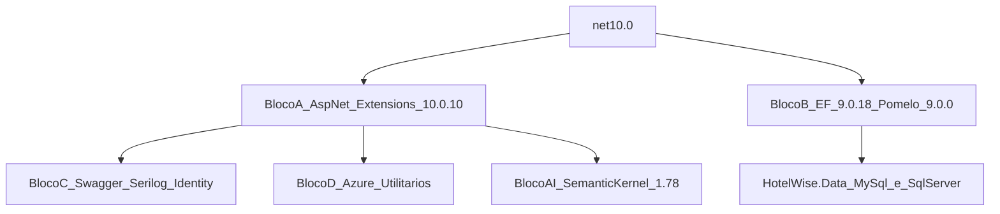

# Levantamento e Conjunto Homologado — HotelWiseAPI (.NET 10)

**Documento:** Inventário + Conjunto Homologado do ciclo  
**Solução:** `HotelWiseAPI/HotelWiseAPI.sln`  
**Data do inventário:** 2026-07-31  
**SDK de referência no ambiente:** `.NET SDK 10.0.301` (também presentes: 8.0.416, 9.0.314, 10.0.300)  
**Processo-base:** `DOCUMENTACAO/GuiaGenericoAtualizacaoPacotes.md`  
**Plano de ação (UpdateDotNet10):** `DOCUMENTACAO/UpdateDotNet10/PlanoAcaoMigracaoDotNet10.md`

---

## 1. Objetivo

Definir o **único conjunto de versões NuGet e TFMs** a aplicar na migração de `HotelWiseAPI` de **.NET 8 → .NET 10**, de forma que:

1. Sejam **compatíveis entre si** (sem `NU1107` / `NU1202`)
2. Maximizem versões estáveis recentes
3. Respeitem a **trava Pomelo ↔ EF Core**
4. Preservem o pacote publicável `GroqApiLibrary` com consumidores em .NET 8

Este documento **não implementa** a migração — apenas homologa o conjunto. A execução está em `DOCUMENTACAO/API/PlanoImplementacaoMigracaoDotNet10-HotelWiseAPI.md`.

---

## 2. Escopo e não escopo

### 2.1 Escopo

| Categoria | Ação |
| --------- | ---- |
| Projetos da solução `HotelWiseAPI.sln` | TFM `net10.0` (exceto packable multi-target) |
| `GroqApiLibrary` (NuGet packable) | Multi-targeting `net8.0;net10.0` |
| Pacotes NuGet | Aplicar **Conjunto Homologado v1** (Seção 6) |
| Central Package Management | Introduzir `HotelWiseAPI/Directory.Packages.props` |
| README / `global.json` | Alinhar a SDK 10.x |

### 2.2 Não escopo

- Frontend `HotelWiseUI` / npm
- Alteração de regras de negócio, contratos REST ou schemas sem necessidade técnica
- Troca de bibliotecas por equivalentes (ex.: fork Pomelo comunitário) — decisão arquitetural separada
- Criação de suíte de testes do zero (gap registrado; não bloqueia o Conjunto)
- Docker .NET da API (não existe hoje; só `QdrantDockerFile`)
- Relatório pós-execução (documento futuro, modelo `RelatorioMigracaoDotNet10.md`)

---

## 3. Inventário de projetos

| Projeto | Caminho | Tipo | TFM atual | TFM alvo | No .sln? |
| ------- | ------- | ---- | --------- | -------- | -------- |
| HotelWise.API | `HotelWiseAPI/HotelWise.API/` | Web API | net8.0 | **net10.0** | Sim |
| HotelWise.Service | `HotelWiseAPI/HotelWise.Service/` | Class Library | net8.0 | **net10.0** | Sim |
| HotelWise.Data | `HotelWiseAPI/HotelWise.Data/` | Class Library + EF | net8.0 | **net10.0** | Sim |
| HotelWise.Domain | `HotelWiseAPI/HotelWise.Domain/` | Class Library + AI | net8.0 | **net10.0** | Sim |
| GroqApiLibrary | `HotelWiseAPI/GroqApiLibrary/` | Library packable (v1.0.8) | net8.0 | **net8.0;net10.0** | Sim |
| HotelWise.ConsolePOC | `HotelWiseAPI/HotelWise.ConsolePOC/` | Console | net8.0 | **net10.0** | Sim |
| GroqToolLibrary | `HotelWiseAPI/GroqApiLibrary/GroqToolLibrary.csproj` | Orphan | net8.0 | Fora do ciclo (não está no .sln) | **Não** |

**Cadeia de referência:**

```text
HotelWise.API
  └── HotelWise.Service
        ├── HotelWise.Data
        └── HotelWise.Domain
              └── GroqApiLibrary

HotelWise.ConsolePOC (independente; OllamaSharp)
```

**Estado de governança de pacotes hoje:**

- Sem `Directory.Packages.props` / CPM
- Sem `Directory.Build.props`
- Sem `global.json`
- Versões inline em cada `.csproj`
- Sem projetos `*Tests*`

---

## 4. Inventário de PackageReference (versões atuais)

### 4.1 HotelWise.API

| Pacote | Versão atual |
| ------ | ------------ |
| Azure.Identity | 1.15.0 |
| Microsoft.AspNetCore.Authentication.JwtBearer | 8.0.19 |
| Microsoft.AspNetCore.Components | 8.0.19 |
| Microsoft.EntityFrameworkCore | 8.0.19 |
| Microsoft.EntityFrameworkCore.Design | 8.0.16 |
| Microsoft.EntityFrameworkCore.Relational | 8.0.16 |
| Microsoft.EntityFrameworkCore.SqlServer | 8.0.16 |
| Microsoft.EntityFrameworkCore.Tools | 8.0.16 |
| Microsoft.Extensions.AI | 9.3.0-preview.1.25161.3 |
| Microsoft.Extensions.Caching.Memory | 9.0.8 |
| Microsoft.Extensions.Configuration (+ Binder, CommandLine, EnvVars, FileExtensions, Json) | 9.0.8 |
| Microsoft.Extensions.Identity.Core | 9.0.8 |
| Microsoft.Graph | 5.91.0 |
| Microsoft.Identity.Web | 3.14.0 |
| Microsoft.IdentityModel.JsonWebTokens | 8.14.0 |
| Microsoft.SemanticKernel | 1.41.0 |
| Microsoft.SemanticKernel.Connectors.MistralAI | 1.41.0-alpha |
| Microsoft.SemanticKernel.Connectors.Ollama | 1.41.0-alpha |
| Microsoft.VisualStudio.Azure.Containers.Tools.Targets | 1.22.1 |
| Serilog.Sinks.Console | 6.0.0 |
| Serilog.Sinks.File | 7.0.0 |
| System.Formats.Asn1 | 9.0.8 |
| System.Text.Json | 9.0.8 |

### 4.2 HotelWise.Service

| Pacote | Versão atual |
| ------ | ------------ |
| AutoMapper | 15.0.1 |
| Azure.ResourceManager.Authorization | 1.1.5 |
| Azure.Storage.Blobs | 12.25.0 |
| Azure.Storage.Queues | 12.23.0 |
| FluentValidation | 12.0.0 |
| Microsoft.AspNetCore.Authentication.JwtBearer | 8.0.19 |
| Microsoft.AspNetCore.Components | 8.0.19 |
| Microsoft.EntityFrameworkCore | 8.0.19 |
| Microsoft.Extensions.* (Caching/Config/Identity) | 9.0.8 |
| Microsoft.Identity.Web | 3.14.0 |
| Microsoft.IdentityModel.JsonWebTokens | 8.14.0 |
| Microsoft.SemanticKernel.Connectors.MistralAI | 1.41.0-alpha |
| Microsoft.SemanticKernel.Connectors.Ollama | 1.41.0-alpha |
| System.Text.Json | 9.0.8 |

### 4.3 HotelWise.Data

| Pacote | Versão atual |
| ------ | ------------ |
| Azure.Data.Tables | 12.11.0 |
| Azure.Identity | 1.15.0 |
| Bogus | 35.6.3 |
| Microsoft.AspNetCore.Authentication.JwtBearer | 8.0.19 |
| Microsoft.AspNetCore.Components | 8.0.19 |
| Microsoft.EntityFrameworkCore | **8.0.19** |
| Microsoft.EntityFrameworkCore.Design / Relational / SqlServer / Tools | **8.0.16** |
| Microsoft.Extensions.* | 9.0.8 |
| Microsoft.Identity.Web | 3.14.0 |
| Microsoft.IdentityModel.JsonWebTokens | 8.14.0 |
| Newtonsoft.Json | 13.0.3 |
| Pomelo.EntityFrameworkCore.MySql | 8.0.3 |
| System.Drawing.Common / System.Formats.Asn1 / System.Text.Json | 9.0.8 |

### 4.4 HotelWise.Domain

| Pacote | Versão atual |
| ------ | ------------ |
| AutoMapper | 15.0.1 |
| Azure.Data.Tables / Azure.Storage.Blobs | 12.11.0 / 12.25.0 |
| DocumentFormat.OpenXml (+ Framework) | 3.3.0 |
| FluentValidation (+ DI Extensions) | 12.0.0 |
| HtmlAgilityPack | 1.12.2 |
| Markdig | 0.41.3 |
| Microsoft.AspNetCore.Authentication.JwtBearer / Components | 8.0.19 |
| Microsoft.Extensions.* | 9.0.8 |
| Microsoft.Extensions.VectorData.Abstractions | 9.0.0-preview.1.25161.1 |
| Microsoft.Identity.Web / JsonWebTokens | 3.14.0 / 8.14.0 |
| Microsoft.KernelMemory.* | 0.97.250211.1 |
| Microsoft.SemanticKernel (+ Abstractions, Core, Handlebars) | 1.41.0 |
| Microsoft.SemanticKernel.Agents.* | 1.41.0-preview |
| Microsoft.SemanticKernel.Connectors.InMemory / Qdrant | 1.41.0-preview |
| Microsoft.SemanticKernel.Plugins.Memory | 1.41.0-alpha |
| Mistral.SDK | 2.1.0 |
| Newtonsoft.Json | 13.0.3 |
| OllamaSharp | 5.1.7 |
| PDFsharp / PDFsharp-MigraDoc | 6.2.1 |
| Polly / Polly.Core | 8.6.3 |
| QuestPDF | 2025.7.1 |
| Swashbuckle.AspNetCore / Filters | 9.0.4 / 9.0.0 |
| Serilog / Serilog.AspNetCore / Sinks | 4.3.0 / 9.0.0 / 6.0.0 / 7.0.0 |
| System.IO.Packaging / System.Text.Json | 9.0.8 |
| System.Security.Claims | 4.3.0 |
| Microsoft.VisualStudio.Azure.Containers.Tools.Targets | 1.22.1 |

### 4.5 GroqApiLibrary

| Pacote | Versão atual |
| ------ | ------------ |
| Microsoft.AspNetCore.Components | 8.0.19 |

### 4.6 HotelWise.ConsolePOC

| Pacote | Versão atual |
| ------ | ------------ |
| OllamaSharp | 5.1.7 |

---

## 5. Problemas detectados no estado atual

| ID | Problema | Impacto | Tratamento no Conjunto v1 |
| -- | -------- | ------- | ------------------------- |
| P1 | Drift EF Core **8.0.19** vs Design/Relational/SqlServer/Tools **8.0.16** | Restore/runtime inconsistente | Alinhar **todo** o Bloco B no mesmo patch **9.0.18** |
| P2 | `Microsoft.Extensions.*` / `System.Text.Json` em **9.0.8** com TFM **net8.0** | Grafo à frente do runtime | Subir TFM para `net10.0` e alinhar Extensions em **10.0.10** |
| P3 | `Pomelo` **8.0.3** trava EF na major 8 | Impede EF 10 | Pomelo **9.0.0** + EF **9.0.18** (runtime net10) |
| P4 | AutoMapper **15.0.1** — vulnerabilidade alta `GHSA-rvv3-g6hj-g44x` | Segurança | Subir para **16.2.0** (major justificada por CVE) |
| P5 | SemanticKernel.Core **1.41.0** — vulnerabilidade crítica `GHSA-2ww3-72rp-wpp4` | Segurança | Subir família SK estável para **1.78.0** |
| P6 | Vários pacotes AI em preview/alpha | Instabilidade de API | Manter família coerente; documentar risco residual |
| P7 | `Microsoft.AspNetCore.Components` em Domain/Data/Service/Groq | Dependência ASP.NET em libs | Manter versão alinhada ao Bloco A; limpeza estrutural fora deste ciclo |
| P8 | Sem projetos de teste | Sem rede de segurança automatizada | Checklist manual obrigatório no plano de implementação |
| P9 | Sem CPM | Drift entre projetos | Introduzir `Directory.Packages.props` |

---

## 6. Princípio de seleção de versões

Cada pacote na **última versão estável** que seja **simultaneamente**:

1. Compatível com **`net10.0`** (ou `net8.0;net10.0` em `GroqApiLibrary`)
2. Compatível com os demais pacotes do **mesmo bloco**
3. Sem `preview`/`rc`/`beta` em produção — **exceto** conectores Semantic Kernel que ainda só existem como alpha/preview (Bloco AI)

**Verificação:** `dotnet list HotelWiseAPI.sln package --outdated` + NuGet.org flat container em **2026-07-31**.

**Regra de ouro Microsoft:**

- Pacotes `Microsoft.AspNetCore.*` / `Microsoft.Extensions.*` / `System.Text.Json` do ciclo .NET 10 → **mesmo patch `10.0.10`**
- Pacotes `Microsoft.EntityFrameworkCore.*` + providers → **mesma major**, limitada pelo provider mais restritivo (**Pomelo 9**)

---

## 7. Conjunto Homologado v1 — versões a aplicar

### 7.1 Grafo de blocos



### 7.2 Dependências rígidas (não violar)

| Se usar | Então obrigatoriamente |
| ------- | ---------------------- |
| `Pomelo.EntityFrameworkCore.MySql` **9.0.0** | Todos `Microsoft.EntityFrameworkCore.*` em **9.0.18** |
| `Microsoft.EntityFrameworkCore` **9.x** | SqlServer/Design/Relational/Tools no **mesmo 9.0.18** |
| `net10.0` + Web API | Todos `Microsoft.AspNetCore.*` em **10.0.10** |
| Qualquer `Microsoft.AspNetCore.*` **10.x** | `Microsoft.Extensions.*` e `System.Text.Json` em **10.0.10** |
| `Swashbuckle.AspNetCore` **10.x** | ASP.NET Core **10.x** |
| Família Semantic Kernel | Pacotes estáveis **1.78.0**; alphas/previews da mesma linha mais próxima possível |

### 7.3 Bloco A — Plataforma .NET 10 (`10.0.10` em todos)

| Pacote | Atual | **Aplicar** | Latest estável NuGet | Justificativa se ≠ latest absoluta |
| ------ | ----- | ----------- | -------------------- | ---------------------------------- |
| Microsoft.AspNetCore.Authentication.JwtBearer | 8.0.19 | **10.0.10** | 10.0.10 | — |
| Microsoft.AspNetCore.Components | 8.0.19 | **10.0.10** | 10.0.10 | — |
| Microsoft.Extensions.Caching.Memory | 9.0.8 | **10.0.10** | 10.0.10 | — |
| Microsoft.Extensions.Configuration | 9.0.8 | **10.0.10** | 10.0.10 | — |
| Microsoft.Extensions.Configuration.Binder | 9.0.8 | **10.0.10** | 10.0.10 | — |
| Microsoft.Extensions.Configuration.CommandLine | 9.0.8 | **10.0.10** | 10.0.10 | — |
| Microsoft.Extensions.Configuration.EnvironmentVariables | 9.0.8 | **10.0.10** | 10.0.10 | — |
| Microsoft.Extensions.Configuration.FileExtensions | 9.0.8 | **10.0.10** | 10.0.10 | — |
| Microsoft.Extensions.Configuration.Json | 9.0.8 | **10.0.10** | 10.0.10 | — |
| Microsoft.Extensions.Identity.Core | 9.0.8 | **10.0.10** | 10.0.10 | — |
| System.Text.Json | 9.0.8 | **10.0.10** | 10.0.10 | — |
| System.Formats.Asn1 | 9.0.8 | **10.0.10** | 10.0.10 | — |
| System.IO.Packaging | 9.0.8 | **10.0.10** | 10.0.10 | — |
| System.Drawing.Common | 9.0.8 | **10.0.10** | 10.0.10 | — |
| Microsoft.Extensions.AI | 9.3.0-preview… | **10.8.3** | 10.8.3 | Sai de preview → estável |
| Microsoft.Extensions.VectorData.Abstractions | 9.0.0-preview… | **10.8.0** | 10.8.0 | Sai de preview → estável |

### 7.4 Bloco B — Persistência (EF 9 alinhado a Pomelo 9)

| Pacote | Atual | **Aplicar** | Latest estável NuGet | Por que não a latest absoluta |
| ------ | ----- | ----------- | -------------------- | ------------------------------ |
| Microsoft.EntityFrameworkCore | 8.0.19 | **9.0.18** | 10.0.10 | Pomelo oficial máximo = **9.0.0** (exige EF ≤ 9) |
| Microsoft.EntityFrameworkCore.Relational | 8.0.16 | **9.0.18** | 10.0.10 | Amarrado ao EF principal |
| Microsoft.EntityFrameworkCore.Design | 8.0.16 | **9.0.18** | 10.0.10 | Idem |
| Microsoft.EntityFrameworkCore.Tools | 8.0.16 | **9.0.18** | 10.0.10 | Idem |
| Microsoft.EntityFrameworkCore.SqlServer | 8.0.16 | **9.0.18** | 10.0.10 | Deve seguir major do EF (9) |
| Pomelo.EntityFrameworkCore.MySql | 8.0.3 | **9.0.0** | **9.0.0** | Latest oficial; sem 10.x no NuGet |

> Pomelo 9 + EF 9 **rodam em runtime `net10.0`** ([matriz Pomelo](https://github.com/PomeloFoundation/Pomelo.EntityFrameworkCore.MySql?tab=readme-ov-file#compatibility)). O runtime é .NET 10; a **lib EF** permanece na major 9.

Persistência dual no HotelWise: MySQL via Pomelo **e** pacote SqlServer — ambos obrigatoriamente na major **9**.

### 7.5 Bloco C — OpenAPI, logging, identidade

| Pacote | Atual | **Aplicar** | Latest estável | Justificativa |
| ------ | ----- | ----------- | -------------- | ------------- |
| Swashbuckle.AspNetCore | 9.0.4 | **10.2.3** | 10.2.3 | Exige ASP.NET 10 |
| Swashbuckle.AspNetCore.Filters | 9.0.0 | **10.0.1** | 10.0.1 | Alinha major ao Swashbuckle 10 |
| Serilog | 4.3.0 | **4.4.0** | 4.4.0 | — |
| Serilog.AspNetCore | 9.0.0 | **10.0.0** | 10.0.0 | Ciclo .NET 10 |
| Serilog.Sinks.Console | 6.0.0 | **6.1.1** | 6.1.1 | — |
| Serilog.Sinks.File | 7.0.0 | **7.0.0** | 7.0.0 | 8.x ainda pré-release |
| Microsoft.Identity.Web | 3.14.0 | **3.15.1** | 4.14.2 | Segura major 3 no v1; major 4 = smoke auth (Conjunto v2 futuro) |
| Microsoft.IdentityModel.JsonWebTokens | 8.14.0 | **8.22.0** | 8.22.0 | — |

### 7.6 Bloco D — Azure, utilitários e domínio

| Pacote | Atual | **Aplicar** | Latest estável | Justificativa |
| ------ | ----- | ----------- | -------------- | ------------- |
| Azure.Identity | 1.15.0 | **1.21.0** | 1.21.0 | — |
| Azure.Storage.Blobs | 12.25.0 | **12.29.1** | 12.29.1 | — |
| Azure.Storage.Queues | 12.23.0 | **12.27.1** | 12.27.1 | — |
| Azure.Data.Tables | 12.11.0 | **12.11.0** | 12.11.0 | Já na latest |
| Azure.ResourceManager.Authorization | 1.1.5 | **1.1.7** | 1.1.7 | — |
| AutoMapper | 15.0.1 | **16.2.0** | 16.2.0 | Major justificada por CVE GHSA-rvv3-g6hj-g44x; verificar licença dual AutoMapper 15+ |
| FluentValidation | 12.0.0 | **12.1.1** | 12.1.1 | — |
| FluentValidation.DependencyInjectionExtensions | 12.0.0 | **12.1.1** | 12.1.1 | — |
| Newtonsoft.Json | 13.0.3 | **13.0.4** | 13.0.4 | — |
| Polly / Polly.Core | 8.6.3 | **8.7.0** | 8.7.0 | — |
| Microsoft.Graph | 5.91.0 | **5.105.0** | 6.2.0 | Segura major 5 no v1 (major 6 = breaking) |
| Bogus | 35.6.3 | **35.6.5** | 35.6.5 | — |
| HtmlAgilityPack | 1.12.2 | **1.12.4** | 1.12.4 | Evita 1.13 beta |
| Markdig | 0.41.3 | **0.45.0** | 1.3.2 | Segura linha 0.x; major 1 = teste dirigido futuro |
| DocumentFormat.OpenXml (+ Framework) | 3.3.0 | **3.5.1** | 3.5.1 | — |
| PDFsharp / PDFsharp-MigraDoc | 6.2.1 | **6.2.4** | 6.2.4 | Evita 7.0 preview |
| QuestPDF | 2025.7.1 | **2026.7.2** | 2026.7.2 | Usar calendário 2026.x (ignorar artefato 2202.8.2) |
| Microsoft.VisualStudio.Azure.Containers.Tools.Targets | 1.22.1 | **1.23.0** | 1.23.0 | — |
| System.Security.Claims | 4.3.0 | **4.3.0** | 4.3.0 | Pacote legado; manter |

### 7.7 Bloco AI — Semantic Kernel / Kernel Memory / conectores

| Pacote | Atual | **Aplicar** | Latest | Justificativa |
| ------ | ----- | ----------- | ------ | ------------- |
| Microsoft.SemanticKernel | 1.41.0 | **1.78.0** | 1.78.0 | Corrige CVE crítica no Core |
| Microsoft.SemanticKernel.Abstractions | 1.41.0 | **1.78.0** | 1.78.0 | Família alinhada |
| Microsoft.SemanticKernel.Core | 1.41.0 | **1.78.0** | 1.78.0 | CVE GHSA-2ww3-72rp-wpp4 |
| Microsoft.SemanticKernel.PromptTemplates.Handlebars | 1.41.0 | **1.78.0** | 1.78.0 | — |
| Microsoft.SemanticKernel.Agents.Abstractions | 1.41.0-preview | **1.78.0** | 1.78.0 | Agora estável |
| Microsoft.SemanticKernel.Agents.Core | 1.41.0-preview | **1.78.0** | 1.78.0 | Agora estável |
| Microsoft.SemanticKernel.Connectors.MistralAI | 1.41.0-alpha | **1.78.0-alpha** | 1.78.0-alpha | Só existe como alpha |
| Microsoft.SemanticKernel.Connectors.Ollama | 1.41.0-alpha | **1.78.0-alpha** | 1.78.0-alpha | Só existe como alpha |
| Microsoft.SemanticKernel.Plugins.Memory | 1.41.0-alpha | **1.78.0-alpha** | 1.78.0-alpha | Só existe como alpha |
| Microsoft.SemanticKernel.Connectors.InMemory | 1.41.0-preview | **1.74.0-preview** | 1.74.0-preview | Latest disponível; **atrás** do core 1.78 — risco residual |
| Microsoft.SemanticKernel.Connectors.Qdrant | 1.41.0-preview | **1.74.0-preview** | 1.74.0-preview | Idem |
| Microsoft.KernelMemory.Core | 0.97.250211.1 | **0.98.250508.3** | 0.98.250508.3 | Família KM alinhada |
| Microsoft.KernelMemory.AI.Ollama | 0.97.250211.1 | **0.98.250508.3** | 0.98.250508.3 | — |
| Microsoft.KernelMemory.SemanticKernelPlugin | 0.97.250211.1 | **0.98.250508.3** | 0.98.250508.3 | — |
| OllamaSharp | 5.1.7 | **5.4.30** | 5.4.30 | — |
| Mistral.SDK | 2.1.0 | **2.3.1** | 2.3.1 | — |

**Risco residual AI:** conectores InMemory/Qdrant em **1.74.0-preview** enquanto o core está em **1.78.0**. Validar restore e smoke dos fluxos Qdrant/InMemory na Fase AI do plano. Se houver `NU1107`, segurar temporariamente o core SK na linha compatível com 1.74 (documentar no relatório de execução) — **não** misturar majors arbitrárias.

---

## 8. O que **não** aplicar no v1

| Tentativa | Resultado | Versão correta |
| --------- | --------- | -------------- |
| EF Core **10.0.10** + Pomelo **9.0.0** | `NU1107` | EF **9.0.18** |
| `Microsoft.AspNetCore.*` **8.x** + `net10.0` | `NU1202` / compile fail | **10.0.10** |
| Swashbuckle **9.x** + ASP.NET **10** | Breaking OpenAPI | Swashbuckle **10.2.3** |
| Pomelo fork comunitário (Microting / omarbaruzzo) | Fora do escopo | Aguardar Pomelo oficial 10 |
| Microsoft.Identity.Web **4.x** sem smoke auth | Possível breaking | Manter **3.15.1** no v1 |
| Microsoft.Graph **6.x** sem migração de código | Breaking | Manter **5.105.0** no v1 |
| Markdig **1.x** sem teste dirigido | Major | Manter **0.45.0** no v1 |
| `Microsoft.Extensions.*` **10.0.10** + AspNetCore **8.x** | Grafo inconsistente | Alinhar Bloco A inteiro |

---

## 9. Conjunto Homologado v2 — futuro (quando Pomelo 10 oficial existir)

Quando `Pomelo.EntityFrameworkCore.MySql` **10.0.x** estável publicar no NuGet oficial ([issue #2007](https://github.com/PomeloFoundation/Pomelo.EntityFrameworkCore.MySql/issues/2007)), substituir **apenas o Bloco B** e avaliar majors adiadas:

| Pacote | v1 (hoje) | **v2 (futuro)** |
| ------ | --------- | --------------- |
| Microsoft.EntityFrameworkCore.* | 9.0.18 | **10.0.10** (ou patch vigente) |
| Pomelo.EntityFrameworkCore.MySql | 9.0.0 | **10.0.x** oficial |
| Microsoft.Identity.Web | 3.15.1 | Avaliar **4.14.2** |
| Microsoft.Graph | 5.105.0 | Avaliar **6.2.0** |
| Markdig | 0.45.0 | Avaliar **1.3.2** |
| SK Connectors InMemory/Qdrant | 1.74.0-preview | Alinhar à linha estável do core quando existir |

Blocos A (patch vigente), C (já 10.x) e maior parte de D permanecem; só revalidar peers.

**Não usar** fork comunitário sem RFC arquitetural explícita.

---

## 10. Centralização — amostra `Directory.Packages.props` (Conjunto v1)

Aplicar em `HotelWiseAPI/Directory.Packages.props` na implementação. Remover atributos `Version=` dos `.csproj`.

```xml
<Project>
  <PropertyGroup>
    <ManagePackageVersionsCentrally>true</ManagePackageVersionsCentrally>
  </PropertyGroup>

  <ItemGroup>
    <!-- Bloco A — Plataforma .NET 10 -->
    <PackageVersion Include="Microsoft.AspNetCore.Authentication.JwtBearer" Version="10.0.10" />
    <PackageVersion Include="Microsoft.AspNetCore.Components" Version="10.0.10" />
    <PackageVersion Include="Microsoft.Extensions.AI" Version="10.8.3" />
    <PackageVersion Include="Microsoft.Extensions.Caching.Memory" Version="10.0.10" />
    <PackageVersion Include="Microsoft.Extensions.Configuration" Version="10.0.10" />
    <PackageVersion Include="Microsoft.Extensions.Configuration.Binder" Version="10.0.10" />
    <PackageVersion Include="Microsoft.Extensions.Configuration.CommandLine" Version="10.0.10" />
    <PackageVersion Include="Microsoft.Extensions.Configuration.EnvironmentVariables" Version="10.0.10" />
    <PackageVersion Include="Microsoft.Extensions.Configuration.FileExtensions" Version="10.0.10" />
    <PackageVersion Include="Microsoft.Extensions.Configuration.Json" Version="10.0.10" />
    <PackageVersion Include="Microsoft.Extensions.Identity.Core" Version="10.0.10" />
    <PackageVersion Include="Microsoft.Extensions.VectorData.Abstractions" Version="10.8.0" />
    <PackageVersion Include="System.Text.Json" Version="10.0.10" />
    <PackageVersion Include="System.Formats.Asn1" Version="10.0.10" />
    <PackageVersion Include="System.IO.Packaging" Version="10.0.10" />
    <PackageVersion Include="System.Drawing.Common" Version="10.0.10" />
    <PackageVersion Include="System.Security.Claims" Version="4.3.0" />

    <!-- Bloco B — Persistência EF 9 + Pomelo 9 -->
    <PackageVersion Include="Microsoft.EntityFrameworkCore" Version="9.0.18" />
    <PackageVersion Include="Microsoft.EntityFrameworkCore.Design" Version="9.0.18" />
    <PackageVersion Include="Microsoft.EntityFrameworkCore.Relational" Version="9.0.18" />
    <PackageVersion Include="Microsoft.EntityFrameworkCore.SqlServer" Version="9.0.18" />
    <PackageVersion Include="Microsoft.EntityFrameworkCore.Tools" Version="9.0.18" />
    <PackageVersion Include="Pomelo.EntityFrameworkCore.MySql" Version="9.0.0" />

    <!-- Bloco C — OpenAPI / Serilog / Identity -->
    <PackageVersion Include="Swashbuckle.AspNetCore" Version="10.2.3" />
    <PackageVersion Include="Swashbuckle.AspNetCore.Filters" Version="10.0.1" />
    <PackageVersion Include="Serilog" Version="4.4.0" />
    <PackageVersion Include="Serilog.AspNetCore" Version="10.0.0" />
    <PackageVersion Include="Serilog.Sinks.Console" Version="6.1.1" />
    <PackageVersion Include="Serilog.Sinks.File" Version="7.0.0" />
    <PackageVersion Include="Microsoft.Identity.Web" Version="3.15.1" />
    <PackageVersion Include="Microsoft.IdentityModel.JsonWebTokens" Version="8.22.0" />

    <!-- Bloco D — Azure e utilitários -->
    <PackageVersion Include="Azure.Identity" Version="1.21.0" />
    <PackageVersion Include="Azure.Storage.Blobs" Version="12.29.1" />
    <PackageVersion Include="Azure.Storage.Queues" Version="12.27.1" />
    <PackageVersion Include="Azure.Data.Tables" Version="12.11.0" />
    <PackageVersion Include="Azure.ResourceManager.Authorization" Version="1.1.7" />
    <PackageVersion Include="AutoMapper" Version="16.2.0" />
    <PackageVersion Include="FluentValidation" Version="12.1.1" />
    <PackageVersion Include="FluentValidation.DependencyInjectionExtensions" Version="12.1.1" />
    <PackageVersion Include="Newtonsoft.Json" Version="13.0.4" />
    <PackageVersion Include="Polly" Version="8.7.0" />
    <PackageVersion Include="Polly.Core" Version="8.7.0" />
    <PackageVersion Include="Microsoft.Graph" Version="5.105.0" />
    <PackageVersion Include="Bogus" Version="35.6.5" />
    <PackageVersion Include="HtmlAgilityPack" Version="1.12.4" />
    <PackageVersion Include="Markdig" Version="0.45.0" />
    <PackageVersion Include="DocumentFormat.OpenXml" Version="3.5.1" />
    <PackageVersion Include="DocumentFormat.OpenXml.Framework" Version="3.5.1" />
    <PackageVersion Include="PDFsharp" Version="6.2.4" />
    <PackageVersion Include="PDFsharp-MigraDoc" Version="6.2.4" />
    <PackageVersion Include="QuestPDF" Version="2026.7.2" />
    <PackageVersion Include="Microsoft.VisualStudio.Azure.Containers.Tools.Targets" Version="1.23.0" />

    <!-- Bloco AI -->
    <PackageVersion Include="Microsoft.SemanticKernel" Version="1.78.0" />
    <PackageVersion Include="Microsoft.SemanticKernel.Abstractions" Version="1.78.0" />
    <PackageVersion Include="Microsoft.SemanticKernel.Core" Version="1.78.0" />
    <PackageVersion Include="Microsoft.SemanticKernel.PromptTemplates.Handlebars" Version="1.78.0" />
    <PackageVersion Include="Microsoft.SemanticKernel.Agents.Abstractions" Version="1.78.0" />
    <PackageVersion Include="Microsoft.SemanticKernel.Agents.Core" Version="1.78.0" />
    <PackageVersion Include="Microsoft.SemanticKernel.Connectors.MistralAI" Version="1.78.0-alpha" />
    <PackageVersion Include="Microsoft.SemanticKernel.Connectors.Ollama" Version="1.78.0-alpha" />
    <PackageVersion Include="Microsoft.SemanticKernel.Plugins.Memory" Version="1.78.0-alpha" />
    <PackageVersion Include="Microsoft.SemanticKernel.Connectors.InMemory" Version="1.74.0-preview" />
    <PackageVersion Include="Microsoft.SemanticKernel.Connectors.Qdrant" Version="1.74.0-preview" />
    <PackageVersion Include="Microsoft.KernelMemory.Core" Version="0.98.250508.3" />
    <PackageVersion Include="Microsoft.KernelMemory.AI.Ollama" Version="0.98.250508.3" />
    <PackageVersion Include="Microsoft.KernelMemory.SemanticKernelPlugin" Version="0.98.250508.3" />
    <PackageVersion Include="OllamaSharp" Version="5.4.30" />
    <PackageVersion Include="Mistral.SDK" Version="2.3.1" />
  </ItemGroup>
</Project>
```

Nos `.csproj`, após CPM:

```xml
<PackageReference Include="Newtonsoft.Json" />
```

(sem `Version=`).

---

## 11. Relação com UpdateDotNet10 e GuiaGenerico

| Documento | Papel |
| --------- | ----- |
| `DOCUMENTACAO/GuiaGenericoAtualizacaoPacotes.md` | Processo genérico (inventário → conjunto → fases) |
| `DOCUMENTACAO/UpdateDotNet10/PlanoAcaoMigracaoDotNet10.md` | Plano operacional HotelWiseAPI (fases + checklist) |
| `DOCUMENTACAO/UpdateDotNet10/RascunhoPlanoUpdateDotNet10.md` | RFC + prompt para IA |
| `DOCUMENTACAO/UpdateDotNet10/RelatorioMigracaoDotNet10.md` | Evidências (pendente até executar) |
| Este levantamento | Conjunto Homologado v1/v2 + inventário de pacotes |

**Características deste ciclo HotelWiseAPI:** 6 projetos no `.sln`; packable só `GroqApiLibrary`; sem testes automatizados; MySQL (Pomelo) + SqlServer; stack AI (SK/KM); sem Docker .NET da API; Bloco A **10.0.10**; EF v1 **9.0.18** + Pomelo **9.0.0**.

---

## 12. Evidências do inventário

```text
Comando: dotnet list HotelWiseAPI.sln package --outdated
Data: 2026-07-31
Fonte: https://api.nuget.org/v3/index.json
Pomelo latest estável oficial: 9.0.0 (sem 10.x no flat container)
ASP.NET / Extensions patch .NET 10: 10.0.10
EF Core 9 último patch: 9.0.18
Avisos restore atuais: NU1903 AutoMapper 15.0.1; NU1904 SemanticKernel.Core 1.41.0
```

---

## 13. Próximo passo

Executar conforme:

**`DOCUMENTACAO/API/PlanoImplementacaoMigracaoDotNet10-HotelWiseAPI.md`**

Após a execução, gerar relatório no modelo de `DOCUMENTACAO/UpdateDotNet10/RelatorioMigracaoDotNet10.md` (documento futuro, não criado neste ciclo).
