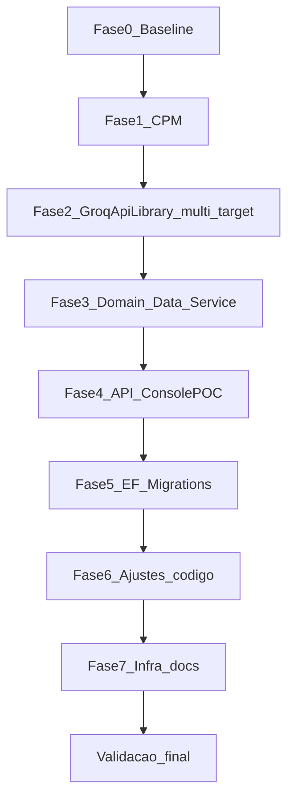

# Plano de Implementação — Migração HotelWiseAPI .NET 8 → .NET 10

**Documento:** Plano operacional executável  
**Solução:** `HotelWiseAPI/HotelWiseAPI.sln`  
**Conjunto Homologado:** `DOCUMENTACAO/API/2026-07-LevantamentoConjuntoHomologado-HotelWiseAPI.md`  
**Processo-base:** `DOCUMENTACAO/GuiaGenericoAtualizacaoPacotes.md`  
**Plano de ação / RFC / relatório:** `DOCUMENTACAO/UpdateDotNet10/PlanoAcaoMigracaoDotNet10.md`, `RascunhoPlanoUpdateDotNet10.md`, `RelatorioMigracaoDotNet10.md`  
**Data:** 2026-07-31

---

## 1. Objetivo

Executar a migração de **todos os projetos .NET** da solução `HotelWiseAPI` de `net8.0` para `net10.0`, aplicando o **Conjunto Homologado v1**, preservando:

- Compatibilidade do pacote publicável `GroqApiLibrary` com consumidores em .NET 8 (`net8.0;net10.0`)
- Integridade de migrations EF Core (MySQL/Pomelo e SqlServer)
- Funcionamento da API, DI, Serilog, Swagger, autenticação Identity.Web e fluxos AI
- Build local e alinhamento de README / `global.json` / pipeline externo
- Zero alteração de regra de negócio ou contrato público sem necessidade técnica

---

## 2. Escopo e não escopo

### 2.1 Escopo

| Categoria | Ação |
| --------- | ---- |
| Bibliotecas (Domain, Data, Service, GroqApiLibrary) | TFM + pacotes do Conjunto v1 |
| API e ConsolePOC | `TargetFramework` → `net10.0` |
| GroqApiLibrary | Multi-targeting `net8.0;net10.0` + pack |
| NuGet | CPM via `HotelWiseAPI/Directory.Packages.props` |
| README / global.json | SDK 10.x |
| Nota de pipeline Azure DevOps | Documentar alinhamento externo (fora do tree) |

### 2.2 Não escopo

- `HotelWiseUI` / npm
- Criação de projetos de teste do zero
- Fork Pomelo comunitário / EF Core 10 (reservado ao Conjunto v2)
- Refatoração arquitetural (ex.: remover `Microsoft.AspNetCore.Components` das libs)
- Docker .NET da API (não existe; `QdrantDockerFile` permanece)
- Commit/PR automático sem pedido explícito do responsável

---

## 3. Pré-requisitos

| Item | Valor |
| ---- | ----- |
| Branch | `chore/update-packages-hotelwiseapi-dotnet10` |
| SDK | .NET SDK **10.x** (`dotnet --list-sdks` deve listar 10.0.x) |
| Documento de versões | Conjunto Homologado v1 (não improvisar versões) |
| Baseline | Build Release verde **antes** de alterar TFMs |
| Banco | Instância MySQL (e SqlServer se usado) disponível para validar migrations |

```powershell
cd HotelWiseAPI
dotnet --version          # esperado: 10.0.x
dotnet --list-sdks
```

---

## 4. Plano por fases



Validar **build** ao final de cada fase. Não avançar com erros de restore (`NU1107`/`NU1202`).

---

### Fase 0 — Preparação e baseline

1. Criar branch a partir da main/master estável.
2. Confirmar inventário ainda válido (reler o Conjunto Homologado).
3. Build baseline:

```powershell
cd HotelWiseAPI
dotnet restore HotelWiseAPI.sln
dotnet build HotelWiseAPI.sln -c Release
```

4. Registrar avisos atuais (`NU1903` AutoMapper, `NU1904` SemanticKernel) — devem sumir após o Conjunto.
5. Commit baseline (opcional, recomendado): *chore: baseline before HotelWiseAPI net10 migration*.

**Critério de saída:** 0 erros de build no estado atual `net8.0`.

---

### Fase 1 — Central Package Management (CPM)

1. Criar `HotelWiseAPI/Directory.Packages.props` com o XML do Conjunto Homologado v1 (Seção 10 do levantamento).
2. Em **todos** os `.csproj` da solução, remover `Version="..."` de cada `PackageReference`.
3. Manter `PrivateAssets` / `IncludeAssets` onde já existirem (Design/Tools).
4. Restore:

```powershell
dotnet restore HotelWiseAPI.sln
dotnet build HotelWiseAPI.sln -c Release
```

**Nota:** Nesta fase os projetos ainda podem estar em `net8.0`. Se o Bloco A `10.0.10` gerar `NU1202` com TFM 8, **adiar a aplicação das versões 10.x** até a Fase 3/4 **ou** subir TFMs imediatamente após criar o props — preferência deste plano: **criar CPM com as versões do Conjunto e subir TFMs na mesma onda das Fases 2–4**, evitando estado intermediário inconsistente.

**Abordagem recomendada (evitar limbo net8 + AspNet 10):**

1. Criar `Directory.Packages.props` com Conjunto v1.
2. Remover `Version=` dos csproj.
3. Em seguida executar Fases 2–4 sem commit intermediário “só CPM”, **ou** commit único “CPM + TFM net10 por camada”.

**Critério de saída:** restore sem conflito de versão; props único como fonte de verdade.

---

### Fase 2 — Packable: GroqApiLibrary

Arquivo: `HotelWiseAPI/GroqApiLibrary/GroqApiLibrary.csproj`

1. Trocar:

```xml
<TargetFramework>net8.0</TargetFramework>
```

por:

```xml
<TargetFrameworks>net8.0;net10.0</TargetFrameworks>
```

2. Garantir `Microsoft.AspNetCore.Components` via CPM (**10.0.10**).
3. Pack e inspeção:

```powershell
dotnet pack HotelWiseAPI/GroqApiLibrary/GroqApiLibrary.csproj -c Release -o ./artifacts/nupkg
# Inspecionar conteúdo do .nupkg — deve conter:
#   lib/net8.0/
#   lib/net10.0/
```

**Critério de saída:** pack gera ambas as pastas `lib/`; build do projeto multi-target OK.

---

### Fase 3 — Bibliotecas internas (ordem de dependência)

Ordem obrigatória:

1. `HotelWise.Domain` → `net10.0`
2. `HotelWise.Data` → `net10.0`
3. `HotelWise.Service` → `net10.0`

Para cada projeto:

```xml
<TargetFramework>net10.0</TargetFramework>
```

Pacotes já resolvidos pelo CPM (Bloco A/B/C/D/AI conforme referências de cada csproj).

Após cada projeto (ou ao final dos três):

```powershell
dotnet build HotelWiseAPI/HotelWise.Domain/HotelWise.Domain.csproj -c Release
dotnet build HotelWiseAPI/HotelWise.Data/HotelWise.Data.csproj -c Release
dotnet build HotelWiseAPI/HotelWise.Service/HotelWise.Service.csproj -c Release
```

**Atenção Bloco AI (Domain):**

- Se restore falhar por peers entre SK **1.78.0** e conectores InMemory/Qdrant **1.74.0-preview**, aplicar mitigação documentada no levantamento (segurar core na linha compatível **ou** isolar pacotes) e registrar no relatório de execução — **não** forçar EF 10 / forks.

**Critério de saída:** três bibliotecas compilam em `net10.0` com Conjunto v1.

---

### Fase 4 — Executáveis (API + ConsolePOC)

1. `HotelWise.API` → `net10.0`
2. `HotelWise.ConsolePOC` → `net10.0`

```powershell
dotnet build HotelWiseAPI/HotelWise.API/HotelWise.API.csproj -c Release
dotnet build HotelWiseAPI/HotelWise.ConsolePOC/HotelWise.ConsolePOC.csproj -c Release
dotnet build HotelWiseAPI.sln -c Release
```

**Critério de saída:** solução Release com **0 erros**.

---

### Fase 5 — EF Core / migrations

Contexto MySQL: `HotelWise.Data` + `UseMySql` / Pomelo em `HotelWise.API/Configure/ServiceCollectionAddAllDependencies.cs`.

1. Confirmar Bloco B: EF **9.0.18** + Pomelo **9.0.0** + SqlServer **9.0.18** (sem drift).
2. Listar migrations:

```powershell
cd HotelWiseAPI
dotnet ef migrations list `
  --project HotelWise.Data/HotelWise.Data.csproj `
  --startup-project HotelWise.API/HotelWise.API.csproj
```

3. Técnica da migration temporária (GuiaGenerico §7.3):

```powershell
dotnet ef migrations add ValidacaoPosUpdateDotNet10 `
  --project HotelWise.Data/HotelWise.Data.csproj `
  --startup-project HotelWise.API/HotelWise.API.csproj

# Se Up/Down VAZIOS → esperado (sem mudança de schema)
dotnet ef migrations remove --force `
  --project HotelWise.Data/HotelWise.Data.csproj `
  --startup-project HotelWise.API/HotelWise.API.csproj
```

4. Se a migration vier **não-vazia**: **parar**, investigar antes de commitar.
5. Em banco de teste: `dotnet ef database update` (ambiente limpo ou cópia).

**Critério de saída:** list/update OK; migration temporária vazia removida; sem schema não intencional.

---

### Fase 6 — Ajustes de código esperáveis

Com base no relatório SmartCoreHub e nas majors deste Conjunto, verificar e corrigir:

| Área | Sintoma típico | Ação |
| ---- | -------------- | ---- |
| Swashbuckle 10 / OpenAPI 2.x | Namespace / `AddSecurityRequirement` quebrado | Atualizar para APIs `Microsoft.OpenApi` 2.x (`OpenApiSecuritySchemeReference`, etc.) |
| ASP.NET Core 10 | APIs obsoletas (`KnownNetworks` / `IPNetwork`) | Substituir por equivalentes .NET 10 se usados |
| AutoMapper 16 | Breaking na config/licença | Ajustar profiles/DI; validar build |
| Semantic Kernel 1.78 | APIs renomeadas / plugins | Compilar Domain/API; smoke chat/assistente |
| EF 9 + LINQ | `Contains` com arrays / avaliação cliente | Preferir `List<T>` onde necessário (padrão Relatorio SCH) |
| Identity.Web 3.15.1 | Warnings menores | Manter major 3; smoke login JWT/Entra |

Arquivos candidatos a revisão (não exaustivo):

- `HotelWise.API/Program.cs` e pastas `Configure/`
- Registros Swagger / autenticação
- `HotelWise.Data` DbContexts e repositórios com LINQ
- Configuração Semantic Kernel / Kernel Memory em Domain/Service

**Critério de saída:** build Release limpo de erros; avisos de obsolescência novos tratados ou justificados.

---

### Fase 7 — Infra, docs e CI

1. Criar `HotelWiseAPI/global.json`:

```json
{
  "sdk": {
    "version": "10.0.301",
    "rollForward": "latestFeature"
  }
}
```

(Ajustar `version` ao patch SDK instalado no CI/local.)

2. Atualizar `HotelWiseAPI/README.md`: requisito **.NET SDK 10** (hoje declara SDK 8).
3. Pipeline Azure DevOps externo (`lionscorp.visualstudio.com/...`): alinhar task `UseDotNet@2` para `10.x` — **fora do tree**; registrar checklist para o responsável de CI.
4. Docker: nenhum Dockerfile `aspnet`/`sdk` da API para alterar. Manter `QdrantDockerFile` intacto.
5. Não alterar `GroqToolLibrary` órfão neste ciclo (opcional: issue para incluir ou remover do disco).

**Critério de saída:** docs locais alinhados; item de CI registrado.

---

## 5. Checklist de validação final

### 5.1 Restore e build

```powershell
cd HotelWiseAPI
dotnet restore HotelWiseAPI.sln
dotnet build HotelWiseAPI.sln -c Release
```

- [ ] Restore sem `NU1107` / `NU1202`
- [ ] Build Release com 0 erros
- [ ] Sem drift EF (todos `Microsoft.EntityFrameworkCore.*` = 9.0.18; Pomelo = 9.0.0)
- [ ] Avisos `NU1903` AutoMapper 15 e `NU1904` SK 1.41** ausentes**

### 5.2 Testes automatizados

```powershell
dotnet test HotelWiseAPI.sln -c Release
```

- [ ] **N/A — gap:** não há projetos de teste. Registrar no relatório: cobertura 0%; mitigação = smoke manual.

### 5.3 Pack GroqApiLibrary

```powershell
dotnet pack HotelWise.API/../GroqApiLibrary/GroqApiLibrary.csproj -c Release -o ./artifacts/nupkg
```

- [ ] `.nupkg` contém `lib/net8.0/` e `lib/net10.0/`

### 5.4 EF / migrations

- [ ] `migrations list` OK
- [ ] Migration temporária vazia (ou investigação concluída se não-vazia)
- [ ] `database update` em ambiente de teste OK

### 5.5 Execução da API

```powershell
dotnet run --project HotelWise.API/HotelWise.API.csproj
```

- [ ] Startup sem `InvalidOperationException` de DI
- [ ] Swagger acessível
- [ ] Autenticação (JWT / Entra) smoke: obter token e chamar endpoint protegido
- [ ] Fluxo AI básico (assistente / Ollama ou provider configurado) sem crash
- [ ] Logs Serilog sem segredos

### 5.6 ConsolePOC

```powershell
dotnet run --project HotelWise.ConsolePOC/HotelWise.ConsolePOC.csproj
```

- [ ] Inicializa sem erro fatal (conforme propósito do POC)

---

## 6. Critérios de aceite

1. Projetos internos/API/Console em `net10.0`; `GroqApiLibrary` em `net8.0;net10.0`.
2. CPM ativo; versões = Conjunto Homologado v1 (desvios só com justificativa no relatório).
3. Build Release 0 erros; pack Groq com dois TFMs.
4. Migrations validadas; sem schema acidental.
5. API sobe; DI e Swagger OK; smoke auth + AI.
6. README + `global.json` em SDK 10; CI externo anotado.
7. Sem alteração de contrato/negócio fora do necessário técnico.

---

## 7. Rollback

```powershell
git checkout chore/update-packages-hotelwiseapi-dotnet10
git reset --hard <commit-baseline-fase-0>

cd HotelWiseAPI
dotnet restore HotelWiseAPI.sln
dotnet build HotelWiseAPI.sln -c Release
```

Restaurar **sempre em conjunto:** `Directory.Packages.props`, todos os `.csproj`, `global.json`, README. Lockfiles NuGet (`packages.lock.json`), se existirem, junto.

---

## 8. Riscos residuais

| Risco | Impacto | Mitigação |
| ----- | ------- | --------- |
| Pomelo 9 trava EF na major 9 | Sem EF 10 no v1 | Conjunto v2 quando Pomelo 10 oficial |
| SK InMemory/Qdrant 1.74-preview vs core 1.78 | Restore/runtime AI | Smoke Qdrant; fallback de versão documentado no levantamento |
| Conectores Mistral/Ollama alpha | API instável | Smoke dirigido; não misturar linhas 1.41 e 1.78 |
| AutoMapper 16 + licença | Compliance / breaking | Revisar uso; smoke mapeamentos |
| Identity.Web permanece em 3.x | Sem features 4.x | Conjunto v2 + smoke auth |
| Graph permanece em 5.x | Sem Graph 6 | Conjunto v2 |
| Ausência de testes automatizados | Regressões silenciosas | Checklist manual §5; considerar suíte em PR separado |
| Pipeline Azure DevOps desalinhado | CI vermelho | Fase 7 — UseDotNet 10.x |
| `Microsoft.AspNetCore.Components` em libs | Acoplamento indevido | Fora de escopo; issue futura |

---

## 9. Ordem de commits sugerida (por fase)

1. `chore(api): add Directory.Packages.props and enable CPM`
2. `chore(api): multi-target GroqApiLibrary net8;net10`
3. `chore(api): migrate Domain/Data/Service to net10 and Conjunto v1`
4. `chore(api): migrate API and ConsolePOC to net10`
5. `fix(api): Swagger/OpenAPI and net10 compatibility adjustments`
6. `chore(api): pin SDK 10 in global.json and update README`

Ajustar mensagens ao estilo do repositório. Só commitar quando o responsável pedir.

---

## 10. Evidências a coletar na execução (relatório futuro)

Gerar depois `DOCUMENTACAO/API/RelatorioMigracaoDotNet10-HotelWiseAPI.md` com:

```text
Projetos .NET atualizados: 6 (+ nota GroqToolLibrary órfão)
Pacotes NuGet alinhados ao Conjunto v1: N
Testes automatizados: 0/0 (gap)
Build Release: OK/FAIL
Pack GroqApiLibrary TFMs: net8.0 + net10.0
Migrations: vazia / investigada
Smoke API / auth / AI: OK/FAIL
Vulnerabilidades NU1903/NU1904 resolvidas: sim/não
Desvios do Conjunto v1: lista
```

---

## 11. Referências

- `DOCUMENTACAO/API/2026-07-LevantamentoConjuntoHomologado-HotelWiseAPI.md`
- `DOCUMENTACAO/GuiaGenericoAtualizacaoPacotes.md`
- `DOCUMENTACAO/UpdateDotNet10/PlanoAcaoMigracaoDotNet10.md`
- `DOCUMENTACAO/UpdateDotNet10/RelatorioMigracaoDotNet10.md`
- `DOCUMENTACAO/UpdateDotNet10/RascunhoPlanoUpdateDotNet10.md`
- Pomelo EF Core 10 tracking: https://github.com/PomeloFoundation/Pomelo.EntityFrameworkCore.MySql/issues/2007
