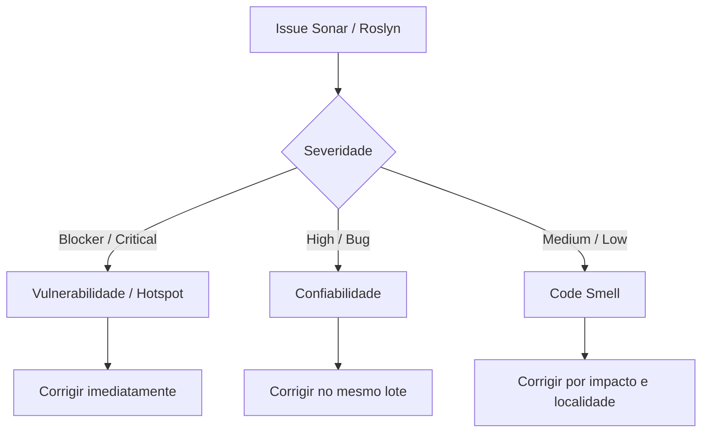
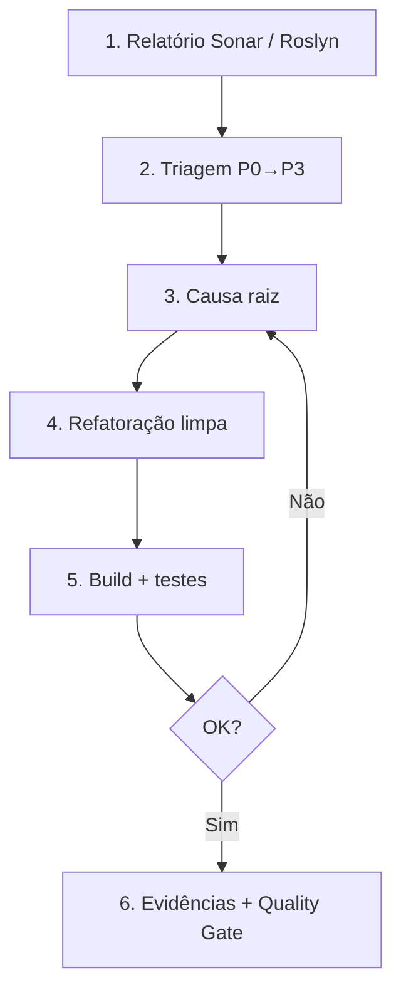

# Diretrizes para Ajuste de Issues e Code Smells — Backend (Genérico C# / .NET)

**Documento:** Guia operacional reutilizável para qualidade estática e governança de código backend  
**Arquivo:** `Diretrizes-CodeSmell-Backend-Generico.md`  
**Escopo:** Soluções C# / .NET (APIs, domínio, serviços, persistência, workers, SDKs, testes)  
**Ferramental:** SonarQube / SonarCloud, Roslyn Analyzers, .NET CLI, `dotnet format`  
**Target:** .NET 10 / C# 13+ (multi-targeting `net8.0;net10.0` e `netstandard2.0/2.1` quando aplicável)  
**Companheiro:** [Diretrizes-Coverage-Backend-Generico.md](./Diretrizes-Coverage-Backend-Generico.md)  
**Data da Revisão:** 2026-08-29  

---

## 1. Objetivo

Padronizar identificação, diagnóstico e remediação de **Code Smells**, **Bugs**, **Vulnerabilidades** e **Security Hotspots**, garantindo:

1. **Zero regressão de negócio** — refatoração não altera comportamento observável, regras nem contratos públicos (REST, gRPC, SignalR, MCP, pacotes NuGet).
2. **Manutenibilidade** — Rating A de Maintainability; menos duplicação, complexidade e acoplamento espúrio.
3. **Confiabilidade e segurança** — eliminar null-derefs, async incorreto, vazamento de recursos, injeções e credenciais hardcoded.
4. **Governança de warnings** — `#pragma warning disable` / `[SuppressMessage]` só com justificativa arquitetural documentada no PR.

---

## 2. Triagem e Priorização



| Prioridade | Tipo | Ação |
| ---------- | ---- | ---- |
| P0 | Vulnerabilidade / Security Hotspot confirmado | Corrigir antes de merge |
| P1 | Bug (Reliability) | Corrigir no mesmo PR / lote |
| P2 | Code Smell High/Medium em caminho quente | Corrigir no lote de qualidade |
| P3 | Code Smell Low / estilo Roslyn | Agrupar; não bloquear feature se Quality Gate ok |

**Regra de lote:** preferir um domínio/arquivo por vez; não misturar refactor amplo com mudança de contrato.

---

## 3. Taxonomia Rápida

| Categoria | Exemplos | Foco da correção |
| --------- | -------- | ---------------- |
| Code Smell | S107, S1172, ternários aninhados, `!` redundante | Legibilidade sem mudar comportamento |
| Bug | S2259, S3168, cancelamento async, exception engolida | Comportamento correto sob falha/cancelamento |
| Vulnerabilidade | S2077, S6437, SSRF | Entrada não confiável / segredos |
| Hotspot | CSRF, cookies, crypto | Revisão consciente + evidência |

---

## 4. Catálogo de Regras e Padrões de Correção

### 4.1 Manutenibilidade

| Regra | Sintoma | Correção canônica |
| ----- | ------- | ----------------- |
| **S107** | Construtor/método com muitos parâmetros | Parameter Object / Context / Factory — **nunca** `#pragma` |
| **S112** | `throw new Exception()` | Exceção específica (`ArgumentNullException`, `InvalidOperationException`, domínio) |
| **S1172** / **S1144** | Parâmetro/membro não usado | Remover; se for contrato FluentValidation/override, discard `_` ou propagar o token |
| **S125** | Código comentado | Remover (histórico no Git) |
| **S3260** | Tipo interno não `sealed` | Adicionar `sealed` quando não há herança |
| **S6562** | `DateTime.Now` | `DateTime.UtcNow` ou `TimeProvider` |
| **Roslyn CA1861** | Array literal repetido em chamada | `private static readonly T[]` |
| **Roslyn CA1847** | `StartsWith("x")` | `StartsWith('x')` |
| **Logging placeholders** | `{time}`, `{message}` | PascalCase: `{Time}`, `{Message}` |
| **PowerShell negation** | `if (!(Test-Path …))` | `if (-not (Test-Path …))` |
| **Nested ternary** | `a ? b : c ? d : e` | `if` / early return em statement independente |
| **JsonSerializerOptions** | `new JsonSerializerOptions` a cada serialize | Campo `static readonly` reutilizável |
| **Null-forgiving `!`** | `obj!` onde o fluxo já prova non-null | Remover `!`; preferir variável local tipada |

### 4.2 Confiabilidade

| Regra | Sintoma | Correção canônica |
| ----- | ------- | ----------------- |
| **S2259** | Null dereference | Guard, pattern matching, `?.` |
| **S1166** | `catch` sem log nem contexto | Logar **e** relançar com wrap (`throw new InvalidOperationException("…", ex)`) **ou** tratar de fato |
| **Cancelamento / async I/O** | I/O async sem token | Passar `CancellationToken` (ex.: `context.RequestAborted`) ou `CancellationToken.None` **explicitamente** |
| **S3168** | `async void` | `Task` / `ValueTask` |
| **S4457** | Validação dentro do async state machine | Validar no método sync público; executar em método `async` privado |
| **S2933** | Campo só atribuído no ctor | `readonly` |

### 4.3 Segurança

| Regra | Sintoma | Correção canônica |
| ----- | ------- | ----------------- |
| **S2077** | SQL concatenado | Parametrizado / EF / Dapper |
| **S6437** | Credencial no código | `IConfiguration`, Key Vault, User Secrets, env |
| **S5144** | URL de usuário em `HttpClient` | Allowlist de hosts |
| **S3330** | Cookie sensível sem HttpOnly | `HttpOnly = true`, `Secure = true` |

### 4.4 SDKs multi-target

| Aspecto | Risco | Correção |
| ------- | ----- | -------- |
| API só em TFM novo | Quebra `netstandard` / `net8` | `#if NET8_0_OR_GREATER` ou PackageReference condicional |
| Tipos públicos sem XML | `CS1591` / DX ruim | `GenerateDocumentationFile` + docs nos membros públicos |
| Domínio de produto no Core | Acoplamento | Core = contratos, generics, helpers, adapters — sem entidades de negócio |
| Remoção abrupta | Quebra consumidores | `[Obsolete(..., DiagnosticId = "...")]` na transição; remover após migração |
| Debug de pacote | Sem símbolos | `IncludeSymbols` + `snupkg` |

---

## 5. Playbook de Correção (anti-padrões frequentes)

### 5.1 Exception handling (`S1166`)

```csharp
// Ruim: engole ou relança sem contexto
catch (Exception ex) { throw; }

// Bom: log + wrap com contexto
catch (Exception ex)
{
    logger.Error(ex, "Falha em {Operation} at {Time}", nameof(Start), DateTime.UtcNow);
    throw new InvalidOperationException("Startup failed. See inner exception.", ex);
}
```

### 5.2 Cancelamento em I/O HTTP

```csharp
// Ruim
await context.Response.WriteAsync(json);

// Bom
await context.Response.WriteAsync(json, context.RequestAborted);
```

### 5.3 Null-forgiving em campos mutáveis

```csharp
// Ruim: campo nullable + ! após LoadAsync
await LoadAsync();
await _collection!.UpsertAsync(item);

// Bom: retornar a instância non-null
var collection = await LoadAsync();
await collection.UpsertAsync(item);
```

### 5.4 Testes

| Evitar | Preferir |
| ------ | -------- |
| `Thread.Sleep` | Remover delay desnecessário ou `await Task.Delay` em teste async |
| `new[] { 1, 2 }` repetido em asserts | `private static readonly int[]` |
| Variável tipada só como interface sem necessidade | Tipo concreto quando o teste instancia a implementação |

---

## 6. Fluxo Operacional



### 6.1 Comandos

```powershell
dotnet build <Solucao>.sln -c Release /p:TreatWarningsAsErrors=false
dotnet format <Solucao>.sln --verify-no-changes --verbosity diagnostic
dotnet test <Solucao>.sln -c Release --no-build
dotnet test <Solucao>.sln -c Release /p:CollectCoverage=true /p:CoverletOutputFormat=opencover
```

---

## 7. Checklist obrigatório

- [ ] Build Release: 0 erros; 0 warnings **novos** introduzidos pelo lote
- [ ] Testes: 100% verdes no escopo afetado (idealmente solução inteira)
- [ ] Contratos públicos preservados (ou versionados / Obsolete documentado)
- [ ] Sem `#pragma` / `SuppressMessage` sem justificativa no PR
- [ ] Evidências: arquivos, regras Sonar, resultado do Quality Gate

---

## 8. Template de evidências

```text
================================================================================
RELATÓRIO DE SANEAMENTO DE CODE SMELLS (BACKEND)
================================================================================
Data: AAAA-MM-DD
Solução: <NomeSolucao>.sln
Lote: <escopo breve>

1. Issues
   - Vulnerabilidades / Hotspots: N
   - Bugs: N
   - Code Smells: N

2. Regras principais
   - S1166 / cancelamento / CA18xx / ... : <ação resumida>

3. Validação
   - Build Release: OK
   - Testes: N/N OK
   - Pack multi-TFM (se SDK): OK
================================================================================
```
