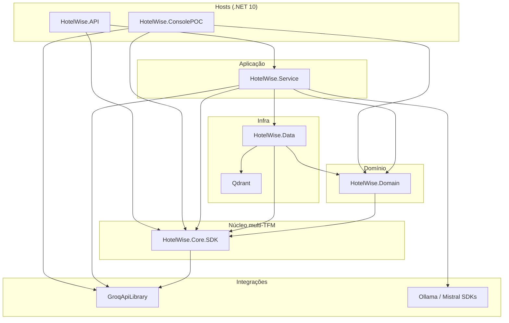

# Diretrizes para Ajuste de Issues e Code Smells — Backend (HotelWise)

**Documento:** Guia operacional específico da solução backend HotelWise  
**Solução:** [`HotelWiseAPI.sln`](../../HotelWiseAPI.sln)  
**Target:** `.NET 10` nos hosts; `HotelWise.Core.SDK` em `net10.0;net8.0;netstandard2.1;netstandard2.0`; `GroqApiLibrary` em `net8.0;net10.0`  
**Guia-base:** [Diretrizes-CodeSmell-Backend-Generico.md](./Diretrizes-CodeSmell-Backend-Generico.md)  
**Cobertura:** [Diretrizes-Coverage-Backend-HotelWise.md](./Diretrizes-Coverage-Backend-HotelWise.md)  
**Data da Revisão:** 2026-08-29  

---

## 1. Contexto Arquitetural

A solução **HotelWise Backend** segue Clean Architecture com núcleo transversal packable (`HotelWise.Core.SDK`), domínio hoteleiro, orquestração de IA (LLMs/SLMs + RAG) e persistência relacional.



### 1.1 Inventário de Projetos

| Projeto | Tipo | TFM | Papel |
| ------- | ---- | --- | ----- |
| **HotelWise.Core.SDK** | Library packable | `net10.0;net8.0;netstandard2.1;netstandard2.0` | Abstrações, generics (`GenericRepositoryBase`, `GenericEntityServiceBase`), JWT, middlewares, AI adapters/configs — **sem** entidades Hotel/Room/Reservation |
| **HotelWise.API** | Web API | `net10.0` | Controllers, JWT, Swagger/Scalar, DI, health |
| **HotelWise.Service** | Library | `net10.0` | Casos de uso hoteleiros, SK, RAG, Polly |
| **HotelWise.Domain** | Library | `net10.0` | Entidades de produto, VOs, FluentValidation, contratos de repositório hotel |
| **HotelWise.Data** | Library | `net10.0` | EF Core, Pomelo MySQL, SQL Server, migrations, repositórios |
| **GroqApiLibrary** | Library packable | `net8.0;net10.0` | Cliente HTTP Groq |
| **HotelWise.ConsolePOC** | Console | `net10.0` | Experimentos Ollama / Qdrant |
| **HotelWise.Core.SDK.Tests** | xUnit | `net10.0` | Suíte Core.SDK (≥ 90% unit-testável) |
| **HotelWise.Domain.Tests** | xUnit | `net10.0` | Validators, mappers, models |
| **HotelWise.Data.Tests** | xUnit | `net10.0` | Repositórios + EF InMemory |
| **HotelWise.Service.Tests** | xUnit | `net10.0` | Serviços com Moq |
| **HotelWise.API.Tests** | xUnit | `net10.0` | Controllers com serviços mockados |

> Status detalhado do Core.SDK: [HotelWise.Core.SDK.Progresso.md](../HotelWise.Core.SDK/HotelWise.Core.SDK.Progresso.md). Cobertura host: [Diretrizes-Coverage-Backend-HotelWise.md](./Diretrizes-Coverage-Backend-HotelWise.md).

---

## 2. Padrões Específicos HotelWise

### 2.1 DI e `S107` (muitos parâmetros)

- Agrupar dependências coesas (`*Dependencies`, `*Options`, factories de IA).
- **Nunca** suprimir `S107` com `#pragma`.
- Preferir agrupamento no Domain/Service do host; o Core.SDK permanece genérico.

### 2.2 IA resiliente (Semantic Kernel, Groq, Ollama, Mistral)

- Propagar `CancellationToken` em inferência e busca vetorial.
- Polly para retry/circuit breaker em provedores externos.
- Proibido `.Result` / `.Wait()` em caminhos async.
- Segredos só via `IConfiguration` / User Secrets / env (`S6437`).
- Preferir tipo concreto (`ApplicationIAConfig`) em métodos privados internos do configure quando o Sonar/Roslyn pedir (desvirtualização); manter interfaces no contrato público DI.

### 2.3 EF Core e multi-database

- APIs async: `ToListAsync`, `FirstOrDefaultAsync`, `AnyAsync`, `SaveChangesAsync` + `CancellationToken`.
- Leituras com `AsNoTracking()` quando apropriado.
- Repositórios do host herdam de `GenericRepositoryBase` do Core.SDK.

### 2.4 Multi-target (`HotelWise.Core.SDK` e `GroqApiLibrary`)

```csharp
#if NET8_0_OR_GREATER
    ArgumentNullException.ThrowIfNull(argument);
#else
    if (argument is null) throw new ArgumentNullException(nameof(argument));
#endif
```

- Dependências pesadas (EF, SK, ASP.NET Core) só em `net8.0`/`net10.0`.
- Validar com `dotnet pack -c Release` nos dois pacotes.

### 2.5 Central Package Management

- Versões apenas em [`Directory.Packages.props`](../../Directory.Packages.props).
- `.csproj` sem `Version=` inline em `PackageReference`.

### 2.6 Governança do Core.SDK

| Regra | Detalhe |
| ----- | ------- |
| Isolamento | Zero DTOs/entidades de Hotel/Quarto/Reserva no SDK |
| Consumo | Hosts usam `HotelWise.Core.SDK.*` direto (shims `HW_CORE_SDK_*` = 0) |
| Docs/símbolos | `GenerateDocumentationFile` + `.snupkg` |
| cref XML | Em overloads, especificar assinatura: `GetChatServiceConfig(AIChatServiceType)` |

### 2.7 Playbook Sonar recorrente neste repositório

| Issue visto | Onde costuma aparecer | Correção homologada |
| ----------- | --------------------- | ------------------- |
| Pass `RequestAborted` / CancellationToken | `GlobalExceptionMiddleware` | `WriteAsync(json, context.RequestAborted)` |
| Cache `JsonSerializerOptions` | Middlewares / serializers | `static readonly JsonSerializerOptions` |
| Log + rethrow com contexto | `WebApplicationConfigureBuilder` | `Log.Error` + `throw new InvalidOperationException("…", ex)` |
| Ternário aninhado | `UseSerilogRequestLogging.GetLevel` | `if` / early return |
| Placeholders Serilog | Service / SDK / API | `{Message}`, `{Time}` (PascalCase) |
| PowerShell `!` | `IA_Local/*.ps1` | Preferir `-not` em vez de `!` |
| `!` redundante | `GenericVectorStoreAdapter`, searches | Retornar coleção local; remover `!` |
| `Thread.Sleep` em teste | `*.Tests` | Remover ou `Task.Delay` async |
| Array literal CA1861 | Testes | `static readonly` fields |
| Parâmetro `cancellationToken` unused | FluentValidation | Discard `_` ou remover da assinatura privada |

---

## 3. Sonar — Exclusões Homologadas

```properties
sonar.exclusions=**/Migrations/**,**/obj/**,**/bin/**,**/*.designer.cs,**/*.g.cs,**/artifacts/**,**/QdrantDockerFile/**,**/IA_Local/**,**/publish-test/**

sonar.coverage.exclusions=**/*Tests*/**,**/*ConsolePOC*/**,**/Program.cs,**/*Dto.cs,**/*Vo.cs,**/*Option*.cs,**/Migrations/**
```

**Não excluir** `HotelWise.Service`, `HotelWise.Domain` ou `HotelWise.Core.SDK` para “passar” Quality Gate.

---

## 4. Procedimento Operacional

```powershell
cd c:\git\HotelWise\HotelWiseAPI

# Diagnóstico
dotnet build HotelWiseAPI.sln -c Release /p:TreatWarningsAsErrors=false
dotnet format HotelWiseAPI.sln --verify-no-changes --verbosity diagnostic

# Testes (suíte existente + cobertura Core)
dotnet test HotelWiseAPI.sln -c Release --no-build
dotnet test HotelWise.Core.SDK.Tests/HotelWise.Core.SDK.Tests.csproj -c Release `
  --collect:"XPlat Code Coverage" --settings HotelWise.Core.SDK.Tests/coverlet.runsettings

# Pack multi-TFM
dotnet pack HotelWise.Core.SDK/HotelWise.Core.SDK.csproj -c Release
dotnet pack GroqApiLibrary/GroqApiLibrary.csproj -c Release
```

Ordem de correção sugerida: **Core.SDK → Domain → Data → Service → API → GroqApiLibrary**.

---

## 5. Checklist de Homologação

- [ ] `dotnet build HotelWiseAPI.sln -c Release` — 0 erros / 0 warnings novos
- [ ] Testes verdes (`Domain`, `Data`, `Service`, `API`, `Core.SDK`)
- [ ] CPM íntegro (`Directory.Packages.props`)
- [ ] `dotnet pack` OK para Core.SDK e GroqApiLibrary
- [ ] Zero resíduos `HW_CORE_SDK_*` / namespace legado
- [ ] EF async + `CancellationToken` nos caminhos novos
- [ ] Sem credenciais hardcoded
- [ ] Quality Gate Sonar (Maintainability / Reliability / Security) em conformidade

---

## 6. Referências

- [HotelWise.Core.SDK.Guide.md](../HotelWise.Core.SDK/HotelWise.Core.SDK.Guide.md)
- [HotelWise.Core.SDK.Progresso.md](../HotelWise.Core.SDK/HotelWise.Core.SDK.Progresso.md)
- [Directory.Packages.props](../../Directory.Packages.props)
- [Diretrizes-CodeSmell-Backend-Generico.md](./Diretrizes-CodeSmell-Backend-Generico.md)
- [Diretrizes-Coverage-Backend-HotelWise.md](./Diretrizes-Coverage-Backend-HotelWise.md)
- [2026-07-LevantamentoConjuntoHomologado-HotelWiseAPI.md](../API/2026-07-LevantamentoConjuntoHomologado-HotelWiseAPI.md)
