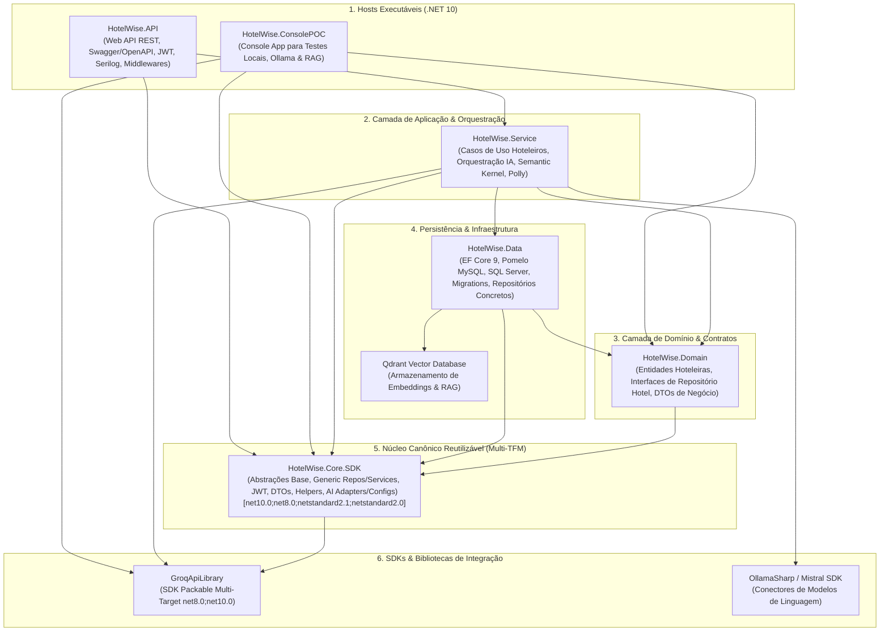

# Diretrizes para Ajuste de Issues e Code Smells — Backend (HotelWise)

**Documento:** Guia operacional específico da solução backend HotelWise  
**Solução:** [HotelWiseAPI.sln](file:///c:/git/HotelWise/HotelWiseAPI/HotelWiseAPI.sln)  
**Target Framework:** `.NET 10` (`net10.0` / Multi-target `net8.0;net10.0;netstandard2.1;netstandard2.0` no `HotelWise.Core.SDK` e `net8.0;net10.0` no `GroqApiLibrary`)  
**Guia-Base Genérico:** [Diretrizes-CodeSmell-Backend-Generico.md](file:///c:/git/HotelWise/HotelWiseAPI/DOCUMENTACAO/COVERAGE%20AND%20TEST/Diretrizes-CodeSmell-Backend-Generico.md)  
**Diretrizes de Cobertura:** [Diretrizes-Coverage-Backend-HotelWise.md](file:///c:/git/HotelWise/HotelWiseAPI/DOCUMENTACAO/COVERAGE%20AND%20TEST/Diretrizes-Coverage-Backend-HotelWise.md)  
**Data da Revisão:** 2026-08-29  

---

## 1. Contexto Arquitetural e Governança no HotelWise

A solução **HotelWise Backend** (`HotelWiseAPI.sln`) é estruturada segundo os princípios de Clean Architecture e Modularidade Canônica, integrando serviços de hospitalidade, um núcleo transversal desacoplado (`HotelWise.Core.SDK`), orquestração de Inteligência Artificial generativa (LLMs/SLMs), recuperação aumentada por geração (RAG vetorial) e persistência relacional:



### 1.1 Inventário de Projetos da Solução

| Projeto | Caminho | Tipo | TFM | Responsabilidade Principal |
| ------- | ------- | ---- | --- | -------------------------- |
| **HotelWise.Core.SDK** | `HotelWise.Core.SDK/` | Class Library (Packable) | `net10.0;net8.0;netstandard2.1;netstandard2.0` | **Núcleo canônico transversal reutilizável:** entidades base (`EntityBase`), DTOs de resposta (`ServiceResponse<T>`), interfaces, helpers, segurança JWT (`TokenService`), persistência genérica (`GenericRepositoryBase`), CRUD genérico (`GenericEntityServiceBase`), middlewares e adapters de IA/RAG. |
| **HotelWise.API** | `HotelWise.API/` | Web API | `net10.0` | Controllers REST, autenticação JWT, documentação Swagger/Scalar, injeção de dependência e health checks. |
| **HotelWise.Service** | `HotelWise.Service/` | Class Library | `net10.0` | Regras de negócio de reservas/hóspedes, orquestração de IA com Semantic Kernel, fluxos de RAG e resiliência via Polly. |
| **HotelWise.Domain** | `HotelWise.Domain/` | Class Library | `net10.0` | Entidades centrais de produto (Hotel, Room, Reservation), Value Objects, contratos de interfaces e validadores FluentValidation. |
| **HotelWise.Data** | `HotelWise.Data/` | Class Library | `net10.0` | Mapeamento relacional EF Core 9, Pomelo MySQL, SQL Server, repositórios concretos e migrações. |
| **GroqApiLibrary** | `GroqApiLibrary/` | Class Library (Packable) | `net8.0;net10.0` | SDK cliente para comunicação de alta performance com a API de inferência Groq Cloud. |
| **HotelWise.ConsolePOC** | `HotelWise.ConsolePOC/` | Console App | `net10.0` | Ambiente de experimentação e validação de embeddings, vetores Qdrant e inferência local via Ollama. |
| **HotelWise.Core.SDK.Tests** | `HotelWise.Core.SDK.Tests/` | Test Project (xUnit) | `net10.0` | Suíte de testes canônicos automatizados do Core.SDK com cobertura ≥ 90% via Coverlet. |

---

## 2. Padrões Específicos de Resolução de Code Smells no HotelWise

### 2.1 Gestão de Injeção de Dependências contra `csharpsquid:S107` (Muitos Parâmetros no Construtor)
- **Problema:** Serviços de orquestração de IA ou de gestão de reservas frequentemente acumulam dependências (repositórios de hóspedes, quartos, reservas, clientes LLM, vetores, cache, loggers), disparando `S107` (*Methods should not have too many parameters*).
- **Solução Arquitetural Homologada:**
  - Agrupar dependências coesas utilizando o padrão **Parameter Object / Context Configuration** (ex.: `ReservationServiceDependencies`, `AiOrchestrationOptions`).
  - Utilizar factories para instanciação de clientes de IA dinâmicos (`IAiClientFactory`).
  - **Regra:** Nunca suprimir `S107` com `#pragma warning disable`; refatorar agrupando dependências em modelos coesos no `HotelWise.Domain`.

---

### 2.2 Integração Resiliente de Modelos de IA (Semantic Kernel, Groq, Ollama)
- **Problema:** Chamadas assíncronas a APIs de inferência externa (Groq Cloud, Ollama Local, Mistral) sem tratamento adequado de timeouts, tokens de cancelamento ou com bloqueios síncronos (`.Result` / `.Wait()`) disparam `S2228`, `S3168` e `S4457`.
- **Solução Arquitetural Homologada:**
  - Sempre propagar `CancellationToken` em todas as operações de inferência e busca vetorial.
  - Aplicar políticas de resiliência com **Polly** (retries exponenciais e circuit breakers para provedores de LLM).
  - Nunca executar chamadas síncronas bloqueantes sobre tasks assíncronas.
  - Isolar segredos e chaves de API (Groq API Key, endpoints) via `IConfiguration` e User Secrets, eliminando `S6437` (*Hard-coded credentials*).

---

### 2.3 Persistência EF Core 9 e Multi-Database (MySQL Pomelo e SQL Server)
- **Problema:** Consultas LINQ com avaliação client-side forçada, falta de métodos assíncronos (`ToList()` em vez de `ToListAsync()`) ou vazamento de contextos de banco disparam `S2259` e `S2953`.
- **Solução Arquitetural Homologada:**
  - Utilizar exclusivamente métodos assíncronos do EF Core: `ToListAsync()`, `FirstOrDefaultAsync()`, `AnyAsync()`, `SaveChangesAsync()`.
  - Passar `CancellationToken` explicitamente em todas as operações do `HotelWiseDbContext`.
  - Garantir o isolamento de queries de leitura com `AsNoTracking()` para otimização de performance e memória.
  - Configurar índices adequados para buscas frequentes de reservas e hóspedes.

---

### 2.4 Biblioteca Packable Multi-Target (`GroqApiLibrary`)
- **Problema:** `GroqApiLibrary` é distribuível como pacote NuGet e deve suportar consumidores legados em .NET 8 e modernos em .NET 10 (`net8.0;net10.0`). O uso incondicional de APIs exclusivas do .NET 10 quebra o build do target .NET 8.
- **Solução Arquitetural Homologada:**
  - Utilizar diretivas de compilação condicional quando necessário:
    ```csharp
    #if NET8_0_OR_GREATER
        ArgumentNullException.ThrowIfNull(argument);
    #else
        if (argument is null) throw new ArgumentNullException(nameof(argument));
    #endif
    ```
  - Validar sempre a compilação multi-target com `dotnet pack` em modo Release.

---

### 2.5 Central Package Management (`Directory.Packages.props`)
- **Problema:** Discrepâncias de versões de pacotes NuGet entre projetos (ex.: versões incompatíveis de `Microsoft.Extensions.AI` ou `SemanticKernel`) causam conflitos de compilação `NU1107` / `NU1202`.
- **Solução Arquitetural Homologada:**
  - Todas as versões de pacotes devem ser gerenciadas centralmente no arquivo [Directory.Packages.props](file:///c:/git/HotelWise/HotelWiseAPI/Directory.Packages.props).
  - Os arquivos `.csproj` individuais devem conter apenas `<PackageReference Include="..." />` sem atributo `Version`.

---

### 2.6 Governança Canônica e Qualidade no `HotelWise.Core.SDK`
- **Problema:** Mistura de contratos de domínio hoteleiro no SDK transversal, quebra de compilação multi-TFM (`net10.0;net8.0;netstandard2.1;netstandard2.0`) ou permanência de shims `[Obsolete]` depreciados nos hosts.
- **Solução Arquitetural Homologada:**
  - **Isolamento Total de Domínio:** O Core.SDK contém apenas tipos genéricos (`EntityBase`, `ServiceResponse<T>`, `GenericRepositoryBase<T, TContext>`, `GenericEntityServiceBase<T, TDto>`, `TokenService`, adaptadores e fábricas de IA). Zero entidades ou DTOs de negócio de Hotel/Quarto/Reserva no SDK.
  - **Consumo Direto pelos Hosts:** Os projetos host (`Domain`, `Data`, `Service`, `API`) consomem diretamente `HotelWise.Core.SDK.*` (warnings e shims `HW_CORE_SDK_*` eliminados).
  - **Multi-TFM e Dependências Condicionais:** Dependências leves (JSON, Serilog) disponíveis em todos os TFMs; dependências modernas (EF Core, Semantic Kernel, ASP.NET Core) condicionadas a `net10.0` e `net8.0`.
  - **Documentação e Símbolos:** Geração de documentação XML (`GenerateDocumentationFile`) e pacote de símbolos (`.snupkg`) para distribuição NuGet profissional.

---

## 3. Configuração do Sonar e Exclusões Homologadas

Recomenda-se a seguinte configuração de exclusões no analisador estático para o HotelWise:

```properties
# Exclusões de análise geral
sonar.exclusions=**/Migrations/**,**/obj/**,**/bin/**,**/*.designer.cs,**/*.g.cs,**/artifacts/**,**/QdrantDockerFile/**,**/IA_Local/**,**/publish-test/**

# Exclusões de cobertura de código
sonar.coverage.exclusions=**/*Tests*/**,**/*ConsolePOC*/**,**/Program.cs,**/*Dto.cs,**/*Vo.cs,**/*Option*.cs,**/Migrations/**
```

> **Atenção:** Nunca adicionar exclusões arbitrárias para classes com regras de negócio (`HotelWise.Service`, `HotelWise.Domain` ou `HotelWise.Core.SDK`) com o objetivo de burlar métricas.

---

## 4. Procedimento Operacional de Saneamento no HotelWise

### Passo 1: Diagnóstico e Compilação com Roslyn Analyzers

```powershell
cd c:\git\HotelWise\HotelWiseAPI

# 1. Executar compilação em modo Release com warnings visíveis
dotnet build HotelWiseAPI.sln -c Release /p:TreatWarningsAsErrors=false

# 2. Executar verificação de formatação e análise estática Roslyn
dotnet format HotelWiseAPI.sln --verify-no-changes --verbosity diagnostic
```

---

### Passo 2: Aplicação das Correções

Aplicar refatorações limpas nos projetos afetados (`HotelWise.Core.SDK`, `HotelWise.Domain`, `HotelWise.Data`, `HotelWise.Service`, `HotelWise.API`, `GroqApiLibrary`), respeitando:
1. Padrões estabelecidos em [Diretrizes-CodeSmell-Backend-Generico.md](file:///c:/git/HotelWise/HotelWiseAPI/DOCUMENTACAO/COVERAGE%20AND%20TEST/Diretrizes-CodeSmell-Backend-Generico.md).
2. Não alteração de contratos públicos REST ou schemas de banco de dados sem alinhamento prévio.

---

### Passo 3: Validação da Suíte de Testes Automatizados

```powershell
# 1. Executar todos os testes automatizados da solução
dotnet test HotelWiseAPI.sln -c Release --no-build

# 2. Executar testes do Core.SDK com coleta de cobertura via Coverlet
dotnet test HotelWise.Core.SDK.Tests/HotelWise.Core.SDK.Tests.csproj -c Release /p:CollectCoverage=true /p:CoverletOutputFormat=opencover

# 3. Executar análise com coleta de cobertura global via Coverlet OpenCover
dotnet test HotelWiseAPI.sln -c Release /p:CollectCoverage=true /p:CoverletOutputFormat=opencover
```

---

### Passo 4: Validação de Empacotamento de SDKs Multi-Target

```powershell
# 1. Validar empacotamento do HotelWise.Core.SDK (net10.0 + net8.0 + netstandard2.1 + netstandard2.0)
dotnet pack HotelWise.Core.SDK/HotelWise.Core.SDK.csproj -c Release

# 2. Validar empacotamento multi-target do GroqApiLibrary (net8.0 + net10.0)
dotnet pack GroqApiLibrary/GroqApiLibrary.csproj -c Release
```

---

## 5. Checklist de Homologação

- [ ] `dotnet build HotelWiseAPI.sln -c Release` conclui com 0 erros e 0 warnings novos.
- [ ] Todos os testes automatizados da solução aprovados com 100% de sucesso (incluindo 79+ testes do `HotelWise.Core.SDK.Tests`).
- [ ] Central Package Management (`Directory.Packages.props`) íntegro sem versões inline nos `.csproj`.
- [ ] Multi-targeting do `HotelWise.Core.SDK` e `GroqApiLibrary` empacotando com sucesso (`dotnet pack`).
- [ ] Ausência de resíduos de shims `HW_CORE_SDK_*` e namespace legado `SmartDigitalPsico`.
- [ ] Métodos assíncronos do EF Core utilizando `CancellationToken`.
- [ ] Sem credenciais ou chaves de API hardcoded no código-fonte.
- [ ] Quality Gate do SonarQube/SonarCloud em conformidade (Rating A em Maintainability, Reliability e Security).

---

## 6. Referências Internas

- [HotelWiseAPI.sln](file:///c:/git/HotelWise/HotelWiseAPI/HotelWiseAPI.sln) — Solução principal backend
- [HotelWise.Core.SDK.Guide.md](file:///c:/git/HotelWise/HotelWiseAPI/DOCUMENTACAO/HotelWise.Core.SDK/HotelWise.Core.SDK.Guide.md) — Guia de referência técnica do Core.SDK
- [HotelWise.Core.SDK.Progresso.md](file:///c:/git/HotelWise/HotelWiseAPI/DOCUMENTACAO/HotelWise.Core.SDK/HotelWise.Core.SDK.Progresso.md) — Registro de progresso e consolidação do Core.SDK
- [Directory.Packages.props](file:///c:/git/HotelWise/HotelWiseAPI/Directory.Packages.props) — Gestão centralizada de pacotes NuGet
- [Diretrizes-CodeSmell-Backend-Generico.md](file:///c:/git/HotelWise/HotelWiseAPI/DOCUMENTACAO/COVERAGE%20AND%20TEST/Diretrizes-CodeSmell-Backend-Generico.md) — Guia genérico de Code Smells C#
- [Diretrizes-Coverage-Backend-HotelWise.md](file:///c:/git/HotelWise/HotelWiseAPI/DOCUMENTACAO/COVERAGE%20AND%20TEST/Diretrizes-Coverage-Backend-HotelWise.md) — Diretrizes de cobertura e testes backend HotelWise
- [2026-07-LevantamentoConjuntoHomologado-HotelWiseAPI.md](file:///c:/git/HotelWise/HotelWiseAPI/DOCUMENTACAO/API/2026-07-LevantamentoConjuntoHomologado-HotelWiseAPI.md) — Levantamento do ecossistema .NET 10
