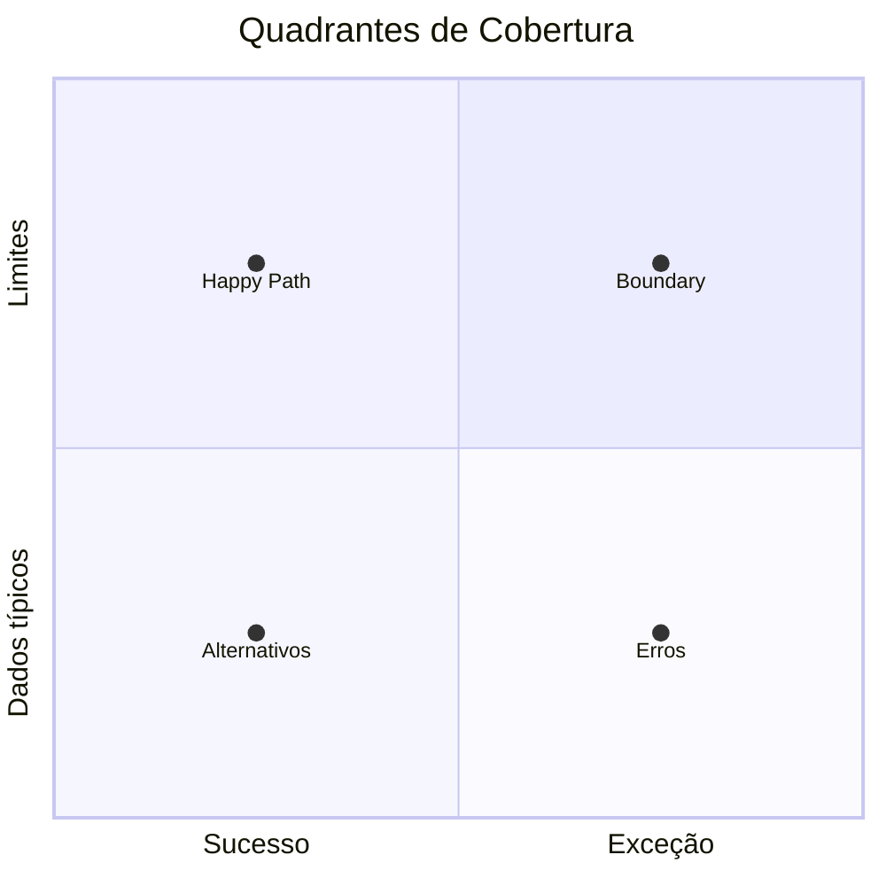

# Diretrizes para Testes Automatizados e Cobertura — Backend (Genérico C# / .NET)

**Documento:** Guia operacional reutilizável para engenharia de testes e metas de cobertura  
**Arquivo:** `Diretrizes-Coverage-Backend-Generico.md`  
**Escopo:** APIs, Domain, Services, Repositories, SDKs  
**Ferramental:** xUnit / NUnit, Moq, Moq.EntityFrameworkCore, Bogus, AwesomeAssertions (ou FluentAssertions), Coverlet, ReportGenerator, Testcontainers  
**Target:** .NET 10 / C# 13+ (SDKs multi-target quando aplicável)  
**Companheiro:** [Diretrizes-CodeSmell-Backend-Generico.md](./Diretrizes-CodeSmell-Backend-Generico.md)  
**Data da Revisão:** 2026-08-29  

---

## 1. Objetivo

1. **Cobertura de lógica de negócio** — linhas e ramos (`if` / `switch` / pattern matching / catch) cobertos por testes determinísticos.
2. **Independência** — testes autocontidos, idempotentes, seguros em paralelo.
3. **Legibilidade** — Arrange / Act / Assert (AAA) explícito.
4. **Dados realistas** — Bogus + boundary testing (evitar literais mágicos desnecessários).
5. **Dependências controladas** — Moq / Moq.EF Core com `ReturnsAsync` / `ThrowsAsync` / `Verify`.
6. **Asserções fluentes** — AwesomeAssertions (Apache-2.0) preferencial; `Assert.Multiple` / asserções agrupadas.
7. **SDKs** — meta canônica **≥ 90%** no escopo unit-testável; exclusões só para código que exige infra externa (documentadas em `.runsettings`).

---

## 2. Metas por tipo de projeto

| Tipo de projeto | Meta de linha/ramo | Observação |
| --------------- | ------------------ | ---------- |
| Domain / Service (regras de negócio) | **100%** do código testável | Excluir DTOs anêmicos se a política Sonar já os excluir |
| SDK / Core packable | **≥ 90%** unit-testável | Adapters live de rede/LLM via `.runsettings` |
| Data / Repositórios | **> 90%** | Preferir InMemory + Testcontainers para integração |
| API / Controllers | **> 85%** | `WebApplicationFactory` para smoke de pipeline |
| Console POC / scripts | **> 80%** ou exclusão Sonar | Não diluir Quality Gate do produto |

---

## 3. Padrões de Escrita

### 3.1 Nomenclatura (inglês)

```text
MethodUnderTest_Scenario_ExpectedResult
```

Exemplos:

- `GetByIdAsync_WhenEntityExists_ReturnsMappedDto`
- `CreateAsync_WhenPayloadIsInvalid_ThrowsValidationException`
- `GenerateEmbeddingAsync_WhenAdapterFails_PropagatesException`

### 3.2 Comentário de contexto (português)

```csharp
// Cenário: Recuperação de recurso inexistente.
// Objetivo: Garantir NotFoundException e que o mapper não seja chamado.
[Fact] // ou [Test] em NUnit
public async Task GetByIdAsync_WhenEntityDoesNotExist_ThrowsNotFoundException()
{
    // Arrange
    // Act
    // Assert
}
```

### 3.3 AAA

```csharp
// Cenário: Criação com e-mail já existente.
// Objetivo: Conflito de negócio; repositório não persiste.
[Fact]
public async Task CreateGuestAsync_WhenEmailAlreadyExists_ThrowsBusinessConflictException()
{
    // Arrange
    var guestDto = new Faker<GuestCreateDto>()
        .RuleFor(g => g.Email, f => f.Internet.Email())
        .Generate();

    _repo.Setup(r => r.ExistsByEmailAsync(guestDto.Email, It.IsAny<CancellationToken>()))
         .ReturnsAsync(true);

    // Act
    var act = async () => await _sut.CreateGuestAsync(guestDto, CancellationToken.None);

    // Assert
    await act.Should().ThrowAsync<BusinessConflictException>();
    _repo.Verify(r => r.InsertAsync(It.IsAny<Guest>(), It.IsAny<CancellationToken>()), Times.Never);
}
```

---

## 4. Ferramental

### 4.1 Bogus

- Preferir `Faker<T>` a strings fixas (`"teste"`, `"123"`) quando o valor não for parte da asserção.
- Cobrir limites: null, empty, max length, datas limítrofes.

### 4.2 Moq

- `ReturnsAsync` / `ThrowsAsync`
- `It.IsAny<CancellationToken>()`
- `Verify(..., Times.Once|Never)`

### 4.3 Moq.EntityFrameworkCore

```csharp
_dbContextMock.Setup(db => db.Rooms).ReturnsDbSet(_roomFaker.Generate(5));
```

### 4.4 SDKs e `.runsettings`

Excluir apenas conectores que **exigem** serviço externo em runtime:

```xml
<?xml version="1.0" encoding="utf-8" ?>
<RunSettings>
  <DataCollectionRunSettings>
    <DataCollectors>
      <DataCollector friendlyName="XPlat Code Coverage">
        <Configuration>
          <Format>opencover,cobertura</Format>
          <Exclude>[*]*.Adapters.*,[*]*.SemanticKernelProviderConfigure*</Exclude>
        </Configuration>
      </DataCollector>
    </DataCollectors>
  </DataCollectionRunSettings>
</RunSettings>
```

Documentar cada exclusão (motivo + data) no README do projeto de teste ou no guia do produto.

---

## 5. Matriz de Cenários (4 quadrantes)



1. **Happy path** — entrada válida, retorno esperado  
2. **Alternativos** — filtros, paginação, coleções vazias  
3. **Boundary** — null, empty, max, negativos, datas limite  
4. **Erros** — validação, not found, timeout, cancelamento, falha de LLM  

---

## 6. Anti-padrões em testes (também Code Smell)

| Evitar | Motivo | Preferir |
| ------ | ------ | -------- |
| `Thread.Sleep` | Flaky / smell Sonar | Sem sleep; ou `await Task.Delay` só se o SUT exigir tempo |
| Array literal repetido | CA1861 | `private static readonly T[]` |
| Ordem dependente entre testes | Não determinístico | Isolamento total |
| Mock “over-verify” | Fragilidade | Verificar efeitos observáveis |
| Cobrir só getters de DTO | Ruído | Excluir DTO/VO na política Sonar |

---

## 7. Roteiro de execução

```powershell
dotnet build <Solucao>.sln -c Release

dotnet test <Solucao>.sln -c Release --no-build `
  /p:CollectCoverage=true /p:CoverletOutputFormat=opencover /p:Threshold=90

dotnet test <ProjetoTeste>.csproj -c Release `
  --collect:"XPlat Code Coverage" --settings coverlet.runsettings

reportgenerator -reports:**/coverage.opencover.xml -targetdir:./CoverageReport -reporttypes:Html
```

---

## 8. Checklist de novo teste

- [ ] Nome `Metodo_Cenario_Resultado` (EN)
- [ ] Comentários `// Cenário:` e `// Objetivo:` (PT)
- [ ] Marcadores `// Arrange` / `// Act` / `// Assert`
- [ ] Dados via Bogus quando fizer sentido
- [ ] Mocks async + `Verify` quando a interação importa
- [ ] Asserções fluentes; múltiplas asserções agrupadas
- [ ] Sem `Thread.Sleep`; sem estado compartilhado mutável
- [ ] Meta de cobertura do tipo de projeto respeitada (sem exclusão arbitrária)
