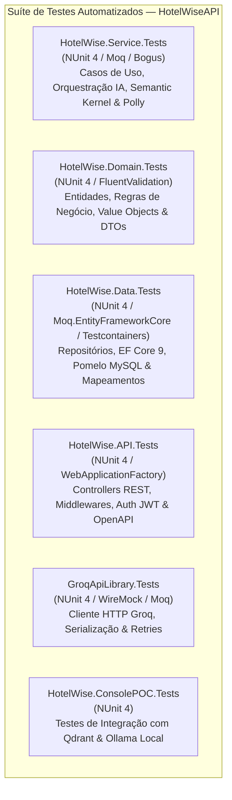

# Diretrizes para Testes Automatizados e Cobertura (Coverage) — Backend (HotelWise)

**Documento:** Guia operacional específico da suíte de testes e cobertura backend HotelWise  
**Solução:** [HotelWiseAPI.sln](file:///c:/git/HotelWise/HotelWiseAPI/HotelWiseAPI.sln)  
**Target Framework:** `.NET 10` (`net10.0` / Multi-target `net8.0;net10.0` no `GroqApiLibrary`)  
**Meta de Cobertura:** **100% de Linhas e Ramos em Lógica de Negócio (Domain / Service) e >90% Global**  
**Guia-Base Genérico:** [Diretrizes-Coverage-Backend-Generico.md](file:///c:/git/HotelWise/HotelWiseAPI/DOCUMENTACAO/COVERAGE%20AND%20TEST/Diretrizes-Coverage-Backend-Generico.md)  
**Diretrizes de Code Smells:** [Diretrizes-CodeSmell-Backend-HotelWise.md](file:///c:/git/HotelWise/HotelWiseAPI/DOCUMENTACAO/COVERAGE%20AND%20TEST/Diretrizes-CodeSmell-Backend-HotelWise.md)  
**Data da Revisão:** 2026-08-28  

---

## 1. Mapa Arquitetural da Suíte de Testes do HotelWise

A suíte de testes automatizados do **HotelWise Backend** é desenhada para cobrir as camadas da Clean Architecture, com foco especial nas regras de hospitalidade, persistência relacional e orquestração de Inteligência Artificial:



### 1.1 Detalhamento dos Projetos de Teste

| Projeto de Teste | Alvo / Escopo | Framework | Foco Principal e Metas de Cobertura |
| ---------------- | ------------- | --------- | ----------------------------------- |
| **`HotelWise.Service.Tests`** | `HotelWise.Service` | NUnit 4 | Casos de uso de reservas, check-in/check-out, orquestração de IA com Semantic Kernel, fluxos RAG, resiliência via Polly e regras hoteleiras (**Meta: 100%**). |
| **`HotelWise.Domain.Tests`** | `HotelWise.Domain` | NUnit 4 | Validação de entidades (Hóspede, Quarto, Reserva), validadores FluentValidation, Value Objects e contratos de interface (**Meta: 100%**). |
| **`HotelWise.Data.Tests`** | `HotelWise.Data` | NUnit 4 | Consultas LINQ assíncronas, repositórios de dados, DbContext EF Core 9, Pomelo MySQL, SQL Server e mapeamentos relacionais (**Meta: >90%**). |
| **`HotelWise.API.Tests`** | `HotelWise.API` | NUnit 4 | Integração de endpoints REST, serialização JSON, filtros de autenticação JWT, tratamento global de exceções e middlewares (**Meta: >85%**). |
| **`GroqApiLibrary.Tests`** | `GroqApiLibrary` | NUnit 4 | Chamadas de inferência Groq Cloud, autenticação por Bearer Token, serialização de payloads, timeouts e retries (**Meta: >95%**). |
| **`HotelWise.ConsolePOC.Tests`** | `HotelWise.ConsolePOC` | NUnit 4 | Operações de busca por similaridade vetorial (Qdrant Vector Data), geração de embeddings e conectores Ollama (**Meta: >80%**). |

---

## 2. Governança e Bibliotecas de Teste no HotelWise

### 2.1 Stack de Testes Padronizada (.NET 10)

Todas as dependências de teste são centralizadas no [Directory.Packages.props](file:///c:/git/HotelWise/HotelWiseAPI/Directory.Packages.props), garantindo integridade e conformidade de licenças:

- **`NUnit 4.x` / `NUnit3TestAdapter`:** Framework de execução e testes unitários.
- **`AwesomeAssertions 9.6.0`:** Biblioteca de asserções fluentes com licença Apache 2.0 (evitando riscos de licença do FluentAssertions 8+).
- **`Moq 4.20.72`:** Criação de mocks, stubs e verificação de chamadas de métodos.
- **`Moq.EntityFrameworkCore 9.0.0.10`:** Simulação precisa de `DbSet<T>` e queries LINQ assíncronas compatíveis com EF Core 9.
- **`Bogus 35.6.5`:** Geração dinâmica e determinística de massas de dados de teste (nomes, e-mails, documentos, tarifas).
- **`coverlet.collector 10.0.1` & `coverlet.msbuild 10.0.1`:** Coleta padronizada de cobertura no formato OpenCover.
- **`Testcontainers 4.x` (opcional para testes de integração):** Instanciação de contêineres Docker efêmeros (MySQL, SQL Server, Qdrant).

---

## 3. Gestão de Gaps de Cobertura e Exclusões Homologadas

### 3.1 Tratamento de Gaps de Cobertura
Ao analisar o relatório de cobertura gerado (`coverlet-gap-report.csv` ou OpenCover):
1. **Identificar métodos não cobertos:** Filtrar classes com `CoveragePct < 100%`.
2. **Priorizar Lógica de Negócio e Serviços:** Focar imediatamente em `HotelWise.Domain` e `HotelWise.Service`.
3. **Exclusões Válidas no Sonar:** Confirmar se o arquivo é um DTO puro, VO anêmico, classe de configuração ou migration antes de criar testes redundantes (conforme `sonar.coverage.exclusions`).

### 3.2 Exclusões Homologadas de Cobertura
```properties
sonar.coverage.exclusions=**/*Tests*/**,**/*ConsolePOC*/**,**/Program.cs,**/*Dto.cs,**/*Vo.cs,**/*Option*.cs,**/Migrations/**
```

---

## 4. Procedimento Operacional de Execução dos Testes

```powershell
cd c:\git\HotelWise\HotelWiseAPI

# 1. Compilar toda a solução em modo Release
dotnet build HotelWiseAPI.sln -c Release

# 2. Executar toda a suíte de testes automatizados
dotnet test HotelWiseAPI.sln -c Release --no-build

# 3. Executar suíte completa com coleta de cobertura via Coverlet
dotnet test HotelWiseAPI.sln -c Release /p:CollectCoverage=true /p:CoverletOutputFormat=opencover

# 4. Executar testes de um projeto específico isoladamente
dotnet test HotelWise.Service.Tests/HotelWise.Service.Tests.csproj -c Release /p:CollectCoverage=true /p:CoverletOutputFormat=opencover

# 5. Gerar relatório visual de cobertura HTML (se o ReportGenerator estiver instalado)
reportgenerator -reports:**/coverage.opencover.xml -targetdir:./CoverageReport -reporttypes:Html
```

---

## 5. Checklist de Homologação de Testes

- [ ] Todos os testes da solução executando e passando em modo Release com 100% de sucesso (0 falhas).
- [ ] Novos testes implementados seguindo a convenção tripartite `Metodo_Cenario_Resultado` em inglês.
- [ ] Comentários explicativos `// Cenário:` e `// Objetivo:` em português adicionados acima de cada método.
- [ ] Blocos `// Arrange`, `// Act`, `// Assert` demarcados explicitamente.
- [ ] Massa de dados dinamicamente instanciada via Bogus.
- [ ] Dependências mockadas via `Moq` e `Moq.EntityFrameworkCore`.
- [ ] Asserções com `AwesomeAssertions` e agrupamentos com `Assert.Multiple`.
- [ ] Métricas de cobertura dentro das metas estabelecidas (100% em Domain/Service).

---

## 6. Referências Internas

- [HotelWiseAPI.sln](file:///c:/git/HotelWise/HotelWiseAPI/HotelWiseAPI.sln) — Solução backend HotelWise
- [Directory.Packages.props](file:///c:/git/HotelWise/HotelWiseAPI/Directory.Packages.props) — Import centralizado de pacotes NuGet
- [Diretrizes-Coverage-Backend-Generico.md](file:///c:/git/HotelWise/HotelWiseAPI/DOCUMENTACAO/COVERAGE%20AND%20TEST/Diretrizes-Coverage-Backend-Generico.md) — Guia genérico de cobertura backend
- [Diretrizes-CodeSmell-Backend-HotelWise.md](file:///c:/git/HotelWise/HotelWiseAPI/DOCUMENTACAO/COVERAGE%20AND%20TEST/Diretrizes-CodeSmell-Backend-HotelWise.md) — Diretrizes de Code Smells backend HotelWise
- [2026-07-LevantamentoConjuntoHomologado-HotelWiseAPI.md](file:///c:/git/HotelWise/HotelWiseAPI/DOCUMENTACAO/API/2026-07-LevantamentoConjuntoHomologado-HotelWiseAPI.md) — Levantamento técnico da API
