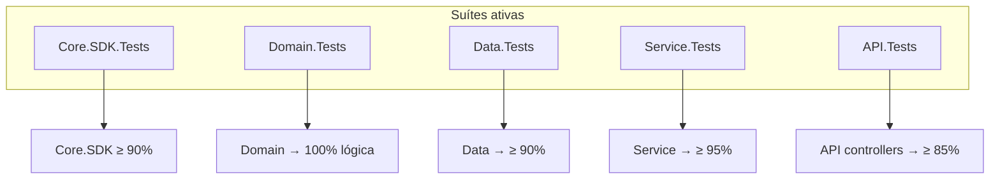

# Diretrizes para Testes Automatizados e Cobertura — Backend (HotelWise)

**Documento:** Guia operacional da suíte de testes e cobertura do backend HotelWise  
**Solução:** [`HotelWiseAPI.sln`](../../HotelWiseAPI.sln)  
**Target:** `.NET 10` nos hosts; Core.SDK multi-TFM `net10.0;net8.0;netstandard2.1;netstandard2.0`  
**Guia-base:** [Diretrizes-Coverage-Backend-Generico.md](./Diretrizes-Coverage-Backend-Generico.md)  
**Code Smells:** [Diretrizes-CodeSmell-Backend-HotelWise.md](./Diretrizes-CodeSmell-Backend-HotelWise.md)  
**Evidências Core.SDK:** [HotelWise.Core.SDK.Progresso.md](../HotelWise.Core.SDK/HotelWise.Core.SDK.Progresso.md)  
**Sonar:** [`sonar-project.properties`](../../sonar-project.properties)  
**Data da Revisão:** 2026-08-29  

---

## 1. Estado das Suítes

| Projeto de teste | Alvo | Framework | Status |
| ---------------- | ---- | --------- | ------ |
| `HotelWise.Core.SDK.Tests` | `HotelWise.Core.SDK` | xUnit | **Ativo** (≥ 90% unit-testável via Coverlet) |
| `HotelWise.Domain.Tests` | `HotelWise.Domain` | xUnit | **Ativo** (validators, mappers, models) |
| `HotelWise.Data.Tests` | `HotelWise.Data` | xUnit + EF InMemory | **Ativo** (repos + seed + model) |
| `HotelWise.Service.Tests` | `HotelWise.Service` | xUnit + Moq | **Ativo** (serviços e helpers com mocks) |
| `HotelWise.API.Tests` | `HotelWise.API` | xUnit + Moq | **Ativo** (controllers unitários) |

`ConsolePOC` e adapters live de LLM/Qdrant permanecem **fora** da meta de cobertura (exclusões Sonar/Coverlet).



---

## 2. Metas

| Alvo | Meta | Escopo |
| ---- | ---- | ------ |
| `HotelWise.Core.SDK` | **≥ 90%** line unit-testável | Após `coverlet.runsettings` |
| `HotelWise.Domain` | **100%** lógica testável | Validators / mappers / models |
| `HotelWise.Service` | **≥ 95%** | Moq; sem LLM/Qdrant reais |
| `HotelWise.Data` | **≥ 90%** | EF InMemory |
| `HotelWise.API` | **≥ 85%** | Controllers (serviços mockados) |
| Global Sonar | Quality Gate A | Respeitar `sonar.coverage.exclusions` |

---

## 3. Stack padronizada

| Pacote | Uso |
| ------ | --- |
| xUnit | Framework de testes (todas as suítes) |
| Moq | Mocks |
| FluentAssertions | Asserções |
| Microsoft.EntityFrameworkCore.InMemory | Data.Tests |
| Microsoft.AspNetCore.Mvc.Testing | Disponível no CPM (API; controllers unitários no 1º lote) |
| coverlet.collector / coverlet.msbuild | Cobertura |

Versões apenas via [`Directory.Packages.props`](../../Directory.Packages.props).

---

## 4. Exclusões Sonar / Coverlet

Arquivo: [`sonar-project.properties`](../../sonar-project.properties)

```properties
sonar.exclusions=**/Migrations/**,**/obj/**,**/bin/**,**/*.designer.cs,**/*.g.cs,**/artifacts/**,**/QdrantDockerFile/**,**/IA_Local/**,**/publish-test/**,**/*Tests*/**
sonar.coverage.exclusions=**/*Tests*/**,**/*ConsolePOC*/**,**/Program.cs,**/*Dto.cs,**/*Vo.cs,**/*Option*.cs,**/Migrations/**,**/AI/Adapters/**,**/SemanticKernelProviderConfigure.cs,**/ApplicationIAConfig.cs
```

Coverlet Core: [`HotelWise.Core.SDK.Tests/coverlet.runsettings`](../../HotelWise.Core.SDK.Tests/coverlet.runsettings) — adapters live / SK configure / ApplicationIAConfig.

---

## 5. Comandos

```powershell
cd c:\git\HotelWise\HotelWiseAPI

dotnet build HotelWiseAPI.sln -c Release

# Toda a solução
dotnet test HotelWiseAPI.sln -c Release

# Por projeto
dotnet test HotelWise.Domain.Tests/HotelWise.Domain.Tests.csproj -c Release
dotnet test HotelWise.Data.Tests/HotelWise.Data.Tests.csproj -c Release
dotnet test HotelWise.Service.Tests/HotelWise.Service.Tests.csproj -c Release
dotnet test HotelWise.API.Tests/HotelWise.API.Tests.csproj -c Release
dotnet test HotelWise.Core.SDK.Tests/HotelWise.Core.SDK.Tests.csproj -c Release `
  --collect:"XPlat Code Coverage" --settings HotelWise.Core.SDK.Tests/coverlet.runsettings

# Cobertura agregada
dotnet test HotelWiseAPI.sln -c Release /p:CollectCoverage=true /p:CoverletOutputFormat=cobertura
```

---

## 6. Checklist

- [ ] Todas as suítes verdes em Release
- [ ] Novos testes: `Metodo_Cenario_Resultado` (EN) + comentários PT + AAA
- [ ] Sem `Thread.Sleep`; mocks para IA/rede
- [ ] Exclusões Sonar aplicadas no projeto cloud (além do arquivo local)
- [ ] Evidências de % atualizadas após o scan Sonar (não hardcode eterno neste doc)

---

## 7. Referências

- [Diretrizes-Coverage-Backend-Generico.md](./Diretrizes-Coverage-Backend-Generico.md)
- [Diretrizes-CodeSmell-Backend-HotelWise.md](./Diretrizes-CodeSmell-Backend-HotelWise.md)
- [HotelWise.Core.SDK.Guide.md](../HotelWise.Core.SDK/HotelWise.Core.SDK.Guide.md)
- [HotelWise.Core.SDK.Progresso.md](../HotelWise.Core.SDK/HotelWise.Core.SDK.Progresso.md)
- [Directory.Packages.props](../../Directory.Packages.props)
- [sonar-project.properties](../../sonar-project.properties)
