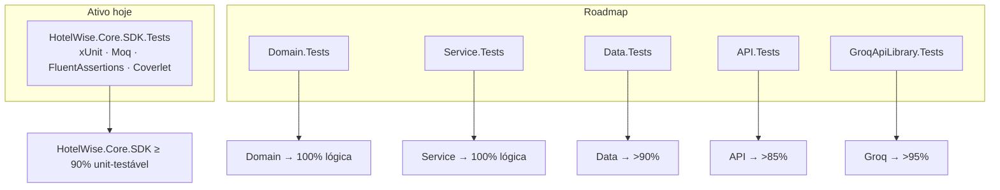

# Diretrizes para Testes Automatizados e Cobertura — Backend (HotelWise)

**Documento:** Guia operacional da suíte de testes e cobertura do backend HotelWise  
**Solução:** [`HotelWiseAPI.sln`](../../HotelWiseAPI.sln)  
**Target:** `.NET 10` nos hosts; Core.SDK multi-TFM `net10.0;net8.0;netstandard2.1;netstandard2.0`  
**Guia-base:** [Diretrizes-Coverage-Backend-Generico.md](./Diretrizes-Coverage-Backend-Generico.md)  
**Code Smells:** [Diretrizes-CodeSmell-Backend-HotelWise.md](./Diretrizes-CodeSmell-Backend-HotelWise.md)  
**Evidências de cobertura Core:** [HotelWise.Core.SDK.Progresso.md](../HotelWise.Core.SDK/HotelWise.Core.SDK.Progresso.md)  
**Data da Revisão:** 2026-08-29  

---

## 1. Estado Atual vs Roadmap

| Situação | Projetos |
| -------- | -------- |
| **Existente (obrigatório manter verde)** | `HotelWise.Core.SDK.Tests` (xUnit + Moq + FluentAssertions + Coverlet) |
| **Planejado (criar sob demanda de Quality Gate)** | `HotelWise.Domain.Tests`, `HotelWise.Service.Tests`, `HotelWise.Data.Tests`, `HotelWise.API.Tests`, `GroqApiLibrary.Tests` |

> Não inventar cobertura “fantasma”: só cite números de cobertura/contagem de testes que estejam atualizados em [Progresso](../HotelWise.Core.SDK/HotelWise.Core.SDK.Progresso.md) ou no último run Coverlet/CI.



---

## 2. Metas de Cobertura HotelWise

| Alvo | Meta | Escopo |
| ---- | ---- | ------ |
| `HotelWise.Core.SDK` | **≥ 90%** line (unit-testável) | Após exclusões do `coverlet.runsettings` |
| `HotelWise.Domain` / `HotelWise.Service` | **100%** lógica testável | Quando as suítes existirem |
| `HotelWise.Data` | **> 90%** | InMemory + (opcional) Testcontainers |
| `HotelWise.API` | **> 85%** | Controllers + middlewares via `WebApplicationFactory` |
| `GroqApiLibrary` | **> 95%** | Cliente HTTP (WireMock/Moq) |
| Global Sonar | Quality Gate A | Respeitar `sonar.coverage.exclusions` |

---

## 3. `HotelWise.Core.SDK.Tests` (suíte canônica)

### 3.1 Stack efetiva do projeto

| Pacote | Uso |
| ------ | --- |
| xUnit | Framework de testes |
| Moq | Mocks |
| FluentAssertions | Asserções fluentes |
| Microsoft.EntityFrameworkCore.InMemory | Repositório genérico / DbContext |
| coverlet.collector + coverlet.msbuild | Cobertura |

> Novo código de teste no Core deve seguir o guia genérico (AAA, nomenclatura EN, comentários PT). Bogus/AwesomeAssertions podem ser adotados em suítes novas de host; no Core, manter alinhado ao `.csproj` atual salvo decisão explícita de migração.

### 3.2 Organização sugerida

| Pasta | Conteúdo |
| ----- | -------- |
| `Domain/` | Fundamentos, DTOs, constants, helpers, middlewares, abstrações AI |
| `Infrastructure/` | `GenericRepositoryBase`, ModelBuilder |
| `Services/` | `GenericEntityServiceBase`, factories de inferência |
| `Consolidation/` | Gaps e regressão de cobertura pós-extração |

### 3.3 Exclusões Coverlet homologadas

Arquivo: [`HotelWise.Core.SDK.Tests/coverlet.runsettings`](../../HotelWise.Core.SDK.Tests/coverlet.runsettings)

| Exclusão | Motivo |
| -------- | ------ |
| `AI/Adapters/*` | Requer vector store / LLM live |
| `SemanticKernelProviderConfigure` | Wiring SK + Qdrant em runtime |
| `ApplicationIAConfig` | Bootstrap de configs ligadas a serviços externos |

**Não** excluir `GenericRepositoryBase`, `GenericEntityServiceBase`, `TokenService`, middlewares HTTP ou helpers.

### 3.4 Comando canônico

```powershell
cd c:\git\HotelWise\HotelWiseAPI

dotnet test HotelWise.Core.SDK.Tests/HotelWise.Core.SDK.Tests.csproj -c Release `
  --collect:"XPlat Code Coverage" `
  --settings HotelWise.Core.SDK.Tests/coverlet.runsettings
```

CI de referência: `.github/workflows/core-sdk.yml` (restore → build → test Coverlet → pack).

---

## 4. Governança e exclusões Sonar

```properties
sonar.coverage.exclusions=**/*Tests*/**,**/*ConsolePOC*/**,**/Program.cs,**/*Dto.cs,**/*Vo.cs,**/*Option*.cs,**/Migrations/**
```

Ao fechar gaps:

1. Priorizar Domain/Service/Core (não DTO anêmico já excluído).
2. Confirmar se o arquivo está em `sonar.coverage.exclusions` antes de escrever teste cosmética.
3. Qualquer exclusão **nova** no Coverlet exige justificativa neste documento + revisão.

---

## 5. Roadmap de suítes de host (quando criar)

| Projeto | Framework sugerido | Foco inicial |
| ------- | ------------------ | ------------ |
| `HotelWise.Domain.Tests` | NUnit 4 ou xUnit (escolher um por solução; documentar) | FluentValidation, regras de entidade |
| `HotelWise.Service.Tests` | Idem | Casos de uso, Polly, orquestração IA com mocks |
| `HotelWise.Data.Tests` | Idem + Moq.EF / Testcontainers | Repositórios, mapeamentos |
| `HotelWise.API.Tests` | `WebApplicationFactory` | Auth JWT, middlewares, health |
| `GroqApiLibrary.Tests` | WireMock / HttpMessageHandler fake | Serialização, retries, erros HTTP |

Dependências novas → apenas via [`Directory.Packages.props`](../../Directory.Packages.props).

---

## 6. Procedimento operacional (solução)

```powershell
cd c:\git\HotelWise\HotelWiseAPI

dotnet build HotelWiseAPI.sln -c Release

# Suíte existente
dotnet test HotelWise.Core.SDK.Tests/HotelWise.Core.SDK.Tests.csproj -c Release `
  --collect:"XPlat Code Coverage" --settings HotelWise.Core.SDK.Tests/coverlet.runsettings

# Toda a solução (quando houver mais projetos de teste)
dotnet test HotelWiseAPI.sln -c Release --no-build

# Relatório HTML (opcional)
reportgenerator -reports:**/coverage.cobertura.xml -targetdir:./CoverageReport -reporttypes:Html
```

---

## 7. Anti-padrões específicos (vistos no Sonar)

| Evitar no HotelWise | Preferir |
| ------------------- | -------- |
| `Thread.Sleep` em teste | Remover delay ou `await Task.Delay` em teste async |
| `new float[] { … }` / `new[] { … }` repetido | `private static readonly` |
| Tipar variável de teste só como interface sem ganho | Tipo concreto da implementação sob teste |
| Teste que sobe Ollama/Qdrant sem container | Exclusão Coverlet **ou** Testcontainers explícito |

---

## 8. Checklist de Homologação

- [ ] `HotelWise.Core.SDK.Tests` 100% verde em Release
- [ ] Line coverage Core ≥ 90% com o `coverlet.runsettings` atual
- [ ] Novos testes: nomenclatura EN + comentários PT + AAA
- [ ] Sem `Thread.Sleep`; arrays estáticos quando CA1861 aplicar
- [ ] Exclusões Coverlet/Sonar sem expansão arbitrária
- [ ] Números de evidência atualizados em [Progresso](../HotelWise.Core.SDK/HotelWise.Core.SDK.Progresso.md) quando o lote mudar a cobertura
- [ ] Pack + CI Core.SDK intactos após mudanças de teste

---

## 9. Referências

- [Diretrizes-Coverage-Backend-Generico.md](./Diretrizes-Coverage-Backend-Generico.md)
- [Diretrizes-CodeSmell-Backend-HotelWise.md](./Diretrizes-CodeSmell-Backend-HotelWise.md)
- [HotelWise.Core.SDK.Guide.md](../HotelWise.Core.SDK/HotelWise.Core.SDK.Guide.md)
- [HotelWise.Core.SDK.Progresso.md](../HotelWise.Core.SDK/HotelWise.Core.SDK.Progresso.md)
- [Directory.Packages.props](../../Directory.Packages.props)
- [coverlet.runsettings](../../HotelWise.Core.SDK.Tests/coverlet.runsettings)
