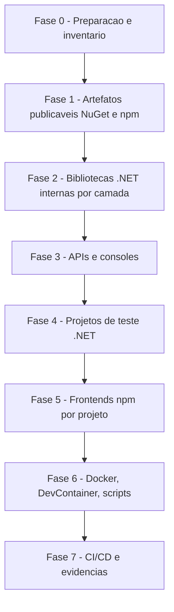

# Guia Genérico — Atualização de Pacotes (.NET NuGet e Frontend npm)

**Documento:** Guia operacional reutilizável
**Baseado em:** `Documentation/Features/FEITOS/UpdateDotNet10/RascunhoPlanoUpdateDotNet10.md`, `PlanoAcaoMigracaoDotNet10.md` e `RelatorioMigracaoDotNet10.md`
**Data:** 2026-07-14
**Aplicabilidade:** Qualquer ciclo de atualização de dependências deste repositório (rotina mensal, upgrade de major, migração de runtime/framework). Aplicar a seção de npm somente quando existirem projetos frontend no repositório.

---

## 1. Objetivo

Padronizar como atualizar dependências de pacotes em todo o repositório, preservando:

- Compatibilidade dos artefatos distribuídos externamente (pacotes NuGet e npm publicáveis) com consumidores em versões anteriores
- Integridade de migrations, seeds, contratos de API e schemas
- Funcionamento de APIs, consoles, DI, logging, telemetria e middlewares
- Build local, Docker, DevContainer e pipelines CI/CD
- Zero alteração de regra de negócio ou contrato público durante o ciclo de atualização

Este guia é genérico: as versões concretas de cada ciclo devem ser registradas em um documento filho por execução (o "Conjunto Homologado" daquele ciclo — ver Seção 5), nunca hardcoded aqui.

---

## 2. Escopo e não escopo

### 2.1 Escopo

| Categoria | Ação |
| --------- | ---- |
| Projetos .NET (bibliotecas, APIs, testes, consoles) | Atualizar pacotes NuGet; atualizar TFM apenas em ciclos de migração de runtime |
| Pacotes NuGet publicáveis (SDKs) | Atualizar preservando multi-targeting e consumidores legados |
| Projetos npm (apps frontend e SDKs TypeScript), quando existirem | Atualizar `dependencies`/`devDependencies`, respeitando `engines`, `peerDependencies` e `overrides` |
| Dockerfiles, docker-compose, DevContainer | Atualizar imagens base somente quando o ciclo envolver mudança de runtime |
| Scripts (PowerShell/Shell/Node) com paths ou versões hardcoded | Atualizar referências |
| Pipelines CI/CD | Alinhar versão de SDK .NET / Node.js |

### 2.2 Não escopo

- Alteração de regras de negócio, contratos REST, payloads JSON ou schemas de banco sem necessidade técnica
- Refatoração de domínio ou preferências arquiteturais não relacionadas à atualização
- Reescrita de testes além do necessário para compilar/executar nas novas versões
- Troca de bibliotecas por equivalentes (isso é decisão arquitetural separada, com RFC própria)

Qualquer mudança fora do escopo deve ser registrada e tratada em PR separado.

---

## 3. Princípios obrigatórios (valem para NuGet e npm)

1. **Inventário antes de alterar** — nunca atualizar sem primeiro gerar a lista do que está desatualizado e vulnerável (Seção 4).
2. **Conjunto Homologado por ciclo** — cada ciclo de atualização produz uma tabela "pacote / versão atual / versão a aplicar / latest disponível / justificativa quando não for a latest". Só entram versões estáveis (sem `preview`, `rc`, `beta`, `next`, `canary`) em produção.
3. **Atualizar por blocos coesos, nunca pacote a pacote isolado** — pacotes do mesmo ecossistema sobem juntos (ex.: todos `Microsoft.AspNetCore.*` no mesmo patch; todos `@angular/*` na mesma minor; toda a família `jest*` alinhada).
4. **Respeitar dependências rígidas do grafo** — quando um pacote trava a major de outro (ex.: provider de banco travando a major do ORM; `peerDependencies` de uma lib de UI travando a major do framework), documentar a trava e NÃO forçar a latest. Registrar a condição de destrave para o próximo ciclo ("Conjunto v2 futuro").
5. **Abordagem incremental por fases** — validar build/teste ao final de cada fase; nunca alterar tudo de uma vez.
6. **Centralização de versões** — .NET usa Central Package Management (`Directory.Packages.props` como fonte única; `.csproj` sem atributo `Version`). npm usa o `package.json` de cada projeto + lockfile commitado; `overrides` para forçar versões transitivas quando necessário.
7. **Não remover compatibilidade dos artefatos publicáveis** — SDKs NuGet mantêm multi-targeting (`TargetFrameworks` com os TFMs suportados); SDKs npm mantêm `engines` e ranges de `peerDependencies` compatíveis com os consumidores atuais (só estreitar range em major bump consciente do pacote).
8. **Branch dedicada com commits por fase** — ex.: `chore/update-packages-YYYY-MM` ou `feature/migration-<runtime>`.
9. **Major bump exige atenção individual** — ler changelog/breaking changes antes de aplicar; um major de terceiro (ex.: compactação, sanitizer, lib de teste) nunca sobe "de carona" no lote.
10. **Nenhuma migration/schema novo por causa de atualização** — se a atualização gerar migration não-vazia ou diff de schema, investigar antes de commitar.

---

## 4. Fase de inventário (sempre a primeira)

### 4.1 .NET / NuGet

```powershell
cd backend
dotnet --list-sdks
dotnet list SmartCoreHub.sln package --outdated
dotnet list SmartCoreHub.sln package --vulnerable --include-transitive
dotnet list SmartCoreHub.sln package
```

Gerar tabelas:

| Projeto | Tipo | TFM atual | Publicável? |
| ------- | ---- | --------- | ----------- |

| Pacote | Versão atual | Latest stable | Versão a aplicar | Justificativa se diferente da latest |
| ------ | ------------ | ------------- | ---------------- | ------------------------------------ |

### 4.2 Frontend / npm (quando projetos existirem)

Localizar os projetos: todo diretório com `package.json` que não seja `node_modules`. Estado atual deste repositório (revalidar a cada ciclo):

| Projeto | Caminho | Stack | Publicável? |
| ------- | ------- | ----- | ----------- |
| smartcorehubui | `frontend/` | Angular + Material/PrimeNG + Jest | Não (app) |
| frontend-public-react | `landingpage/frontend-public-react/` | React + Vite + Jest | Não (app) |
| @smartcorehub/localization-sdk | `frontendsdk/LocalizationSdkTypeScript/` | TypeScript + tsup + Jest | **Sim (npm público)** |
| exampleangular | `landingpage/frontendsdkexample/LocalizationSdk/exampleangular/` | Angular (exemplo) | Não (exemplo) |

Comandos por projeto:

```powershell
cd <pasta-do-projeto>
node --version            # deve satisfazer "engines" do package.json
npm outdated
npm audit --omit=dev      # vulnerabilidades de produção primeiro
npm ls --depth=0
```

Gerar a mesma tabela de Conjunto Homologado (pacote / atual / latest / aplicar / justificativa).

---

## 5. Conjunto Homologado — regras de montagem

### 5.1 Blocos .NET (modelo)

Organizar o conjunto em blocos, na ordem de dependência:

- **Bloco A — Plataforma** (`Microsoft.AspNetCore.*`, `Microsoft.Extensions.*`, `System.Text.Json`): todos no MESMO patch do ciclo do runtime alvo.
- **Bloco B — Persistência** (`Microsoft.EntityFrameworkCore.*` + providers `Pomelo`, `Npgsql`, `SqlServer`, `InMemory` + mocks de EF): todos na MESMA major, limitada pela major suportada pelo provider mais restritivo. Documentar a trava (ex.: "Pomelo X exige EF <= X") e a condição de destrave.
- **Bloco C — OpenAPI, logging, telemetria** (Swashbuckle/Scalar, Serilog e sinks, Application Insights/OpenTelemetry): Swashbuckle segue a major do ASP.NET Core.
- **Bloco D — Domínio, utilitários e integrações** (FluentValidation, AutoMapper, Newtonsoft, Dapper, Polly, Azure.*, Mongo, Redis, etc.): latest estável, com atenção a licenças em majors novos (ex.: AutoMapper 15+ e MediatR 13+ são dual-licensed).
- **Bloco E — Testes** (Test.Sdk, NUnit/xunit, Moq, FluentAssertions, coverlet, Testcontainers): latest estável; mocks acoplados a EF seguem o Bloco B.

Dependências rígidas típicas (validar a cada ciclo):

| Se usar | Então obrigatoriamente |
| ------- | ---------------------- |
| Provider de banco na major N | Todos `Microsoft.EntityFrameworkCore.*` na major N |
| Runtime `netX.0` em Web API | Todos `Microsoft.AspNetCore.*` no patch do ciclo X |
| Qualquer `Microsoft.AspNetCore.*` X.y | `Microsoft.Extensions.*` e `System.Text.Json` no mesmo X.y |
| Swashbuckle major M | ASP.NET Core compatível com M (não segurar major antiga) |

Aplicação: todas as versões entram/atualizam em `backend/Directory.Packages.props`; `.csproj` permanecem sem `Version=` (exceção documentada: projetos `*.ConsoleTest.Nuget` que fixam versão do pacote publicado, com centralização desabilitada localmente).

### 5.2 Blocos npm (modelo)

- **Bloco F — Framework** (`@angular/*` + `zone.js` + `@angular-devkit/*` + `@angular/cli`; ou `react` + `react-dom` + `@types/react*` + plugin Vite): mesma major/minor entre si. Angular: usar `ng update @angular/core@<major> @angular/cli@<major>` (aplica schematics de migração) em vez de editar o `package.json` na mão em major bump.
- **Bloco G — UI e ecossistema** (Material/CDK, PrimeNG/primeuix, bootstrap, ngx-translate, i18next/react-i18next): PrimeNG e Material seguem a major do Angular; conferir `peerDependencies` antes de subir.
- **Bloco H — Build e tooling** (typescript, vite/tsup, eslint + plugins, ts-node): TypeScript limitado ao range suportado pelo framework (Angular trava a versão do TS por release; conferir antes de subir).
- **Bloco I — Testes** (jest + jest-environment-jsdom + jest-preset-angular/ts-jest + reporters + @types/jest + jsdom): família jest alinhada na mesma major; `jest-preset-angular` segue a major do Angular.
- **Overrides**: revisar o campo `overrides` a cada ciclo — remover os que ficaram obsoletos (a versão forçada já virou a resolvida) e manter os de alinhamento (`$@angular/core` etc.).

Regras npm:

1. Atualizar via `npm install <pkg>@<versao-exata-homologada>` ou editando o `package.json` + `npm install` — SEMPRE commitar o `package-lock.json` resultante.
2. `npm audit fix` sem `--force`; correções que exijam major passam pelo fluxo de major bump (changelog + teste dirigido).
3. Respeitar/atualizar `engines.node` em conjunto com a versão de Node dos pipelines e DevContainer.
4. Para o SDK publicável (`@smartcorehub/localization-sdk`): `peerDependencies` só estreitam range em major do SDK; validar `npm pack` e o conteúdo de `dist/` (ESM/CJS/UMD/types) após qualquer bump de `tsup`/`typescript`.

---

## 6. Plano de execução por fases



- **Fase 0 — Preparação**: branch dedicada; inventário (Seção 4); montar Conjunto Homologado (Seção 5); commit baseline com build e testes verdes no estado atual.
- **Fase 1 — Publicáveis primeiro**: SDKs NuGet (multi-target) e SDK npm. São os artefatos com consumidores externos: qualquer quebra aparece aqui e barata. Validar `dotnet pack` (pastas `lib/<tfm>/` esperadas) e `npm pack`.
- **Fase 2 — Bibliotecas internas .NET**: ordem de dependência das camadas (ex.: Core.SDK → Domain → Infrastructure → Service), com build parcial por projeto.
- **Fase 3 — APIs e consoles**: aplicar blocos A/C; startup manual de cada API (checklist 7.4).
- **Fase 4 — Testes .NET**: Bloco E; suíte completa com cobertura (meta do repositório: >= 80%).
- **Fase 5 — Frontends npm**: um projeto por vez (app admin, landing page, exemplos), cada um com `npm install` + lint + testes + build de produção antes de passar ao próximo.
- **Fase 6 — Containers e scripts**: somente se o ciclo mudou runtime (.NET/Node): imagens base dos Dockerfiles, DevContainer, scripts com paths `bin/Debug/netX.0` ou versões de Node hardcoded.
- **Fase 7 — CI/CD e evidências**: versão de SDK .NET (`UseDotNet@2`) e de Node nos pipelines; gerar relatório final (Seção 9).

---

## 7. Checklist de validação

### 7.1 .NET — build e restore

```powershell
cd backend
dotnet restore SmartCoreHub.sln
dotnet build SmartCoreHub.sln -c Release
```

- [ ] Restore sem `NU1107` (conflito de versão) e `NU1202` (TFM incompatível)
- [ ] Build Release com 0 erros; warnings novos de obsolescência corrigidos ou justificados (`TreatWarningsAsErrors` onde já existe)
- [ ] Warnings `NU1510` (PackageReference redundante) anotados para limpeza em PR separado

### 7.2 .NET — testes

```powershell
dotnet test SmartCoreHub.sln -c Release --no-build
dotnet test SmartCoreHub.sln -c Release /p:CollectCoverage=true /p:CoverletOutputFormat=opencover
```

- [ ] 100% dos testes passando
- [ ] Cobertura >= 80% (ou regressão justificada)

### 7.3 .NET — EF Core / migrations

```powershell
cd backend
dotnet ef migrations list --project Implementations/SmartCoreHub.Infrastructure/SmartCoreHub.Infrastructure.csproj --startup-project APIs/SmartCoreHub.API/SmartCoreHub.API.csproj
dotnet ef database update  --project Implementations/SmartCoreHub.Infrastructure/SmartCoreHub.Infrastructure.csproj --startup-project APIs/SmartCoreHub.API/SmartCoreHub.API.csproj
```

- [ ] `migrations list` e `database update` em banco limpo sem erro
- [ ] Técnica da migration temporária: gerar migration `ValidacaoPosUpdate`; se vier com `Up`/`Down` VAZIOS, a atualização não alterou schema (esperado) — remover com `dotnet ef migrations remove --force`. Se vier não-vazia, investigar antes de commitar
- [ ] Seeds consistentes

### 7.4 .NET — execução das APIs

```powershell
dotnet run --project APIs/SmartCoreHub.API/SmartCoreHub.API.csproj
dotnet run --project APIs/SmartCoreHub.Localization.API/SmartCoreHub.Localization.API.csproj
```

- [ ] Startup sem `InvalidOperationException` de DI (em Development, manter `ValidateScopes = true` e `ValidateOnBuild = true`)
- [ ] `GET /health` e `GET /health/ready` retornam 200
- [ ] Swagger acessível; headers de segurança e `X-Correlation-ID` presentes
- [ ] Logs sem segredos

### 7.5 .NET — pack dos SDKs publicáveis

```powershell
dotnet pack SDKs/SmartCoreHub.Localization.SDK/SmartCoreHub.Localization.SDK.csproj -c Release
dotnet pack SDKs/SmartCoreHub.ClientSDK/SmartCoreHub.CloudClientSDK.csproj -c Release
tar -tf <caminho>.nupkg | findstr "lib/net"
```

- [ ] Pacote contém uma pasta `lib/` por TFM declarado (ex.: `lib/net8.0/` e `lib/net10.0/`)
- [ ] Consumo validado nos `ConsoleTest.Nuget` (consumidor no TFM mais antigo suportado)

### 7.6 npm — por projeto frontend

```powershell
cd <pasta-do-projeto>
npm ci                    # valida lockfile integro do zero
npm run lint
npm test
npm run build:prod        # ou "npm run build" conforme scripts do projeto
```

- [ ] `npm ci` sem erros de peer dependency (`ERESOLVE`)
- [ ] Lint sem erros novos
- [ ] 100% dos testes passando
- [ ] Build de produção gera bundle sem erro; conferir tamanho do bundle contra o baseline (regressões grandes = investigar)
- [ ] `npm audit` sem vulnerabilidades high/critical em dependências de produção
- [ ] App sobe localmente (`npm start`/`npm run dev`) e telas principais carregam

### 7.7 npm — SDK publicável

```powershell
cd frontendsdk/LocalizationSdkTypeScript
npm run build:prod
npm pack --dry-run
npm test
```

- [ ] `dist/` contém as saídas esperadas (ESM, CJS, UMD min, `.d.ts`)
- [ ] `peerDependencies` continuam compatíveis com os consumidores (apps do repositório e externos)
- [ ] Smoke test manual (`npm run manual:smoke`) contra API local

---

## 8. Docker, DevContainer, scripts e CI/CD (quando o runtime mudar)

| Item | O que verificar |
| ---- | --------------- |
| Dockerfiles backend | `mcr.microsoft.com/dotnet/aspnet:<versao>` e `sdk:<versao>`; manter usuário non-root, volumes, `UseAppHost=false` |
| Dockerfiles/pipelines frontend | Imagem/task de Node alinhada ao `engines.node` dos `package.json` |
| DevContainer | `mcr.microsoft.com/devcontainers/dotnet:<versao>`; `postCreateCommand` funciona; `dotnet --version` e `node --version` corretos |
| docker-compose | `docker compose build --no-cache && docker compose up -d`; containers healthy |
| Pipelines Azure DevOps | `UseDotNet@2` com `version: '<X>.x'`; task de Node com a versão homologada; paths dos projetos corretos |
| Scripts | Buscar por versões hardcoded: `net8.0`, `net10.0`, `node:2x`, paths `bin/Debug/` em `scripts/`, `*.ps1`, `*.sh` |

---

## 9. Evidências obrigatórias da entrega

1. **Conjunto Homologado do ciclo** — tabela final aplicada (NuGet + npm), com justificativas das versões seguradas e a lista de travas para o próximo ciclo ("Conjunto v2 futuro").
2. **Lista de arquivos alterados** — `Directory.Packages.props`, `.csproj`, `package.json` + lockfiles, Dockerfiles, DevContainer, pipelines, scripts.
3. **Relatório quantitativo:**

```text
Projetos .NET atualizados: N
Pacotes NuGet atualizados: N
Projetos npm atualizados: N
Pacotes npm atualizados: N
Testes .NET executados/passando: N/N
Testes npm executados/passando: N/N
Vulnerabilidades resolvidas: N
Falhas encontradas/corrigidas: N/N
```

4. **Riscos residuais** — majors adiados, travas de grafo, warnings pendentes, consumidores externos a monitorar.

---

## 10. Plano de rollback

```powershell
git checkout <branch-do-ciclo>
git reset --hard <commit-baseline>

# .NET
cd backend
dotnet restore SmartCoreHub.sln && dotnet build SmartCoreHub.sln && dotnet test SmartCoreHub.sln

# npm (por projeto)
cd <pasta-do-projeto>
npm ci && npm test
```

Restaurar em conjunto: `Directory.Packages.props`, `.csproj`, `package.json` + `package-lock.json` (sempre os dois juntos — lockfile dessincronizado do manifest é estado inválido), Dockerfiles, DevContainer e pipelines.

---

## 11. Riscos e mitigações recorrentes

| Risco | Impacto | Mitigação |
| ----- | ------- | --------- |
| Provider trava major do ORM (ex.: Pomelo x EF) | Não é possível usar a latest do bloco | Segurar o bloco inteiro na major compatível; documentar destrave ("Conjunto v2") |
| Mistura de patches `Microsoft.*` | `NU1107`/restore instável | CPM (`Directory.Packages.props`) + bloco A no mesmo patch |
| Major bump silencioso de terceiro | Breaking em runtime | Major nunca sobe no lote; changelog + teste dirigido |
| `peerDependencies` incompatíveis (npm) | `ERESOLVE`/quebra em runtime | Subir framework e ecossistema (blocos F/G) juntos; `ng update` para Angular |
| Lockfile não commitado ou dessincronizado | Builds não reproduzíveis em CI | `npm ci` no checklist; lockfile sempre no mesmo commit do `package.json` |
| `overrides` obsoletos mascarando versões | Dependências presas em versões antigas | Revisar `overrides` a cada ciclo |
| Artefato publicável perde compatibilidade | Consumidores externos quebram | Multi-targeting NuGet + smoke test no TFM antigo; ranges de peer/engines no npm |
| `TreatWarningsAsErrors` + obsolescência nova | Build quebrado | Corrigir ou suprimir com justificativa na fase correspondente |
| Migration não-vazia pós-update | Alteração de schema não intencional | Técnica da migration temporária (7.3); investigar antes de commitar |
| Pipelines com SDK/Node desalinhado | CI vermelho ou build divergente do local | Fase 7 obrigatória; `engines.node` como fonte de verdade no npm |
| Licenciamento em majors novos (AutoMapper 15+, MediatR 13+) | Obrigação comercial/copyleft | Verificar licença antes de major bump; registrar decisão |

---

## 12. Modo de execução sugerido (para IA/agente)

1. Ler este guia e gerar o inventário completo (Seção 4) sem alterar nada.
2. Propor o Conjunto Homologado do ciclo (Seção 5) em documento filho `Documentation/Features/UpdatePackages/<AAAA-MM>-ConjuntoHomologado.md` e aguardar aprovação.
3. Executar por fases (Seção 6), commitando por fase, marcando os checklists (Seção 7).
4. Atualizar infraestrutura/CI apenas se o ciclo mudar runtime (Seção 8).
5. Entregar relatório final com evidências (Seção 9) e abrir PR.

---

## Referências

- `Documentation/Features/FEITOS/UpdateDotNet10/RascunhoPlanoUpdateDotNet10.md` — RFC original que deu origem a este guia
- `Documentation/Features/FEITOS/UpdateDotNet10/PlanoAcaoMigracaoDotNet10.md` — exemplo concreto de Conjunto Homologado por blocos e execução por fases
- `Documentation/Features/FEITOS/UpdateDotNet10/RelatorioMigracaoDotNet10.md` — exemplo de relatório de evidências e da técnica da migration temporária
- `backend/Directory.Packages.props` — fonte única de versões NuGet (CPM)
- `Documentation/Outros/EF-MIGRATIONS-HOWTO.md`, `Documentation/PROJECT_GUIDELINES.md`
