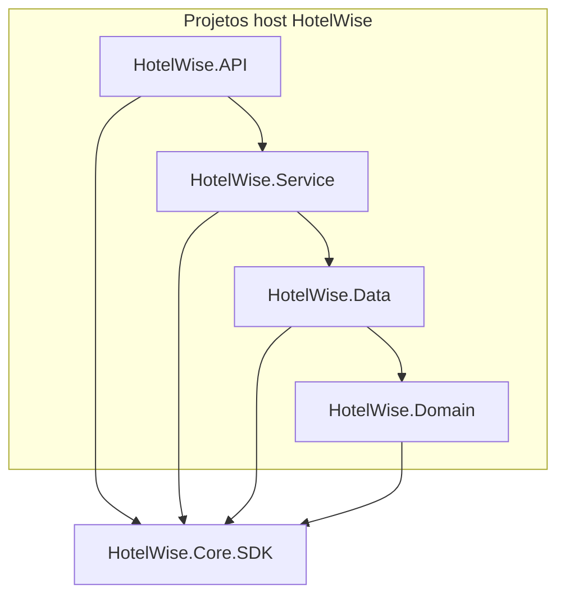
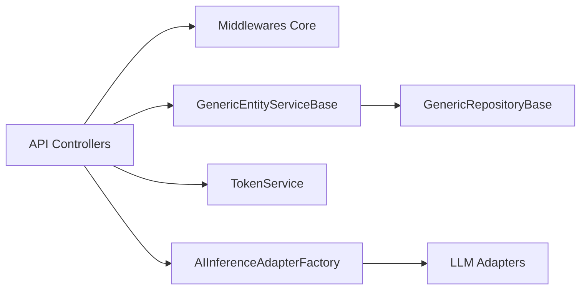

# Guia de Referência — HotelWise.Core.SDK

**Pacote:** `HotelWise.Core.SDK` `1.0.0`  
**TFM:** `net10.0;net8.0;netstandard2.1;netstandard2.0`  
**Host de referência:** HotelWise API (`net10.0`)

---

## 1. Introdução

### Objetivo do SDK

O **HotelWise.Core.SDK** é o núcleo reutilizável do ecossistema HotelWise: abstrações, helpers, infraestrutura genérica (EF/repos), segurança JWT, middlewares ASP.NET Core e o núcleo de IA (adapters LLM, RAG, Semantic Kernel).

Tipos específicos de hotel permanecem nos projetos host (`HotelWise.Domain`, `HotelWise.Data`, `HotelWise.Service`, `HotelWise.API`). O Core concentra o que é transversal e testável de forma isolada.

### Benefícios

| Benefício | Descrição |
| :--- | :--- |
| **Reutilização** | Um único NuGet para Domain/Data/Service/API e futuros hosts. |
| **Testes** | Suite `HotelWise.Core.SDK.Tests` com Coverlet (≥ 90% no escopo unit-testável). |
| **Evolução independente** | Versionamento semântico do pacote sem acoplar features de hotel. |
| **Documentação** | XML docs (`HotelWise.Core.SDK.xml`) + este guia. |
| **Multi-TFM** | Helpers leves em netstandard; ASP.NET/EF/SK em `net8.0`/`net10.0`. |

---

## 2. Arquitetura

### Estrutura de pastas e namespaces

```
HotelWise.Core.SDK/
├── Abstractions/          HotelWise.Core.SDK.Abstractions
├── Domain/                HotelWise.Core.SDK.Domain
├── Common/                HotelWise.Core.SDK.Common (+ Constants, Exceptions)
├── Infrastructure/        HotelWise.Core.SDK.Infrastructure (+ Middleware)
├── Services/              HotelWise.Core.SDK.Services
├── Security/              HotelWise.Core.SDK.Security
├── Helpers/               HotelWise.Core.SDK.Helpers
├── Extensions/            HotelWise.Core.SDK.Extensions
├── Logging/               HotelWise.Core.SDK.Logging
├── Validation/            HotelWise.Core.SDK.Validation
└── AI/
    ├── Abstractions/      HotelWise.Core.SDK.AI.Abstractions
    ├── Adapters/          HotelWise.Core.SDK.AI.Adapters
    ├── Configuration/     HotelWise.Core.SDK.AI.Configuration
    ├── Configure/         HotelWise.Core.SDK.AI.Configure
    ├── Constants/         HotelWise.Core.SDK.AI.Constants
    ├── DTO/               HotelWise.Core.SDK.AI.DTO
    ├── Enums/             HotelWise.Core.SDK.AI.Enums
    ├── Helpers/           HotelWise.Core.SDK.AI.Helpers
    ├── Services/          HotelWise.Core.SDK.AI.Services
    └── Validation/        HotelWise.Core.SDK.AI.Validation
```

### Relação host × Core.SDK



- Hosts referenciam o Core via `ProjectReference` (dev) ou pacote NuGet (consumo externo).
- Tipos migrados no host ficam como shims `[Obsolete(..., DiagnosticId = "HW_CORE_SDK_*")]` que herdam ou encapsulam o tipo Core.
- Código novo deve usar namespaces `HotelWise.Core.SDK.*` diretamente.

### Diagrama simplificado de camadas



---

## 3. Principais componentes

### Domain / Common

| Tipo | Responsabilidade |
| :--- | :--- |
| `EntityBase` / `EntityBaseWithNameEmail` | Bases de entidade com Id e auditoria. |
| `ServiceResponse<T>` / `ErrorResponse` | Envelope de resultado e erros de API/serviço. |
| `EntityDtoBase`, `SecurityDto`, DTOs de cultura/fuso | Contratos transversais. |
| Constantes (`AppConfigConstants`, `ValidatorConstants`, …) | Mensagens e chaves compartilhadas. |
| `AppWarningException` | Exceção de aviso (mapeada para HTTP 400 no middleware). |

### Data (infraestrutura EF)

| Tipo | Responsabilidade |
| :--- | :--- |
| `GenericRepositoryBase<T, TContext>` | CRUD genérico EF Core (`IGenericRepository<T>`). |
| `ModelBuilderExtensions` | Extensões de modelagem EF. |
| `HelperCharSet` | Charset padrão (`latin1`) para configuração de entidades. |

> Helpers de charset específicos do Pomelo/hotel permanecem no host (`ConfigurationEntitiesHelper`).

### Service

| Tipo | Responsabilidade |
| :--- | :--- |
| `GenericEntityServiceBase<T, TDto>` | CRUD + FluentValidation + AutoMapper + logging. |
| `TokenService` | Access JWT (HMAC-SHA512) e refresh token. |
| `AIInferenceService` / `AIInferenceAdapterFactory` | Orquestração e seleção de adapter LLM. |
| `GenericVectorStoreServiceBase` / `VectorStoreAdapterFactory` | Serviços e fábrica de vector store. |

### API (middlewares e integração)

| Tipo | Responsabilidade |
| :--- | :--- |
| `CorrelationIdMiddleware` | Propaga/gera `X-Correlation-ID` e enriquece LogContext. |
| `GlobalExceptionMiddleware` | JSON padronizado 400/500. |
| `RequestLoggingMiddleware` | Log de request/response. |
| `SecurityHelperApi` | Extrai user id do `ClaimsPrincipal`. |
| `ServiceCollectionConfigureCors` / `AppSettings` / `AutoMapper` | Helpers de DI. |
| `ConfigureServicesAI` / `SemanticKernelProviderConfigure` | Registro de IA e Kernel. |

---

## 4. Exemplos de uso

### CRUD genérico com `GenericEntityServiceBase`

```csharp
public class HotelService : GenericEntityServiceBase<Hotel, HotelDto>
{
    public HotelService(
        IGenericRepository<Hotel> repository,
        IMapper mapper,
        Serilog.ILogger logger,
        IValidator<Hotel> validator)
        : base(repository, mapper, logger, validator) { }
}

// Em um controller / handler:
service.SetUserId(userId);
var all = await service.GetAllAsync();
var one = await service.GetByIdAsync(id);
var created = await service.AddAsync(dto);
```

### Emissão de JWT com `TokenService`

```csharp
services.AddSingleton<ITokenConfigurationDto>(sp => /* bind TokenConfigurations */);
services.AddScoped<ITokenService, TokenService>();

var claims = new[]
{
    new Claim(ClaimTypes.NameIdentifier, userId.ToString()),
    new Claim(ClaimTypes.Name, userName),
    new Claim(ClaimTypes.Role, role)
};
var access = tokenService.GenerateAccessToken(claims);
var refresh = tokenService.GenerateRefreshToken();
var principal = tokenService.GetPrincipalFromExpiredToken(expiredAccess);
```

### Seleção dinâmica de LLM com `AIInferenceAdapterFactory`

```csharp
ConfigureServicesAI.RegisterGenericAiServices(services);
// + registro de IApplicationIAConfig e Kernel no host

var adapter = factory.CreateAdapter(InferenceAiAdapterType.GroqApi);
var reply = await adapter.GenerateChatCompletionAsync(messages);

// Ou via serviço:
var text = await aiInferenceService.GenerateChatCompletionAsync(
    messages, InferenceAiAdapterType.Ollama);
```

### Configuração de DI com `ServiceCollectionConfigure*`

```csharp
ServiceCollectionConfigureCors.Configure(services);
ServiceCollectionConfigureAppSettings.AddAndReturnTokenConfiguration(services, configuration);
ServiceCollectionConfigureAutoMapper.AddProfile<HotelProfile>(services);
ConfigureServicesAI.RegisterGenericAiServices(services);
```

Pipeline de middlewares (Program/Startup):

```csharp
app.UseMiddleware<CorrelationIdMiddleware>();
app.UseMiddleware<GlobalExceptionMiddleware>();
app.UseMiddleware<RequestLoggingMiddleware>();
```

---

## 5. Contexto de IA

### Adapters

| Adapter | Uso |
| :--- | :--- |
| `GroqApiAdapter` | Inferência via Groq API. |
| `MistralApiAdapter` | Inferência via Mistral. |
| `OllamaAdapter` | Modelos locais/remotos Ollama. |
| `SemanticKernelAdapter` | Chat/agent/RAG via Semantic Kernel + DI. |
| `GenericVectorStoreAdapter<TVector>` | Upsert/search em coleções vetoriais. |

A fábrica `AIInferenceAdapterFactory.CreateAdapter(InferenceAiAdapterType)` escolhe a implementação; tipos desconhecidos fazem fallback para Groq.

### Configs e DTOs RAG

| Tipo | Papel |
| :--- | :--- |
| `ApplicationIAConfig` / `IApplicationIAConfig` | Agrega configs de chat, embeddings e stores. |
| `RagConfig` | Adapter de chat/embedding, dimensões, batch, `VectorStoreType`. |
| `QdrantConfig`, `RedisConfig`, `AzureOpenAIConfig`, `OllamaConfig`, … | Seções tipadas de `appsettings`. |
| `PromptMessageVO`, `DataVectorVO`, `AskAssistantRequest/Response` | Mensagens e contexto RAG. |
| `DataVectorBase` / `IDataVector` | Registro vetorial com key, embedding e tags. |

`RagConfig.GetAInferenceAdapterType()` mapeia `AIChatServiceType` → `InferenceAiAdapterType`.

### Helpers

- `TokenCounterHelper` — estimativa de tokens (`length/4`) e tamanho de contexto vetorial.
- `ChatSessionHelper` — monta histórico textual a partir de `PromptMessageVO[]`.
- `EmbeddingHelper` — utilitários de embedding.

### Semantic Kernel

`SemanticKernelProviderConfigure.SetupSemanticKernelProvider<TVector>(…)` configura Kernel, connectors e vector store (InMemory/Qdrant etc.) conforme `ApplicationIAConfig`. Depende de rede/serviços externos em cenários reais; testes unitários priorizam factories/helpers com mocks.

---

## 6. Guia para desenvolvedores

### Como adicionar ProjectReference

No `.csproj` do host:

```xml
<ItemGroup>
  <ProjectReference Include="..\HotelWise.Core.SDK\HotelWise.Core.SDK.csproj" />
</ItemGroup>
```

Ou via NuGet (após pack):

```xml
<PackageReference Include="HotelWise.Core.SDK" Version="1.0.0" />
```

### Como consumir serviços genéricos

1. Implementar entidade (`EntityBase` ou equivalente) e DTO.
2. Criar repositório herdando `GenericRepositoryBase<T, TContext>` (ou shim host).
3. Criar serviço herdando `GenericEntityServiceBase<T, TDto>` com `IValidator<T>` e profiles AutoMapper.
4. Registrar no DI e chamar `SetUserId` quando houver auditoria por usuário.

### Como estender DTOs e helpers

- Preferir **composição** no host (DTOs de hotel) em vez de alterar o Core.
- Novos helpers genéricos: adicionar em `HotelWise.Core.SDK/Helpers` + testes em `HotelWise.Core.SDK.Tests`.
- Novos adapters LLM: implementar `IAIInferenceAdapter` e registrar no `AIInferenceAdapterFactory`.

### Como rodar testes e validar cobertura

```bash
dotnet test HotelWise.Core.SDK.Tests/HotelWise.Core.SDK.Tests.csproj -c Release

dotnet test HotelWise.Core.SDK.Tests/HotelWise.Core.SDK.Tests.csproj -c Release \
  --collect:"XPlat Code Coverage" \
  --settings HotelWise.Core.SDK.Tests/coverlet.runsettings
```

Exclusões Coverlet (rede/SK live): `AI/Adapters/*`, `SemanticKernelProviderConfigure`, `ApplicationIAConfig`. Meta: **≥ 90%** line coverage no escopo incluído.

Pack:

```bash
dotnet pack HotelWise.Core.SDK/HotelWise.Core.SDK.csproj -c Release -o artifacts
```

---

## 7. Checklist de consumo

- [ ] `dotnet build` da solução Release — 0 erros
- [ ] Shims `[Obsolete(..., DiagnosticId = "HW_CORE_SDK_*")]` presentes no host onde tipos foram migrados
- [ ] Usings da API apontam para `HotelWise.Core.SDK.*` (sem namespaces legados)
- [ ] `dotnet test HotelWise.Core.SDK.Tests` — 100% passando
- [ ] Coverlet ≥ 90% no escopo unit-testável (runsettings)
- [ ] Pack gera `.nupkg` + `.snupkg` + XML docs
- [ ] Smoke da API (ambiente com MySQL): health, swagger, version, login, hotéis, correlation id

### Smoke HTTP (roteiro)

1. `GET /health` → 200  
2. `GET /swagger/index.html` → 200  
3. `GET /api/appinformationversionproduct/v1/GetAppInformationVersionProduct` → 200  
4. `POST /api/auth/v1/login` → token  
5. `GET /api/hotels/v1` (Bearer) → 200  
6. Header `X-Correlation-ID` ecoado na resposta  

---

## Referências

- [HotelWise.Core.SDK.Levantamento.md](./HotelWise.Core.SDK.Levantamento.md)
- [HotelWise.Core.SDK.PlanoImplementacao.md](./HotelWise.Core.SDK.PlanoImplementacao.md)
- [HotelWise.Core.SDK.Progresso.md](./HotelWise.Core.SDK.Progresso.md)
- Documentação XML do assembly: `HotelWise.Core.SDK.xml` (gerada no build)
