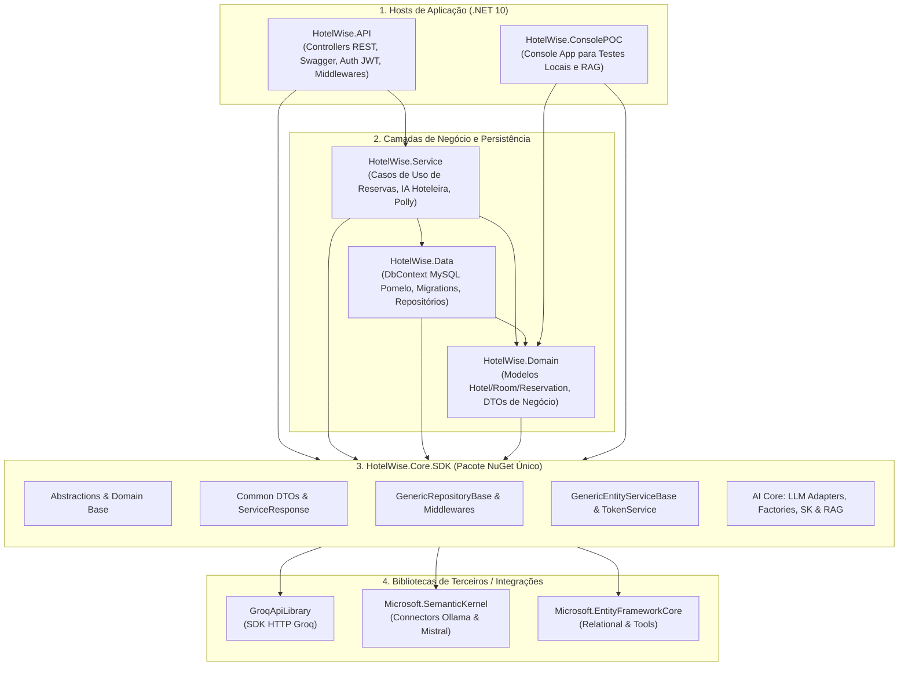
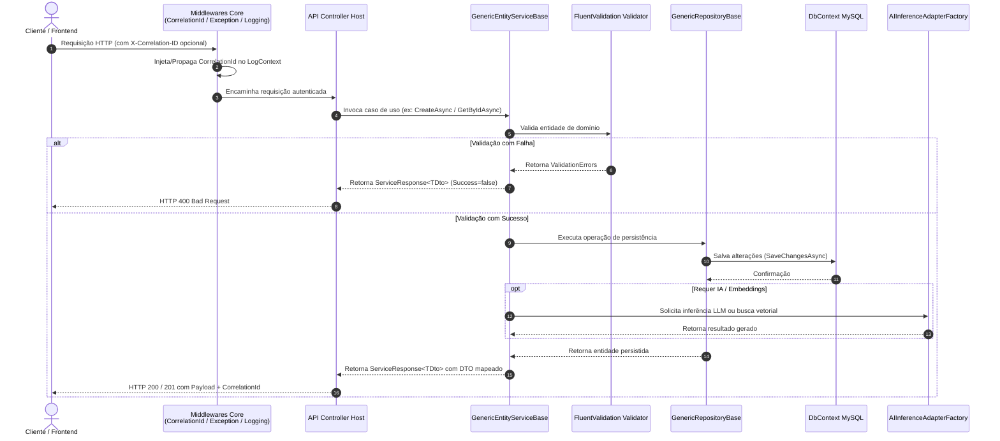

# Guia de Referência Técnica — HotelWise.Core.SDK

**Versão do Documento:** 2.3.0  
**Versão do Pacote:** `HotelWise.Core.SDK` `1.0.0` (NuGet Único)  
**Data da Revisão:** 2026-08-29  
**Status Arquitetural:** 🟢 Consolidado — hosts consomem Core.SDK diretamente (0 shims `[Obsolete]`)  
**Target Frameworks (Multi-TFM):** `net10.0; net8.0; netstandard2.1; netstandard2.0`  
**Host de Referência:** HotelWise API (`net10.0`)  

---

## 1. Introdução e Princípios de Design

### 1.1 Objetivo do SDK

O **`HotelWise.Core.SDK`** é o núcleo canônico, desacoplado e reutilizável do ecossistema HotelWise. Ele consolida em um único pacote NuGet todas as abstrações estruturais, DTOs de comunicação, infraestrutura genérica de acesso a dados (Entity Framework Core), pipeline de segurança JWT, middlewares HTTP para ASP.NET Core e a suíte completa de orquestração de Inteligência Artificial (conectores LLM agnósticos, Semantic Kernel e RAG vetorial).

### 1.2 Princípios Não Negociáveis

| Princípio | Descrição |
| :--- | :--- |
| **Fonte Única da Verdade (SSoT)** | Toda estrutura transversal reside exclusivamente no `HotelWise.Core.SDK`. |
| **Isolamento Total de Domínio** | Zero entidades, DTOs ou lógicas de hospitalidade no SDK. O Core é 100% agnóstico a regras de produto. |
| **Consumo Direto pelos Hosts** | Os projetos host (`Domain`, `Data`, `Service`, `API`) consomem diretamente namespaces `HotelWise.Core.SDK.*`. |
| **Multi-Targeting Inteligente** | Dependências leves compiladas para `netstandard2.0/2.1`; integrações modernas (EF Core, ASP.NET Core, Semantic Kernel) em `net8.0/net10.0`. |
| **Alta Testabilidade e Qualidade** | Suíte canônica [HotelWise.Core.SDK.Tests](file:///c:/git/HotelWise/HotelWiseAPI/HotelWise.Core.SDK.Tests) com **79 testes unitários aprovados** e **92.62%** de line coverage via Coverlet. |

---

## 2. Arquitetura e Estrutura de Módulos

### 2.1 Visão Geral de Pastas e Namespaces

```
HotelWise.Core.SDK/
├── Abstractions/                  HotelWise.Core.SDK.Abstractions (Contratos base de repositório, serviço e entidades)
├── Domain/                        HotelWise.Core.SDK.Domain (EntityBase, EntityBaseWithNameEmail)
├── Common/                        HotelWise.Core.SDK.Common (ServiceResponse<T>, ErrorResponse, DTOs transversais)
│   ├── Constants/                 HotelWise.Core.SDK.Common.Constants (AppConfigConstants, ValidatorConstants, etc.)
│   └── Exceptions/                HotelWise.Core.SDK.Common.Exceptions (AppWarningException)
├── Infrastructure/                HotelWise.Core.SDK.Infrastructure (GenericRepositoryBase, HelperCharSet)
│   └── Middleware/                HotelWise.Core.SDK.Infrastructure.Middleware (CorrelationId, GlobalException, RequestLogging)
├── Services/                      HotelWise.Core.SDK.Services (GenericEntityServiceBase com AutoMapper e FluentValidation)
├── Security/                      HotelWise.Core.SDK.Security (TokenService, TokenVO, TokenConfigurationDto, SecurityHelper)
├── Helpers/                       HotelWise.Core.SDK.Helpers (DataHelper, MarkdownHelper, HtmlHelper, TimeFormatter)
├── Extensions/                    HotelWise.Core.SDK.Extensions (ModelBuilderExtensions, DI Extensions, EnumExtensions)
├── Logging/                       HotelWise.Core.SDK.Logging (LogAppHelper integrado ao Serilog)
├── Validation/                    HotelWise.Core.SDK.Validation (HelperValidation para mapeamento FluentValidation)
└── AI/
    ├── Abstractions/              HotelWise.Core.SDK.AI.Abstractions (IAIInferenceAdapter, IVectorStoreAdapter, etc.)
    ├── Adapters/                  HotelWise.Core.SDK.AI.Adapters (GroqApi, MistralApi, Ollama, SemanticKernel, VectorStore)
    ├── Configuration/             HotelWise.Core.SDK.AI.Configuration (ApplicationIAConfig, RagConfig, SearchSettings)
    ├── Configure/                 HotelWise.Core.SDK.AI.Configure (SemanticKernelProviderConfigure, ConfigureServicesAI)
    ├── Constants/                 HotelWise.Core.SDK.AI.Constants (ChatCompletionValidatorsConstants)
    ├── DTO/                       HotelWise.Core.SDK.AI.DTO (PromptMessageVO, DataVectorBase, AskAssistantRequest/Response)
    ├── Enums/                     HotelWise.Core.SDK.AI.Enums (AIChatServiceType, AIEmbeddingServiceType, VectorStoreType)
    ├── Helpers/                   HotelWise.Core.SDK.AI.Helpers (TokenCounterHelper, ChatSessionHelper, EmbeddingHelper)
    ├── Services/                  HotelWise.Core.SDK.AI.Services (AIInferenceService, AIInferenceAdapterFactory, etc.)
    └── Validation/                HotelWise.Core.SDK.AI.Validation (AskAssistantRequestValidator, PromptMessageValidator)
```

### 2.2 Relação de Dependência entre Hosts e SDK



### 2.3 Fluxo de Processamento de Requisição



---

## 3. Catálogo Detalhado dos Componentes Canônicos

### 3.1 Domain & Common

| Tipo | Namespace | Descrição e Papel Arquitetural |
| :--- | :--- | :--- |
| `EntityBase` | `HotelWise.Core.SDK.Domain` | Classe abstrata base com `Id` (`long`) e métodos de auditoria/igualdade. |
| `EntityBaseWithNameEmail` | `HotelWise.Core.SDK.Domain` | Especialização com propriedades `Name` e `Email` para entidades cadastrais. |
| `ServiceResponse<T>` | `HotelWise.Core.SDK.Common` | Envelope padronizado contendo `Data`, flag `Success`, `Message` e coleção de `ErrorResponse`. |
| `ErrorResponse` | `HotelWise.Core.SDK.Common` | Modelo estruturado de erro com `ErrorCode`, `ErrorMessage` e campo afetado. |
| `EntityDtoBase` | `HotelWise.Core.SDK.Common` | DTO base com propriedade `Id` para mapeamentos via AutoMapper. |
| `AppInformationVersionProductDto` | `HotelWise.Core.SDK.Common` | DTO com metadados de versão da aplicação, assembly e ambiente. |
| `AppWarningException` | `HotelWise.Core.SDK.Common.Exceptions` | Exceção de negócio tratada automaticamente pelo middleware para HTTP 400. |

### 3.2 Infraestrutura e Persistência (EF Core)

| Tipo | Namespace | Descrição e Papel Arquitetural |
| :--- | :--- | :--- |
| `GenericRepositoryBase<T, TContext>` | `HotelWise.Core.SDK.Infrastructure` | Implementação canônica de `IGenericRepository<T>` com CRUD assíncrono completo (`AddAsync`, `GetByIdAsync`, `GetAllAsync`, `FindAsync`, `UpdateAsync`, `DeleteAsync`, `CountAsync`, `ExistsAsync`, `FetchAsync`). |
| `GenericRepositoryBase<T>` | `HotelWise.Core.SDK.Infrastructure` | Sobrecarga de conveniência utilizando `DbContext` base. |
| `ModelBuilderExtensions` | `HotelWise.Core.SDK.Extensions` | Extensões para conversão em massa DateTime → UTC, filtros globais e convenções EF. |
| `HelperCharSet` | `HotelWise.Core.SDK.Infrastructure` | Constantes de charset e collation agnósticas (`latin1`, `utf8mb4`). |

### 3.3 Camada de Serviço e Orquestração

| Tipo | Namespace | Descrição e Papel Arquitetural |
| :--- | :--- | :--- |
| `GenericEntityServiceBase<T, TDto>` | `HotelWise.Core.SDK.Services` | Orquestrador de CRUD genérico integrando `IGenericRepository<T>`, `IMapper`, `IValidator<T>` e `Serilog.ILogger`. Fornece auditoria por usuário via `SetUserId(long id)`. |
| `TokenService` | `HotelWise.Core.SDK.Security` | Emissão de tokens de acesso JWT assinados com HMAC-SHA512, refresh tokens e extração de claims de tokens expirados. |
| `SecurityHelperApi` | `HotelWise.Core.SDK.Security` | Utilitário para extração segura de `UserId` a partir do `ClaimsPrincipal` do ASP.NET Core. |

### 3.4 Middlewares ASP.NET Core

| Middleware | Namespace | Papel no Pipeline HTTP |
| :--- | :--- | :--- |
| `CorrelationIdMiddleware` | `HotelWise.Core.SDK.Infrastructure.Middleware` | Lê ou gera o header `X-Correlation-ID`, propaga no `HttpContext` e enriquece o `LogContext` do Serilog. |
| `GlobalExceptionMiddleware` | `HotelWise.Core.SDK.Infrastructure.Middleware` | Captura exceções não tratadas e `AppWarningException`, serializando respostas JSON no padrão `ServiceResponse<object>`. |
| `RequestLoggingMiddleware` | `HotelWise.Core.SDK.Infrastructure.Middleware` | Registra métricas de tempo de resposta e status HTTP de cada requisição. |

### 3.5 Núcleo de Inteligência Artificial, RAG e Semantic Kernel

| Componente | Namespace | Função no SDK |
| :--- | :--- | :--- |
| `AIInferenceAdapterFactory` | `HotelWise.Core.SDK.AI.Services` | Fábrica de adaptadores LLM com seleção dinâmica em runtime (`GroqApi`, `Mistral`, `Ollama`, `SemanticKernel`). |
| `AIInferenceService` | `HotelWise.Core.SDK.AI.Services` | Serviço de alto nível para orquestração de inferência com fallback e retry. |
| `VectorStoreAdapterFactory` | `HotelWise.Core.SDK.AI.Services` | Fábrica de adaptadores de vector store (`Qdrant`, `InMemory`). |
| `GenericVectorStoreAdapter<T>` | `HotelWise.Core.SDK.AI.Adapters` | Adaptador genérico para upsert, busca por similaridade e indexação vetorial. |
| `ApplicationIAConfig` / `RagConfig` | `HotelWise.Core.SDK.AI.Configuration` | Modelos fortemente tipados para configuração de provedores de IA, dimensões de embedding e endpoints. |
| `TokenCounterHelper` | `HotelWise.Core.SDK.AI.Helpers` | Estimativa de tokens e cálculo de janelas de contexto. |
| `ChatSessionHelper` | `HotelWise.Core.SDK.AI.Helpers` | Montagem e serialização de histórico conversacional a partir de `PromptMessageVO[]`. |

---

## 4. Exemplos Práticos de Implementação

### 4.1 Implementando um Repositório de Domínio no Host

```csharp
using HotelWise.Core.SDK.Infrastructure;
using HotelWise.Data.Context;
using HotelWise.Domain.Interfaces.Entity.HotelInterfaces.Repository;
using HotelWise.Domain.Model.HotelModels;
using Microsoft.EntityFrameworkCore;

namespace HotelWise.Data.Repository.HotelRepositories
{
    public class HotelRepository 
        : GenericRepositoryBase<Hotel, HotelWiseDbContextMysql>, IHotelRepository
    {
        public HotelRepository(
            HotelWiseDbContextMysql context,
            DbContextOptions<HotelWiseDbContextMysql> options)
            : base(context, options)
        {
        }

        public async Task<List<Hotel>> GetHotelsByCityAsync(string city, CancellationToken ct = default)
        {
            return await _dataset
                .AsNoTracking()
                .Where(h => h.City == city && h.Active)
                .ToListAsync(ct);
        }
    }
}
```

### 4.2 Implementando um Serviço de Domínio com Validação e AutoMapper

```csharp
using AutoMapper;
using FluentValidation;
using HotelWise.Core.SDK.Common;
using HotelWise.Core.SDK.Services;
using HotelWise.Domain.Dto.Enitty.HotelDtos;
using HotelWise.Domain.Interfaces.Entity.HotelInterfaces.Repository;
using HotelWise.Domain.Interfaces.Entity.HotelInterfaces.Service;
using HotelWise.Domain.Model.HotelModels;

namespace HotelWise.Service.Entity.HotelServices
{
    public class HotelService 
        : GenericEntityServiceBase<Hotel, HotelDto>, IHotelService
    {
        private readonly IHotelRepository _hotelRepository;

        public HotelService(
            IHotelRepository hotelRepository,
            IMapper mapper,
            Serilog.ILogger logger,
            IValidator<Hotel> validator)
            : base(hotelRepository, mapper, logger, validator)
        {
            _hotelRepository = hotelRepository;
        }

        // Operações especializadas complementares...
    }
}
```

### 4.3 Invocando Inferência de IA Agnóstica a Provedor

```csharp
using HotelWise.Core.SDK.AI.Abstractions;
using HotelWise.Core.SDK.AI.DTO;
using HotelWise.Core.SDK.AI.Enums;

public class GuestAiAssistant
{
    private readonly IAIInferenceAdapterFactory _aiFactory;

    public GuestAiAssistant(IAIInferenceAdapterFactory aiFactory)
    {
        _aiFactory = aiFactory;
    }

    public async Task<string> AskQuestionAsync(string question, InferenceAiAdapterType provider)
    {
        IAIInferenceAdapter adapter = _aiFactory.CreateAdapter(provider);

        var messages = new List<PromptMessageVO>
        {
            new() { Role = RoleAiPromptsType.System, Message = "Você é o assistente virtual StayMate do HotelWise." },
            new() { Role = RoleAiPromptsType.User, Message = question }
        };

        return await adapter.GenerateChatCompletionAsync(messages);
    }
}
```

### 4.4 Configurando Injeção de Dependência e Pipeline na API (`Program.cs`)

```csharp
using HotelWise.Core.SDK.Extensions;
using HotelWise.Core.SDK.Infrastructure.Middleware;
using HotelWise.Core.SDK.Security;

var builder = WebApplication.CreateBuilder(args);

// 1. Configuração de CORS e AppSettings do Core
ServiceCollectionConfigureCors.Configure(builder.Services);
var tokenConfig = ServiceCollectionConfigureAppSettings.AddAndReturnTokenConfiguration(
    builder.Services, builder.Configuration);

// 2. Registro do TokenService
builder.Services.AddSingleton(tokenConfig);
builder.Services.AddScoped<ITokenService, TokenService>();

// 3. Registro de IA Genérica
ConfigureServicesAI.RegisterGenericAiServices(builder.Services);

var app = builder.Build();

// 4. Pipeline de Middlewares Canônicos
app.UseMiddleware<CorrelationIdMiddleware>();
app.UseMiddleware<GlobalExceptionMiddleware>();
app.UseMiddleware<RequestLoggingMiddleware>();

app.UseAuthentication();
app.UseAuthorization();
app.MapControllers();

app.Run();
```

---

## 5. Matriz de Compatibilidade Multi-TFM

| Módulo / Funcionalidade | `net10.0` | `net8.0` | `netstandard2.1` | `netstandard2.0` |
| :--- | :---: | :---: | :---: | :---: |
| Entidades Base e Contratos (`EntityBase`, `IEntityBase`) | ✅ | ✅ | ✅ | ✅ |
| Response Pattern (`ServiceResponse<T>`, `ErrorResponse`) | ✅ | ✅ | ✅ | ✅ |
| Helpers de Data, Hora, Formatação e Logging | ✅ | ✅ | ✅ | ✅ |
| DTOs de Configuração RAG e Enums de IA | ✅ | ✅ | ✅ | ✅ |
| `GenericRepositoryBase<T, TContext>` (EF Core) | ✅ | ✅ | ❌ | ❌ |
| `GenericEntityServiceBase<T, TDto>` (AutoMapper/FV) | ✅ | ✅ | ❌ | ❌ |
| `TokenService` (JWT Bearer) | ✅ | ✅ | ❌ | ❌ |
| Adaptadores de IA & Semantic Kernel | ✅ | ✅ | ❌ | ❌ |
| Middlewares HTTP ASP.NET Core | ✅ | ✅ | ❌ | ❌ |

---

## 6. Procedimento de Testes e Empacotamento

### 6.1 Execução da Suíte de Testes Canônica

```powershell
# Execução completa dos 79 testes unitários
dotnet test HotelWise.Core.SDK.Tests/HotelWise.Core.SDK.Tests.csproj -c Release

# Execução com coleta de cobertura via Coverlet (alvo ≥ 90%)
dotnet test HotelWise.Core.SDK.Tests/HotelWise.Core.SDK.Tests.csproj -c Release `
    --collect:"XPlat Code Coverage" `
    --settings HotelWise.Core.SDK.Tests/coverlet.runsettings
```

### 6.2 Empacotamento NuGet

```powershell
# Geração do pacote .nupkg + .snupkg + documentação XML
dotnet pack HotelWise.Core.SDK/HotelWise.Core.SDK.csproj -c Release -o artifacts/core-sdk
```

---

## 7. Checklist de Qualidade e Governança

- [ ] **Zero Regressão de Build**: `dotnet build HotelWiseAPI.sln -c Release` conclui com 0 erros.
- [ ] **100% de Testes Verdes**: 79/79 testes em `HotelWise.Core.SDK.Tests` aprovados.
- [ ] **Cobertura Validada**: Cobertura de linhas ≥ 90% (resultado homologado: **92.62%**).
- [ ] **Saneamento de Shims**: Zero ocorrências de `HW_CORE_SDK_*` nos hosts.
- [ ] **Saneamento de Namespaces**: Zero ocorrências de namespaces legados (`SmartDigitalPsico`).
- [ ] **Documentação XML**: Arquivo `HotelWise.Core.SDK.xml` gerado e empacotado.

---

## 8. Documentos de Referência

- [HotelWise.Core.SDK.Progresso.md](file:///c:/git/HotelWise/HotelWiseAPI/DOCUMENTACAO/HotelWise.Core.SDK/HotelWise.Core.SDK.Progresso.md) — Histórico de consolidação e evidências de validação.
- [HotelWise.Core.SDK.Levantamento.md](file:///c:/git/HotelWise/HotelWiseAPI/DOCUMENTACAO/HotelWise.Core.SDK/HotelWise.Core.SDK.Levantamento.md) — Inventário completo de migração de 107 tipos.
- [HotelWise.Core.SDK.PlanoImplementacao.md](file:///c:/git/HotelWise/HotelWiseAPI/DOCUMENTACAO/HotelWise.Core.SDK/HotelWise.Core.SDK.PlanoImplementacao.md) — Plano de execução das 4 ondas.
- [HotelWise.Core.SDK/README.md](file:///c:/git/HotelWise/HotelWiseAPI/HotelWise.Core.SDK/README.md) — Documentação introdutória e quickstart do pacote.
