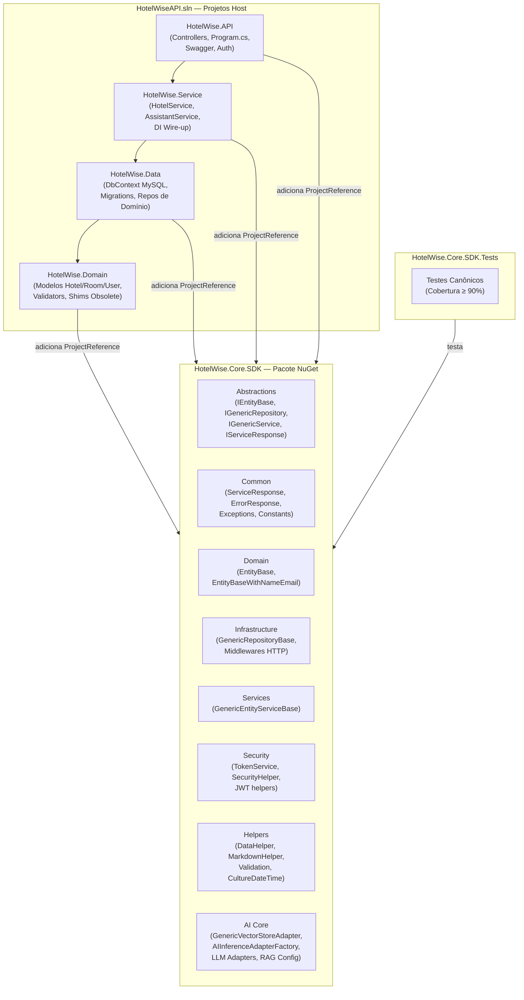
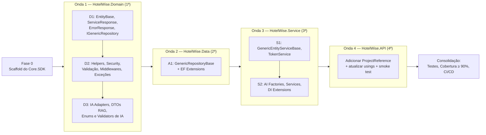

# HotelWise.Core.SDK — Levantamento e Arquitetura

**Versão:** 1.1.0  
**Data:** 2026-08-28  
**Status:** ✅ Especificação Consolidada — Pronta para Execução  
**PackageId Alvo:** `HotelWise.Core.SDK` (Pacote NuGet Único)  
**TFMs:** `net10.0` (host) · `net10.0;net8.0;netstandard2.1;netstandard2.0` (SDK multi-target)  
**Solução analisada:** `HotelWiseAPI.sln` → `HotelWise.Domain` · `HotelWise.Data` · `HotelWise.Service` · `HotelWise.API`

---

## Documentos desta série

| Arquivo | Escopo |
| :--- | :--- |
| **HotelWise.Core.SDK.Levantamento.md** ← *este documento* | Visão geral, inventário consolidado, roadmap e critérios globais |
| [HotelWise.Core.SDK.Especificacao.Domain.md](./HotelWise.Core.SDK.Especificacao.Domain.md) | Análise detalhada de `HotelWise.Domain` |
| [HotelWise.Core.SDK.Especificacao.Data.md](./HotelWise.Core.SDK.Especificacao.Data.md) | Análise detalhada de `HotelWise.Data` |
| [HotelWise.Core.SDK.Especificacao.Service.md](./HotelWise.Core.SDK.Especificacao.Service.md) | Análise detalhada de `HotelWise.Service` |
| [HotelWise.Core.SDK.Especificacao.API.md](./HotelWise.Core.SDK.Especificacao.API.md) | Análise detalhada de `HotelWise.API` |

---

## 1. Objetivo e Motivação

O ecossistema **HotelWiseAPI** possui código genérico e reutilizável disperso em quatro projetos — Domain, Data, Service e API. A duplicação e o acoplamento dificultam manutenção, testes e evolução do sistema.

Esta iniciativa **extrai, padroniza e centraliza** todas as implementações genéricas em um núcleo reutilizável: o **`HotelWise.Core.SDK`**, empacotado como um único NuGet e consumido pelos projetos host via `ProjectReference` (desenvolvimento) ou referência de pacote (produção).

### Benefícios esperados
- Zero duplicação de helpers, repositórios base e contratos
- Suíte de testes canônica e cobertura ≥ 90% garantida
- Evolução independente do SDK sem afetar regras de negócio
- Base sólida para futuros projetos do ecossistema HotelWise

---

## 2. Regras Não Negociáveis

| # | Regra |
| :--- | :--- |
| 1 | **Core = fonte canônica.** Toda implementação genérica vive exclusivamente em `HotelWise.Core.SDK`. |
| 2 | **Host ≠ apagado.** Nenhum arquivo original do host é removido na fase de migração. Recebem `[Obsolete]` + shim fino delegando ao Core. |
| 3 | **Não inventar.** Apenas tipos já existentes na solução são migrados. Nenhum tipo novo é criado sem correspondência no inventário. |
| 4 | **Isolamento de domínio.** `DbContext`, migrations, entidades de negócio, repositórios concretos e serviços de negócio permanecem no host. |
| 5 | **Zero regressão.** `dotnet build HotelWiseAPI.sln` e `dotnet test` devem permanecer 100% verdes após cada fase. |
| 6 | **Cobertura ≥ 90%.** Módulos migrados para o Core.SDK devem atingir cobertura de linhas ≥ 90% no projeto `HotelWise.Core.SDK.Tests`. |
| 7 | **Um NuGet.** `PackageId = HotelWise.Core.SDK`. Sem pacotes satélite (`.Data`, `.Security`, etc.). Dependências pesadas (EF, Semantic Kernel) entram condicionalmente por TFM. |
| 8 | **Build obrigatório após cada fase** — nenhum lote avança com erros de compilação. |

---

## 3. Padrão de Obsoletação e Shims no Host

### Código-padrão para shim de classe estática
```csharp
namespace HotelWise.Domain.Helpers
{
    // ⚠️ Movido para HotelWise.Core.SDK — implementação canônica no pacote Core.
    // Use o tipo correspondente em HotelWise.Core.SDK.Helpers.DataHelper.
    [Obsolete(
        "Movido para HotelWise.Core.SDK. Use HotelWise.Core.SDK.Helpers.DataHelper.",
        error: false,
        DiagnosticId = "HW_CORE_SDK_HELPER")]
    public static class DataHelper
    {
        public static DateTime GetDateTimeNowBrazil() =>
            HotelWise.Core.SDK.Helpers.DataHelper.GetDateTimeNowBrazil();

        public static DateTime GetDateTimeNow() =>
            HotelWise.Core.SDK.Helpers.DataHelper.GetDateTimeNow();

        public static DateTime ApplyTimeZone(DateTime dateTime, string timeZoneId) =>
            HotelWise.Core.SDK.Helpers.DataHelper.ApplyTimeZone(dateTime, timeZoneId);
    }
}
```

### Código-padrão para shim de classe abstrata (repositório)
```csharp
namespace HotelWise.Data.Repository.Generic
{
    using Microsoft.EntityFrameworkCore;

    // ⚠️ Movido para HotelWise.Core.SDK — implementação canônica no pacote Core.
    [Obsolete(
        "Movido para HotelWise.Core.SDK. Use HotelWise.Core.SDK.Infrastructure.GenericRepositoryBase<T, TContext>.",
        error: false,
        DiagnosticId = "HW_CORE_SDK_REPO")]
    public abstract class GenericRepositoryBase<T, TContext>
        : HotelWise.Core.SDK.Infrastructure.GenericRepositoryBase<T, TContext>
        where T : class
        where TContext : DbContext
    {
        protected GenericRepositoryBase(TContext context, DbContextOptions<TContext> options)
            : base(context, options) { }
    }
}
```

### Tabela de DiagnosticIds

| DiagnosticId | Família |
| :--- | :--- |
| `HW_CORE_SDK_DOMAIN` | Interfaces base de entidades (`IEntityBase`, `EntityBase`, `EntityBaseWithNameEmail`) |
| `HW_CORE_SDK_REPO` | Repositórios genéricos EF e extensões de persistência |
| `HW_CORE_SDK_COMMON` | Tipos transversais (`ServiceResponse<T>`, `ErrorResponse`, exceções, constantes) |
| `HW_CORE_SDK_HELPER` | Utilitários gerais (datas, markdown, HTML, validação, enumerações) |
| `HW_CORE_SDK_SECURITY` | Token JWT, hash de senhas, segurança e claims extraction |
| `HW_CORE_SDK_AI` | Adaptadores de inferência LLM, Vector Store e Semantic Kernel |
| `HW_CORE_SDK_MIDDLEWARE` | Middlewares HTTP ASP.NET Core |
| `HW_CORE_SDK_SERVICE` | Serviços base genéricos (CRUD + validação) |
| `HW_CORE_SDK_DI` | Métodos de extensão de injeção de dependência |
| `HW_CORE_SDK_LOGGING` | Logging helpers e Serilog enrichers |

---

## 4. Estrutura Canônica de Pastas do Core.SDK

```text
HotelWise.Core.SDK/
 ├─ HotelWise.Core.SDK.csproj         ← multi-TFM, NuGet metadata, GlobalUsings
 ├─ README.md
 ├─ LICENSE
 ├─ GlobalUsings.cs
 │
 ├─ Abstractions/                      ← IEntityBase, IGenericRepository<T>, IGenericService<TDto>, IServiceResponse
 ├─ Common/                            ← ServiceResponse<T>, ErrorResponse, EntityDtoBase, AppWarningException
 │   ├─ Constants/                     ← AppConfigConstants, ValidatorConstants, AzureADEntraIDConstants
 │   └─ Exceptions/                    ← AppWarningException e hierarquia base
 ├─ Domain/                            ← EntityBase, EntityBaseWithNameEmail
 ├─ Infrastructure/                    ← GenericRepositoryBase<T,TContext>, HelperCharSet, ConfigurationEntitiesHelper
 │   └─ Middleware/                    ← CorrelationIdMiddleware, GlobalExceptionMiddleware, RequestLoggingMiddleware
 ├─ Services/                          ← GenericEntityServiceBase<T,TDto>
 ├─ Validation/                        ← HelperValidation, conversão FluentValidation → ErrorResponse
 ├─ Helpers/                           ← DataHelper, CultureDateTimeHelper, MarkdownHelper, HtmlHelper, TimeFormatter
 ├─ Extensions/                        ← EnumExtensions, ServiceCollectionHelper, ModelBuilderExtensions
 ├─ Caching/                           ← abstrações e providers leves (preparação futura)
 ├─ Cloud/                             ← abstrações de Blob/Queue/Table (preparação futura)
 ├─ Security/                          ← SecurityHelper, SecurityHelperApi, TokenService, TokenConfigurationDto, TokenVO
 ├─ Logging/                           ← LogAppHelper e Serilog helpers
 ├─ Mapping/                           ← utilitários genéricos AutoMapper
 └─ AI/                                ← Adapters IA, Vector Store, Semantic Kernel, DTOs e helpers de IA
     ├─ Abstractions/                  ← IAIInferenceAdapter, IVectorStoreAdapter<T>, IDataVector, etc.
     ├─ Adapters/                      ← GenericVectorStoreAdapter<T>, GroqApiAdapter, MistralApiAdapter, etc.
     ├─ Configuration/                 ← ApplicationIAConfig, RagConfig, QdrantConfig, OllamaConfig, etc.
     ├─ DTO/                           ← PromptMessageVO, DataVectorBase, AskAssistantResponse
     ├─ Enums/                         ← AIChatServiceType, AIEmbeddingServiceType, InferenceAiAdapterType, etc.
     ├─ Helpers/                       ← ChatSessionHelper, TokenCounterHelper, EmbeddingHelper
     ├─ Services/                      ← GenericVectorStoreServiceBase, AIInferenceAdapterFactory, AIInferenceService
     └─ Validation/                    ← Validators genéricos de prompt (PromptMessageValidator, etc.)
```

---

## 5. Inventário Consolidado — Matriz de Migração

### Legenda

| Status | Significado |
| :--- | :--- |
| **Portar + Obsoletar** | Cópia canônica vai para o Core.SDK; original no host vira shim `[Obsolete]` |
| **Manter no Host** | Tipo com regras de negócio ou acoplamento específico — permanece ativo no host |
| **Não Portar** | Tipo inexistente ou irrelevante — não criar equivalente no Core |

---

### 5.1 Módulo `HotelWise.Data`

| Tipo / Artefato | Localização no Host | Destino no Core.SDK | Status | DiagnosticId |
| :--- | :--- | :--- | :--- | :--- |
| `GenericRepositoryBase<T, TContext>` | `Repository/Generic/` | `Infrastructure/` | **Portar+Obsoletar** | `HW_CORE_SDK_REPO` |
| `ModelBuilderExtensions` | `Context/Configure/Helper/` | `Extensions/` | **Portar+Obsoletar** | `HW_CORE_SDK_REPO` |
| `HelperCharSet` | `Context/Configure/Helper/` | `Infrastructure/` | **Portar+Obsoletar** | `HW_CORE_SDK_REPO` |
| `ConfigurationEntitiesHelper` | `Context/Configure/Helper/` | `Infrastructure/` | **Portar+Obsoletar** | `HW_CORE_SDK_REPO` |
| `HotelWiseDbContextMysql` | `Context/` | — | **Manter no Host** | — |
| `*Configuration.cs` (Fluent API) | `Context/Configure/Entity/*` | — | **Manter no Host** | — |
| `*MockData.cs` (Seeds) | `Context/Configure/Mock/*` | — | **Manter no Host** | — |
| Migrations MySQL | `Migrations/MySql/*` | — | **Manter no Host** | — |
| Repositórios de domínio (`Hotel*`, `Room*`, `Reservation*`, `User*`, `ChatSession*`) | `Repository/*` | — | **Manter no Host** | — |

---

### 5.2 Módulo `HotelWise.Domain`

#### 5.2.1 Entidades Base e Contratos

| Tipo / Artefato | Localização no Host | Destino no Core.SDK | Status | DiagnosticId |
| :--- | :--- | :--- | :--- | :--- |
| `EntityBase` | `Model/EntityBase.cs` | `Domain/` | **Portar+Obsoletar** | `HW_CORE_SDK_DOMAIN` |
| `EntityBaseWithNameEmail` | `Model/EntityBaseWithNameEmail.cs` | `Domain/` | **Portar+Obsoletar** | `HW_CORE_SDK_DOMAIN` |
| `IEntityBase`, `IEntityBaseLog`, `IEntityFieldBaseLog`, `IEntityDto` | `Interfaces/Base/` | `Abstractions/` | **Portar+Obsoletar** | `HW_CORE_SDK_DOMAIN` |
| `IGenericRepository<T>` | `Interfaces/Base/IGenericRepository.cs` | `Abstractions/` | **Portar+Obsoletar** ¹ | `HW_CORE_SDK_REPO` |
| `IGenericService<TDto>` | `Interfaces/Base/IGenericService.cs` | `Abstractions/` | **Portar+Obsoletar** | `HW_CORE_SDK_SERVICE` |
| `IServiceResponse` | `Interfaces/Base/IServiceResponse.cs` | `Abstractions/` | **Portar+Obsoletar** | `HW_CORE_SDK_COMMON` |

> ¹ Corrigir namespace aninhado duplicado no arquivo original antes de migrar.

#### 5.2.2 DTOs e Contratos Transversais

| Tipo / Artefato | Localização no Host | Destino no Core.SDK | Status | DiagnosticId |
| :--- | :--- | :--- | :--- | :--- |
| `ServiceResponse<T>`, `ErrorResponse` | `Dto/` | `Common/` | **Portar+Obsoletar** | `HW_CORE_SDK_COMMON` |
| `EntityDtoBase` | `Dto/Base/` | `Common/` | **Portar+Obsoletar** | `HW_CORE_SDK_COMMON` |
| `SecurityDto`, `CultureDisplayDto`, `TimeZoneDisplayDto`, `RepositoryInfo` | `Dto/` | `Common/` | **Portar+Obsoletar** | `HW_CORE_SDK_COMMON` |
| `AppInformationVersionProductDto` | `Dto/` | `Common/` | **Portar+Obsoletar** | `HW_CORE_SDK_COMMON` |
| `TokenConfigurationDto`, `TokenVO` | `Dto/AppConfig/` | `Security/` | **Portar+Obsoletar** | `HW_CORE_SDK_SECURITY` |
| DTOs de domínio (`HotelDto`, `RoomDto`, `ReservationDto`, etc.) | `Dto/Enitty/` | — | **Manter no Host** | — |

#### 5.2.3 Helpers e Utilitários

| Tipo / Artefato | Localização no Host | Destino no Core.SDK | Status | DiagnosticId |
| :--- | :--- | :--- | :--- | :--- |
| `DataHelper` | `Helpers/DataHelper.cs` | `Helpers/` | **Portar+Obsoletar** | `HW_CORE_SDK_HELPER` |
| `CultureDateTimeHelper` | `Helpers/CultureDateTimeHelper.cs` | `Helpers/` | **Portar+Obsoletar** | `HW_CORE_SDK_HELPER` |
| `TimeFormatter` | `Helpers/TimeFormatter.cs` | `Helpers/` | **Portar+Obsoletar** | `HW_CORE_SDK_HELPER` |
| `MarkdownHelper` | `Helpers/MarkdownHelper.cs` | `Helpers/` | **Portar+Obsoletar** | `HW_CORE_SDK_HELPER` |
| `HtmlHelper` | `Helpers/HtmlHelper.cs` | `Helpers/` | **Portar+Obsoletar** | `HW_CORE_SDK_HELPER` |
| `HelperValidation` | `Helpers/HelperValidation.cs` | `Validation/` | **Portar+Obsoletar** | `HW_CORE_SDK_HELPER` |
| `EnumExtensions` | `Helpers/EnumExtensions.cs` | `Extensions/` | **Portar+Obsoletar** | `HW_CORE_SDK_HELPER` |
| `ServiceCollectionHelper` | `Helpers/ServiceCollectionHelper.cs` | `Extensions/` | **Portar+Obsoletar** | `HW_CORE_SDK_HELPER` |
| `ConfigurationAppSettingsHelper` | `Helpers/ConfigurationAppSettingsHelper.cs` | `Helpers/` | **Portar+Obsoletar** | `HW_CORE_SDK_HELPER` |
| `LogAppHelper` | `Helpers/LogAppHelper.cs` | `Logging/` | **Portar+Obsoletar** | `HW_CORE_SDK_LOGGING` |
| `SecurityHelper` | `Helpers/SecurityHelper.cs` | `Security/` | **Portar+Obsoletar** | `HW_CORE_SDK_SECURITY` |
| `SecurityHelperApi` | `Helpers/SecurityHelperApi.cs` | `Security/` | **Portar+Obsoletar** | `HW_CORE_SDK_SECURITY` |
| `EmbeddingHelper` | `Helpers/EmbeddingHelper.cs` | `AI/Helpers/` | **Portar+Obsoletar** | `HW_CORE_SDK_AI` |
| `ChatSessionHelper` | `Helpers/AI/ChatSessionHelper.cs` | `AI/Helpers/` | **Portar+Obsoletar** | `HW_CORE_SDK_AI` |
| `TokenCounterHelper` | `Helpers/AI/TokenCounterHelper.cs` | `AI/Helpers/` | **Portar+Obsoletar** | `HW_CORE_SDK_AI` |

#### 5.2.4 Infraestrutura, Middlewares e Exceções

| Tipo / Artefato | Localização no Host | Destino no Core.SDK | Status | DiagnosticId |
| :--- | :--- | :--- | :--- | :--- |
| `CorrelationIdMiddleware` | `CustomMiddleware/` | `Infrastructure/Middleware/` | **Portar+Obsoletar** | `HW_CORE_SDK_MIDDLEWARE` |
| `GlobalExceptionMiddleware` | `CustomMiddleware/` | `Infrastructure/Middleware/` | **Portar+Obsoletar** | `HW_CORE_SDK_MIDDLEWARE` |
| `RequestLoggingMiddleware` | `CustomMiddleware/` | `Infrastructure/Middleware/` | **Portar+Obsoletar** | `HW_CORE_SDK_MIDDLEWARE` |
| `AppWarningException` | `AppException/` | `Common/Exceptions/` | **Portar+Obsoletar** | `HW_CORE_SDK_COMMON` |
| `AppConfigConstants`, `ValidatorConstants`, `AzureADEntraIDConstants`, `EntityTypeConfigurationConstants` | `Constants/` | `Common/Constants/` | **Portar+Obsoletar** | `HW_CORE_SDK_COMMON` |
| `ChatCompletionValidatorsConstants` | `Constants/IA/` | `AI/Constants/` | **Portar+Obsoletar** | `HW_CORE_SDK_AI` |

#### 5.2.5 Módulo de IA, Vector Store e Semantic Kernel

| Tipo / Artefato | Localização no Host | Destino no Core.SDK | Status | DiagnosticId |
| :--- | :--- | :--- | :--- | :--- |
| `GenericVectorStoreAdapter<TVector>` | `AI/Adapter/` | `AI/Adapters/` | **Portar+Obsoletar** | `HW_CORE_SDK_AI` |
| `GroqApiAdapter`, `MistralApiAdapter`, `OllamaAdapter`, `SemanticKernelAdapter` | `AI/Adapter/` | `AI/Adapters/` | **Portar+Obsoletar** | `HW_CORE_SDK_AI` |
| `IAIInferenceAdapter`, `IAIInferenceAdapterFactory`, `IAIInferenceService`, `IAssistantService`, `IDataVector` | `Interfaces/IA/` | `AI/Abstractions/` | **Portar+Obsoletar** | `HW_CORE_SDK_AI` |
| `IVectorStoreAdapter<T>`, `IVectorStoreAdapterFactory`, `IVectorStoreService` | `Interfaces/SemanticKernel/` | `AI/Abstractions/` | **Portar+Obsoletar** | `HW_CORE_SDK_AI` |
| DTOs de Configuração RAG (`ApplicationIAConfig`, `RagConfig`, `QdrantConfig`, `OllamaConfig`, etc.) | `Dto/AppConfig/Rag/` | `AI/Configuration/` | **Portar+Obsoletar** | `HW_CORE_SDK_AI` |
| `PromptMessageVO`, `DataVectorBase` | `Dto/IA/SemanticKernel/` | `AI/DTO/` | **Portar+Obsoletar** | `HW_CORE_SDK_AI` |
| Enums de IA (`AIChatServiceType`, `AIEmbeddingServiceType`, `InferenceAiAdapterType`, `RoleAiPromptsType`, `VectorStoreType`) | `Enuns/IA/` | `AI/Enums/` | **Portar+Obsoletar** | `HW_CORE_SDK_AI` |
| Validators genéricos de Prompt (`AskAssistantRequestValidator`, `PromptMessageValidator`, `HistoryPromptsValidator`, `ChatSessionHistoryValidator`) | `Validator/AI/` | `AI/Validation/` | **Portar+Obsoletar** | `HW_CORE_SDK_AI` |
| Modelos de domínio (`Hotel`, `Room`, `Reservation`, `User`, `ChatSessionHistory`) | `Model/` | — | **Manter no Host** | — |
| Interfaces de domínio (Hotel*, Room*, Reservation*, User*, ChatSessionHistory*) | `Interfaces/Entity/` | — | **Manter no Host** | — |
| Validators de domínio (`HotelValidator`, `RoomValidator`, etc.) | `Validator/HotelValidators/` | — | **Manter no Host** | — |
| `AutoMapperProfile` | `Mapper/` | — | **Manter no Host** | — |

---

### 5.3 Módulo `HotelWise.Service`

| Tipo / Artefato | Localização no Host | Destino no Core.SDK | Status | DiagnosticId |
| :--- | :--- | :--- | :--- | :--- |
| `GenericEntityServiceBase<T, TDto>` | `Entity/Generic/` | `Services/` | **Portar+Obsoletar** | `HW_CORE_SDK_SERVICE` |
| `GenericVectorStoreServiceBase` | `Generic/GenericServiceBase.cs` | `AI/Services/` | **Portar+Obsoletar** | `HW_CORE_SDK_AI` |
| `AIInferenceAdapterFactory` | `AI/` | `AI/Services/` | **Portar+Obsoletar** | `HW_CORE_SDK_AI` |
| `AIInferenceService` | `AI/` | `AI/Services/` | **Portar+Obsoletar** | `HW_CORE_SDK_AI` |
| `VectorStoreAdapterFactory` | `AI/` | `AI/Services/` | **Portar+Obsoletar** | `HW_CORE_SDK_AI` |
| `TokenService` | `Security/` | `Security/` | **Portar+Obsoletar** | `HW_CORE_SDK_SECURITY` |
| `SemanticKernelProviderConfigure` | `Configure/` | `AI/Configure/` | **Portar+Obsoletar** | `HW_CORE_SDK_AI` |
| `ConfigureServicesAI` | `Configure/` | `AI/Configure/` | **Portar+Obsoletar** | `HW_CORE_SDK_AI` |
| `ServiceCollectionConfigureCors` | `Configure/` | `Extensions/` | **Portar+Obsoletar** | `HW_CORE_SDK_DI` |
| `ServiceCollectionConfigureAppSettings` | `Configure/` | `Extensions/` | **Portar+Obsoletar** | `HW_CORE_SDK_DI` |
| `ServiceCollectionConfigureAutoMapper` | `Configure/` | `Extensions/` | **Portar+Obsoletar** | `HW_CORE_SDK_DI` |
| `HotelService`, `RoomService`, `ReservationService`, `RoomAvailabilityService`, `UserService` | `Entity/` | — | **Manter no Host** | — |
| `ChatSessionHistoryService`, `GenerateHotelService` | `Entity/` | — | **Manter no Host** | — |
| `HotelSearchService`, `HotelResponseProcessor`, `StayMatePromptGenerator` | `Bussines/` | — | **Manter no Host** | — |
| `AssistantService`, `HotelVectorStoreService` | `AI/` | — | **Manter no Host** | — |
| `ServicesDomainRepository`, `ServicesDomainService` | `Configure/` | — | **Manter no Host** | — |
| `ServiceCollectionConfigureServicesDomain` | `Configure/` | — | **Manter no Host** | — |

---

### 5.4 Módulo `HotelWise.API`

| Tipo / Artefato | Localização no Host | Status | Observação |
| :--- | :--- | :--- | :--- |
| `Program.cs` | Raiz | **Manter no Host** | Entry point do host ASP.NET Core |
| `WebApplicationConfigureBuilder` | `Configure/` | **Manter no Host** | Atualizar `using`s → Core (Middlewares) |
| `WebApplicationConfigureServiceCollections` | `Configure/` | **Manter no Host** | Atualizar `using`s → Core |
| `ServiceCollectionAddAllDependencies` | `Configure/` | **Manter no Host** | Atualizar `using`s → Core |
| `ServiceCollectionConfigureSecurity` | `Configure/` | **Manter no Host** | Atualizar `using`s → Core (TokenConfigurationDto) |
| `HotelsController`, `RoomsController`, `ReservationsController`, `RoomAvailabilityController` | `Controllers/HotelEndpoints/` | **Manter no Host** | Atualizar `using`s → Core (ServiceResponse, SecurityHelperApi) |
| `AuthController` | `Controllers/` | **Manter no Host** | Atualizar `using`s → Core |
| `AssistantController` | `Controllers/Ai/` | **Manter no Host** | Atualizar `using`s → Core |
| `AppInformationVersionProductController` | `Controllers/` | **Manter no Host** ² | Corrigir namespace legado `SmartDigitalPsico.*` |

> ² Namespace legado deve ser corrigido de `SmartDigitalPsico.WebAPI.Controllers.v1.SystemDomains` para `HotelWise.API.Controllers`.

---

## 6. Arquitetura Alvo



---

## 7. Ordem de Execução — Ondas e Fases



### Critérios de passagem entre ondas

| Gate | Condição |
| :--- | :--- |
| **Fase 0 → Onda 1** | Shell `HotelWise.Core.SDK` + Tests compilam sem erros; solution atualizada |
| **Onda 1 → Onda 2** | Tipos canônicos do Domain no Core; `dotnet build HotelWise.Domain` verde |
| **Onda 2 → Onda 3** | `GenericRepositoryBase` no Core; `dotnet build HotelWise.Data` verde; repositórios de domínio herdam do Core |
| **Onda 3 → Onda 4** | Serviços genéricos e factories no Core; `dotnet build HotelWise.Service` verde |
| **Onda 4 → Consolidação** | API compila e responde em smoke test; zero referências a namespaces legados `SmartDigitalPsico.*` |

---

## 8. Detalhamento das Fases

| Fase | Escopo | Critério de aceite |
| :--- | :--- | :--- |
| **0 — Scaffold** | Criar `HotelWise.Core.SDK.csproj` e `Tests.csproj`. Adicionar à solution. Criar `GlobalUsings.cs`, `LICENSE`, `README.md`. | Build da solution verde. Zero classes de negócio. |
| **1 — Fundamentos (D1)** | `EntityBase`, `EntityBaseWithNameEmail`, `IEntityBase*`, `IGenericRepository<T>`, `IGenericService<TDto>`, `ServiceResponse<T>`, `ErrorResponse`, `IServiceResponse`. | Domain.Test compila. |
| **2 — Helpers e Segurança (D2)** | `DataHelper`, `CultureDateTimeHelper`, `MarkdownHelper`, `HtmlHelper`, `HelperValidation`, `EnumExtensions`, `ServiceCollectionHelper`, `SecurityHelper`, `SecurityHelperApi`, `LogAppHelper`, Middlewares, `AppWarningException`, Constantes. | Build verde; testes de helpers passam. |
| **3 — IA e Adapters (D3)** | `GenericVectorStoreAdapter<T>`, LLM Adapters, Interfaces IA/SK, DTOs RAG, Enums IA, Validators de prompt. | Tipos IA compilam; testes de adapters passam. |
| **4 — Data (A1)** | `GenericRepositoryBase<T, TContext>`, `ModelBuilderExtensions`, `HelperCharSet`, `ConfigurationEntitiesHelper`. | Repositórios de domínio herdam do Core; `HotelWise.Data` compila. |
| **5 — Service (S1)** | `GenericEntityServiceBase<T, TDto>`, `GenericVectorStoreServiceBase`, `TokenService`, configurações de DI genéricas. | `HotelWise.Service` compila; serviços de domínio herdam base do Core. |
| **6 — Service AI (S2)** | `AIInferenceAdapterFactory`, `AIInferenceService`, `VectorStoreAdapterFactory`, `SemanticKernelProviderConfigure`. | Build verde; testes de factories passam. |
| **7 — API** | Adicionar `ProjectReference`; corrigir `using`s e namespace legado; smoke test de endpoints. | `HotelWise.API` compila; `/health` responde 200 OK. |
| **8 — CI/CD e Cobertura** | Replicar suíte de testes em `HotelWise.Core.SDK.Tests`; Coverlet ≥ 90%; `dotnet pack` gera `.nupkg`. | Coverlet report gerado; zero erros de pack. |

---

## 9. Comandos de Referência

```powershell
# Na raiz da solution
$root = "c:\git\HotelWise\HotelWiseAPI"

# Build completo
dotnet build "$root\HotelWiseAPI.sln" -c Release

# Testes com cobertura
dotnet test "$root\HotelWise.Core.SDK.Tests\HotelWise.Core.SDK.Tests.csproj" `
    --collect:"XPlat Code Coverage" `
    --results-directory "$root\TestResults"

# Pack do NuGet
dotnet build "$root\HotelWise.Core.SDK\HotelWise.Core.SDK.csproj" -c Release
dotnet pack "$root\HotelWise.Core.SDK\HotelWise.Core.SDK.csproj" -c Release --no-build
```

---

## 10. Critérios de Aceite Globais

| # | Critério | Verificação |
| :--- | :--- | :--- |
| 1 | Build 100% verde | `dotnet build HotelWiseAPI.sln` — 0 erros |
| 2 | Shims no host com `[Obsolete]` | `grep -r "HW_CORE_SDK_"` encontra todos os tipos migrados |
| 3 | Consumidores usam namespaces do Core | `grep -r "HotelWise\.Core\.SDK"` nos controllers e services |
| 4 | Nenhum namespace legado `SmartDigitalPsico.*` restante | `grep -r "SmartDigitalPsico"` = 0 ocorrências no código C# |
| 5 | Sem tipos inventados fora do inventário | Revisão manual do inventário desta seção §5 |
| 6 | Cobertura ≥ 90% | `dotnet test --collect:"XPlat Code Coverage"` → relatório Coverlet |
| 7 | `dotnet pack` gera `.nupkg` com símbolos e XML docs | Arquivo `.nupkg` e `.snupkg` presentes no output |
| 8 | Smoke test da API | `GET /health` → 200 OK; `GET /swagger` → 200 OK |
