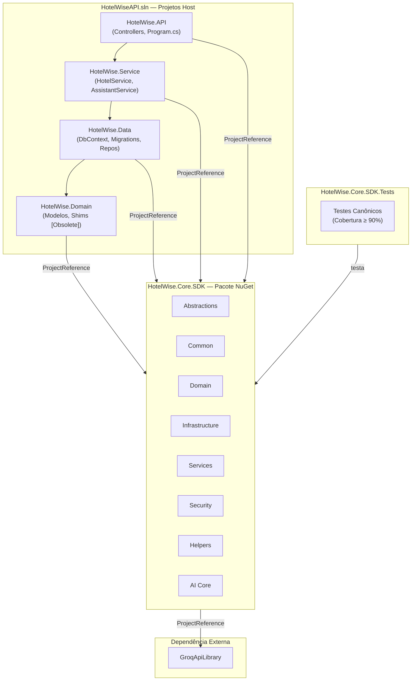
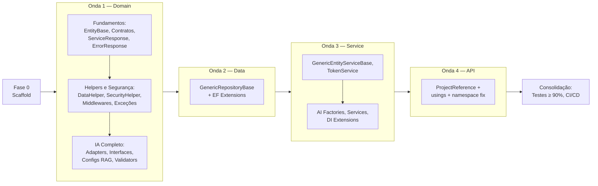

# HotelWise.Core.SDK — Levantamento e Arquitetura

**Versão:** 2.0.0  
**Data:** 2026-08-28  
**Status:** ✅ Especificação Consolidada — Pronta para Execução  
**PackageId Alvo:** `HotelWise.Core.SDK` (Pacote NuGet Único)  
**TFMs:** `net10.0` (host) · `net10.0;net8.0;netstandard2.1;netstandard2.0` (SDK multi-target)  
**Solução analisada:** `HotelWiseAPI.sln`

---

## Documentos desta série

| Arquivo | Escopo |
| :--- | :--- |
| **HotelWise.Core.SDK.Levantamento.md** ← *este documento* | Visão geral, inventário consolidado, roadmap e critérios globais |
| [HotelWise.Core.SDK.Especificacao.Domain.md](./HotelWise.Core.SDK.Especificacao.Domain.md) | Análise detalhada de `HotelWise.Domain` |
| [HotelWise.Core.SDK.Especificacao.Data.md](./HotelWise.Core.SDK.Especificacao.Data.md) | Análise detalhada de `HotelWise.Data` |
| [HotelWise.Core.SDK.Especificacao.Service.md](./HotelWise.Core.SDK.Especificacao.Service.md) | Análise detalhada de `HotelWise.Service` |
| [HotelWise.Core.SDK.Especificacao.API.md](./HotelWise.Core.SDK.Especificacao.API.md) | Análise detalhada de `HotelWise.API` |

---

## 1. Projetos da Solução `HotelWiseAPI.sln`

| Projeto | SDK | TFM | Papel | Referências |
| :--- | :--- | :--- | :--- | :--- |
| **HotelWise.Domain** | `Microsoft.NET.Sdk` | `net10.0` | Modelos, contratos, helpers, adapters IA, middlewares | → `GroqApiLibrary` |
| **HotelWise.Data** | `Microsoft.NET.Sdk` | `net10.0` | Persistência EF Core, DbContext MySQL, repositórios | → `HotelWise.Domain` |
| **HotelWise.Service** | `Microsoft.NET.Sdk` | `net10.0` | Serviços de negócio, IA, token JWT, DI | → `HotelWise.Data`, `HotelWise.Domain` |
| **HotelWise.API** | `Microsoft.NET.Sdk.Web` | `net10.0` | Host ASP.NET Core, controllers REST, Swagger | → `HotelWise.Service` |
| **GroqApiLibrary** | `Microsoft.NET.Sdk` | `net10.0` | Client HTTP para Groq API (LLM) | — (standalone) |
| **HotelWise.ConsolePOC** | `Microsoft.NET.Sdk` | `net10.0` | POC de console (fora do escopo) | — |

---

## 2. Objetivo e Motivação

O ecossistema **HotelWiseAPI** possui código genérico e reutilizável disperso em quatro projetos. A duplicação e o acoplamento dificultam manutenção, testes e evolução.

Esta iniciativa **extrai, padroniza e centraliza** todas as implementações genéricas em um núcleo reutilizável: o **`HotelWise.Core.SDK`**, empacotado como um único NuGet e consumido pelos projetos host via `ProjectReference` (desenvolvimento) ou referência de pacote (produção).

### Benefícios esperados
- Zero duplicação de helpers, repositórios base e contratos
- Suíte de testes canônica com cobertura ≥ 90%
- Evolução independente do SDK sem afetar regras de negócio
- Base sólida para futuros projetos do ecossistema HotelWise

---

## 3. Regras Não Negociáveis

| # | Regra |
| :--- | :--- |
| 1 | **Core = fonte canônica.** Toda implementação genérica vive exclusivamente em `HotelWise.Core.SDK`. |
| 2 | **Host ≠ apagado.** Nenhum arquivo original do host é removido na fase de migração. Recebem `[Obsolete]` + shim fino delegando ao Core. |
| 3 | **Não inventar.** Apenas tipos já existentes na solução são migrados. Nenhum tipo novo é criado sem correspondência no inventário. |
| 4 | **Isolamento de domínio.** `DbContext`, migrations, entidades de negócio, repositórios concretos e serviços de negócio permanecem no host. |
| 5 | **Zero regressão.** `dotnet build HotelWiseAPI.sln` e `dotnet test` devem permanecer 100% verdes após cada fase. |
| 6 | **Cobertura ≥ 90%.** Módulos migrados para o Core.SDK devem atingir cobertura de linhas ≥ 90% no projeto `HotelWise.Core.SDK.Tests`. |
| 7 | **Um NuGet.** `PackageId = HotelWise.Core.SDK`. Sem pacotes satélite. Dependências pesadas (EF, Semantic Kernel) entram condicionalmente por TFM. |
| 8 | **Build obrigatório após cada fase** — nenhum lote avança com erros de compilação. |

---

## 4. Padrão de Obsoletação e Shims no Host

### Shim para classe estática
```csharp
namespace HotelWise.Domain.Helpers
{
    // ⚠️ Movido para HotelWise.Core.SDK — implementação canônica no pacote Core.
    [Obsolete(
        "Movido para HotelWise.Core.SDK. Use HotelWise.Core.SDK.Helpers.DataHelper.",
        error: false,
        DiagnosticId = "HW_CORE_SDK_HELPER")]
    public static class DataHelper
    {
        public static DateTime GetDateTimeNowBrazil() =>
            HotelWise.Core.SDK.Helpers.DataHelper.GetDateTimeNowBrazil();
        // ... demais métodos delegados
    }
}
```

### Shim para classe abstrata (repositório)
```csharp
namespace HotelWise.Data.Repository.Generic
{
    using Microsoft.EntityFrameworkCore;

    [Obsolete(
        "Movido para HotelWise.Core.SDK. Use HotelWise.Core.SDK.Infrastructure.GenericRepositoryBase<T, TContext>.",
        error: false,
        DiagnosticId = "HW_CORE_SDK_REPO")]
    public abstract class GenericRepositoryBase<T, TContext>
        : HotelWise.Core.SDK.Infrastructure.GenericRepositoryBase<T, TContext>
        where T : class
        where TContext : DbContext
    {
        protected GenericRepositoryBase(TContext context, DbContextOptions<TContext> options)
            : base(context, options) { }
    }
}
```

### Tabela de DiagnosticIds

| DiagnosticId | Família |
| :--- | :--- |
| `HW_CORE_SDK_DOMAIN` | Interfaces base de entidades (`IEntityBase`, `EntityBase`, `EntityBaseWithNameEmail`) |
| `HW_CORE_SDK_REPO` | Repositórios genéricos EF e extensões de persistência |
| `HW_CORE_SDK_COMMON` | Tipos transversais (`ServiceResponse<T>`, `ErrorResponse`, exceções, constantes, `ETypeDataBase`) |
| `HW_CORE_SDK_HELPER` | Utilitários gerais (datas, markdown, HTML, validação, enumerações) |
| `HW_CORE_SDK_SECURITY` | Token JWT, hash de senhas, segurança e claims extraction |
| `HW_CORE_SDK_AI` | Adaptadores de inferência LLM, Vector Store, Semantic Kernel, configs RAG |
| `HW_CORE_SDK_MIDDLEWARE` | Middlewares HTTP ASP.NET Core |
| `HW_CORE_SDK_SERVICE` | Serviços base genéricos |
| `HW_CORE_SDK_DI` | Métodos de extensão de injeção de dependência |
| `HW_CORE_SDK_LOGGING` | Logging helpers e Serilog enrichers |

---

## 5. Estrutura Canônica de Pastas do Core.SDK

```text
HotelWise.Core.SDK/
 ├─ HotelWise.Core.SDK.csproj
 ├─ README.md · LICENSE · GlobalUsings.cs
 │
 ├─ Abstractions/              ← IEntityBase, IEntityBaseLog, IEntityFieldBaseLog, IEntityDto
 │                                IGenericRepository<T>, IGenericService<TDto>, IServiceResponse
 │                                ITokenConfigurationDto, ITokenService
 ├─ Common/                    ← ServiceResponse<T>, ErrorResponse, EntityDtoBase, SecurityDto
 │   │                            CultureDisplayDto, TimeZoneDisplayDto, RepositoryInfo
 │   │                            AppInformationVersionProductDto, ETypeDataBase
 │   ├─ Constants/             ← AppConfigConstants, ValidatorConstants, AzureADEntraIDConstants
 │   │                            EntityTypeConfigurationConstants
 │   └─ Exceptions/            ← AppWarningException
 ├─ Domain/                    ← EntityBase, EntityBaseWithNameEmail
 ├─ Infrastructure/            ← GenericRepositoryBase<T,TContext>, HelperCharSet
 │   │                            ConfigurationEntitiesHelper
 │   └─ Middleware/            ← CorrelationIdMiddleware, GlobalExceptionMiddleware
 │                                RequestLoggingMiddleware
 ├─ Services/                  ← GenericEntityServiceBase<T,TDto>
 ├─ Validation/                ← HelperValidation
 ├─ Helpers/                   ← DataHelper, CultureDateTimeHelper, MarkdownHelper, HtmlHelper
 │                                TimeFormatter, ConfigurationAppSettingsHelper
 ├─ Extensions/                ← EnumExtensions, ServiceCollectionHelper, ModelBuilderExtensions
 │                                ServiceCollectionConfigureCors, ServiceCollectionConfigureAppSettings
 │                                ServiceCollectionConfigureAutoMapper
 ├─ Caching/                   ← (preparação futura)
 ├─ Cloud/                     ← (preparação futura)
 ├─ Security/                  ← SecurityHelper, SecurityHelperApi, TokenService
 │                                TokenConfigurationDto, TokenVO
 ├─ Logging/                   ← LogAppHelper
 ├─ Mapping/                   ← (preparação futura — utilitários genéricos AutoMapper)
 └─ AI/
     ├─ Abstractions/          ← IAIInferenceAdapter, IAIInferenceAdapterFactory
     │                            IAIInferenceService, IAssistantService, IDataVector
     │                            IVectorStoreAdapter<T>, IVectorStoreAdapterFactory
     │                            IVectorStoreService, IAiInferenceConfigBase
     │                            IApplicationIAConfig, IAzureAdConfig, IRagConfig
     ├─ Adapters/              ← GenericVectorStoreAdapter<T>, GroqApiAdapter
     │                            MistralApiAdapter, OllamaAdapter, SemanticKernelAdapter
     ├─ Configuration/         ← ApplicationIAConfig, RagConfig, AiInferenceConfigBase
     │                            AzureAdConfig, AzureAISearchConfig, AzureCosmosDBConfig
     │                            AzureOpenAIConfig, AzureOpenAIEmbeddingsConfig
     │                            GroqApiConfig, MistralApiConfig, MistralApiEmbeddingsConfig
     │                            OllamaConfig, OpenAIConfig, OpenAIEmbeddingsConfig
     │                            QdrantConfig, RedisConfig, SearchSettings, WeaviateConfig
     ├─ Constants/             ← ChatCompletionValidatorsConstants
     ├─ DTO/                   ← PromptMessageVO, DataVectorBase, AskAssistantResponse
     │                            AskAssistantRequest
     ├─ Enums/                 ← AIChatServiceType, AIEmbeddingServiceType
     │                            InferenceAiAdapterType, RoleAiPromptsType, VectorStoreType
     ├─ Helpers/               ← ChatSessionHelper, TokenCounterHelper, EmbeddingHelper
     ├─ Services/              ← GenericVectorStoreServiceBase, AIInferenceAdapterFactory
     │                            AIInferenceService, VectorStoreAdapterFactory
     ├─ Configure/             ← SemanticKernelProviderConfigure, ConfigureServicesAI
     └─ Validation/            ← AskAssistantRequestValidator, PromptMessageValidator
                                  HistoryPromptsValidator
```

---

## 6. Inventário Consolidado — Matriz de Migração

### Legenda

| Status | Significado |
| :--- | :--- |
| **Portar + Obsoletar** | Cópia canônica vai para o Core.SDK; original no host vira shim `[Obsolete]` |
| **Manter no Host** | Tipo com regras de negócio ou acoplamento específico — permanece ativo |
| **Decisão Pendente** | Requer análise adicional antes de classificar |

---

### 6.1 `HotelWise.Domain` — Portar + Obsoletar

#### 6.1.1 Entidades Base e Contratos

| Tipo | Caminho no Host | Destino Core.SDK | DiagnosticId |
| :--- | :--- | :--- | :--- |
| `EntityBase` | `Model/EntityBase.cs` | `Domain/` | `HW_CORE_SDK_DOMAIN` |
| `EntityBaseWithNameEmail` | `Model/EntityBaseWithNameEmail.cs` | `Domain/` | `HW_CORE_SDK_DOMAIN` |
| `IEntityBase` | `Interfaces/Base/IEntityBase.cs` | `Abstractions/` | `HW_CORE_SDK_DOMAIN` |
| `IEntityBaseLog` | `Interfaces/Base/IEntityBaseLog.cs` | `Abstractions/` | `HW_CORE_SDK_DOMAIN` |
| `IEntityFieldBaseLog` | `Interfaces/Base/IEntityFieldBaseLog.cs` | `Abstractions/` | `HW_CORE_SDK_DOMAIN` |
| `IEntityDto` | `Interfaces/Base/IEntityDto.cs` | `Abstractions/` | `HW_CORE_SDK_DOMAIN` |
| `IGenericRepository<T>` ¹ | `Interfaces/Base/IGenericRepository.cs` | `Abstractions/` | `HW_CORE_SDK_REPO` |
| `IGenericService<TDto>` | `Interfaces/Base/IGenericService.cs` | `Abstractions/` | `HW_CORE_SDK_SERVICE` |
| `IServiceResponse` | `Interfaces/Base/IServiceResponse.cs` | `Abstractions/` | `HW_CORE_SDK_COMMON` |
| `ITokenConfigurationDto` | `Interfaces/AppConfig/ITokenConfigurationDto.cs` | `Abstractions/` | `HW_CORE_SDK_SECURITY` |
| `ITokenService` | `Interfaces/AppConfig/ITokenService.cs` | `Abstractions/` | `HW_CORE_SDK_SECURITY` |

> ¹ Contém bug de namespace aninhado duplicado — corrigir na versão canônica.

#### 6.1.2 Interfaces de Configuração de IA

| Tipo | Caminho no Host | Destino Core.SDK | DiagnosticId |
| :--- | :--- | :--- | :--- |
| `IAiInferenceConfigBase` | `Interfaces/AppConfig/IAiInferenceConfigBase.cs` | `AI/Abstractions/` | `HW_CORE_SDK_AI` |
| `IApplicationIAConfig` | `Interfaces/AppConfig/IApplicationIAConfig.cs` | `AI/Abstractions/` | `HW_CORE_SDK_AI` |
| `IAzureAdConfig` | `Interfaces/AppConfig/IAzureAdConfig.cs` | `AI/Abstractions/` | `HW_CORE_SDK_AI` |
| `IRagConfig` | `Interfaces/AppConfig/IRagConfig.cs` | `AI/Abstractions/` | `HW_CORE_SDK_AI` |

#### 6.1.3 DTOs Transversais e Response Pattern

| Tipo | Caminho no Host | Destino Core.SDK | DiagnosticId |
| :--- | :--- | :--- | :--- |
| `ServiceResponse<T>` | `Dto/ServiceResponse.cs` | `Common/` | `HW_CORE_SDK_COMMON` |
| `ErrorResponse` | `Dto/ErrorResponse.cs` | `Common/` | `HW_CORE_SDK_COMMON` |
| `EntityDtoBase` | `Dto/Base/EntityDtoBase.cs` | `Common/` | `HW_CORE_SDK_COMMON` |
| `SecurityDto` | `Dto/SecurityDto.cs` | `Common/` | `HW_CORE_SDK_COMMON` |
| `CultureDisplayDto` | `Dto/CultureDisplayDto.cs` | `Common/` | `HW_CORE_SDK_COMMON` |
| `TimeZoneDisplayDto` | `Dto/TimeZoneDisplayDto.cs` | `Common/` | `HW_CORE_SDK_COMMON` |
| `RepositoryInfo` | `Dto/RepositoryInfo.cs` | `Common/` | `HW_CORE_SDK_COMMON` |
| `AppInformationVersionProductDto` | `Dto/AppInformationVersionProductDto.cs` | `Common/` | `HW_CORE_SDK_COMMON` |
| `TokenConfigurationDto` | `Dto/AppConfig/TokenConfigurationDto.cs` | `Security/` | `HW_CORE_SDK_SECURITY` |
| `TokenVO` | `Dto/AppConfig/TokenVO.cs` | `Security/` | `HW_CORE_SDK_SECURITY` |

#### 6.1.4 Helpers e Utilitários

| Tipo | Caminho no Host | Destino Core.SDK | DiagnosticId |
| :--- | :--- | :--- | :--- |
| `DataHelper` | `Helpers/DataHelper.cs` | `Helpers/` | `HW_CORE_SDK_HELPER` |
| `CultureDateTimeHelper` | `Helpers/CultureDateTimeHelper.cs` | `Helpers/` | `HW_CORE_SDK_HELPER` |
| `TimeFormatter` | `Helpers/TimeFormatter.cs` | `Helpers/` | `HW_CORE_SDK_HELPER` |
| `MarkdownHelper` | `Helpers/MarkdownHelper.cs` | `Helpers/` | `HW_CORE_SDK_HELPER` |
| `HtmlHelper` | `Helpers/HtmlHelper.cs` | `Helpers/` | `HW_CORE_SDK_HELPER` |
| `HelperValidation` | `Helpers/HelperValidation.cs` | `Validation/` | `HW_CORE_SDK_HELPER` |
| `SecurityHelper` | `Helpers/SecurityHelper.cs` | `Security/` | `HW_CORE_SDK_SECURITY` |
| `SecurityHelperApi` | `Helpers/SecurityHelperApi.cs` | `Security/` | `HW_CORE_SDK_SECURITY` |
| `ServiceCollectionHelper` | `Helpers/ServiceCollectionHelper.cs` | `Extensions/` | `HW_CORE_SDK_HELPER` |
| `EnumExtensions` | `Helpers/EnumExtensions.cs` | `Extensions/` | `HW_CORE_SDK_HELPER` |
| `ConfigurationAppSettingsHelper` | `Helpers/ConfigurationAppSettingsHelper.cs` | `Helpers/` | `HW_CORE_SDK_HELPER` |
| `LogAppHelper` | `Helpers/LogAppHelper.cs` | `Logging/` | `HW_CORE_SDK_LOGGING` |
| `EmbeddingHelper` | `Helpers/EmbeddingHelper.cs` | `AI/Helpers/` | `HW_CORE_SDK_AI` |
| `ChatSessionHelper` | `Helpers/AI/ChatSessionHelper.cs` | `AI/Helpers/` | `HW_CORE_SDK_AI` |
| `TokenCounterHelper` | `Helpers/AI/TokenCounterHelper.cs` | `AI/Helpers/` | `HW_CORE_SDK_AI` |

#### 6.1.5 Middlewares, Exceções e Constantes

| Tipo | Caminho no Host | Destino Core.SDK | DiagnosticId |
| :--- | :--- | :--- | :--- |
| `CorrelationIdMiddleware` | `CustomMiddleware/CorrelationIdMiddleware.cs` | `Infrastructure/Middleware/` | `HW_CORE_SDK_MIDDLEWARE` |
| `GlobalExceptionMiddleware` | `CustomMiddleware/GlobalExceptionMiddleware.cs` | `Infrastructure/Middleware/` | `HW_CORE_SDK_MIDDLEWARE` |
| `RequestLoggingMiddleware` | `CustomMiddleware/RequestLoggingMiddleware.cs` | `Infrastructure/Middleware/` | `HW_CORE_SDK_MIDDLEWARE` |
| `AppWarningException` | `AppException/AppWarningException.cs` | `Common/Exceptions/` | `HW_CORE_SDK_COMMON` |
| `AppConfigConstants` | `Constants/AppConfigConstants.cs` | `Common/Constants/` | `HW_CORE_SDK_COMMON` |
| `ValidatorConstants` | `Constants/ValidatorConstants.cs` | `Common/Constants/` | `HW_CORE_SDK_COMMON` |
| `AzureADEntraIDConstants` | `Constants/AzureADEntraIDConstants.cs` | `Common/Constants/` | `HW_CORE_SDK_COMMON` |
| `EntityTypeConfigurationConstants` | `Constants/EntityTypeConfigurationConstants.cs` | `Common/Constants/` | `HW_CORE_SDK_COMMON` |
| `ChatCompletionValidatorsConstants` | `Constants/IA/ChatCompletionValidatorsConstants.cs` | `AI/Constants/` | `HW_CORE_SDK_AI` |
| `ETypeDataBase` | `Enuns/ETypeDataBase.cs` | `Common/` | `HW_CORE_SDK_COMMON` |

#### 6.1.6 Módulo de IA, Vector Store e Semantic Kernel

| Tipo | Caminho no Host | Destino Core.SDK | DiagnosticId |
| :--- | :--- | :--- | :--- |
| `GenericVectorStoreAdapter<T>` | `AI/Adapter/GenericVectorStoreAdapter.cs` | `AI/Adapters/` | `HW_CORE_SDK_AI` |
| `GroqApiAdapter` | `AI/Adapter/GroqApiAdapter.cs` | `AI/Adapters/` | `HW_CORE_SDK_AI` |
| `MistralApiAdapter` | `AI/Adapter/MistralApiAdapter.cs` | `AI/Adapters/` | `HW_CORE_SDK_AI` |
| `OllamaAdapter` | `AI/Adapter/OllamaAdapter.cs` | `AI/Adapters/` | `HW_CORE_SDK_AI` |
| `SemanticKernelAdapter` | `AI/Adapter/SemanticKernelAdapter.cs` | `AI/Adapters/` | `HW_CORE_SDK_AI` |
| `IAIInferenceAdapter` | `Interfaces/IA/IAIInferenceAdapter.cs` | `AI/Abstractions/` | `HW_CORE_SDK_AI` |
| `IAIInferenceAdapterFactory` | `Interfaces/IA/IAIInferenceAdapterFactory.cs` | `AI/Abstractions/` | `HW_CORE_SDK_AI` |
| `IAIInferenceService` | `Interfaces/IA/IAIInferenceService.cs` | `AI/Abstractions/` | `HW_CORE_SDK_AI` |
| `IAssistantService` | `Interfaces/IA/IAssistantService.cs` | `AI/Abstractions/` | `HW_CORE_SDK_AI` |
| `IDataVector` | `Interfaces/IA/IDataVector.cs` | `AI/Abstractions/` | `HW_CORE_SDK_AI` |
| `IVectorStoreAdapter<T>` | `Interfaces/SemanticKernel/IVectorStoreAdapter.cs` | `AI/Abstractions/` | `HW_CORE_SDK_AI` |
| `IVectorStoreAdapterFactory` | `Interfaces/SemanticKernel/IVectorStoreAdapterFactory.cs` | `AI/Abstractions/` | `HW_CORE_SDK_AI` |
| `IVectorStoreService` | `Interfaces/SemanticKernel/IVectorStoreService.cs` | `AI/Abstractions/` | `HW_CORE_SDK_AI` |
| `PromptMessageVO` | `Dto/IA/SemanticKernel/PromptMessageVO.cs` | `AI/DTO/` | `HW_CORE_SDK_AI` |
| `DataVectorBase` | `Dto/IA/SemanticKernel/DataVectorBase.cs` | `AI/DTO/` | `HW_CORE_SDK_AI` |
| `AskAssistantResponse` + `AskAssistantRequest` ² | `Dto/IA/AskAssistantResponse.cs` | `AI/DTO/` | `HW_CORE_SDK_AI` |
| Enums IA (`AIChatServiceType`, `AIEmbeddingServiceType`, `InferenceAiAdapterType`, `RoleAiPromptsType`, `VectorStoreType`) | `Enuns/IA/*` | `AI/Enums/` | `HW_CORE_SDK_AI` |
| `AskAssistantRequestValidator` | `Validator/AI/AskAssistantRequestValidator.cs` | `AI/Validation/` | `HW_CORE_SDK_AI` |
| `PromptMessageValidator` | `Validator/AI/PromptMessageValidator.cs` | `AI/Validation/` | `HW_CORE_SDK_AI` |
| `HistoryPromptsValidator` | `Validator/AI/HistoryPromptsValidator.cs` | `AI/Validation/` | `HW_CORE_SDK_AI` |

> ² O arquivo `AskAssistantResponse.cs` contém duas classes: `AskAssistantResponse` e `AskAssistantRequest`. Ambas são genéricas (não referenciam entidades de domínio) e devem ser portadas.

#### 6.1.7 DTOs de Configuração RAG (todos genéricos — Portar + Obsoletar)

| Tipo | Caminho no Host | Destino Core.SDK |
| :--- | :--- | :--- |
| `AiInferenceConfigBase` | `Dto/AppConfig/Rag/AiInferenceConfigBase.cs` | `AI/Configuration/` |
| `ApplicationIAConfig` | `Dto/AppConfig/Rag/ApplicationIAConfig.cs` | `AI/Configuration/` |
| `AzureAdConfig` | `Dto/AppConfig/Rag/AzureAdConfig.cs` | `AI/Configuration/` |
| `AzureAISearchConfig` | `Dto/AppConfig/Rag/AzureAISearchConfig.cs` | `AI/Configuration/` |
| `AzureCosmosDBConfig` | `Dto/AppConfig/Rag/AzureCosmosDBConfig.cs` | `AI/Configuration/` |
| `AzureOpenAIConfig` | `Dto/AppConfig/Rag/AzureOpenAIConfig.cs` | `AI/Configuration/` |
| `AzureOpenAIEmbeddingsConfig` | `Dto/AppConfig/Rag/AzureOpenAIEmbeddingsConfig.cs` | `AI/Configuration/` |
| `GroqApiConfig` | `Dto/AppConfig/Rag/GroqApiConfig.cs` | `AI/Configuration/` |
| `MistralApiConfig` | `Dto/AppConfig/Rag/MistralApiConfig.cs` | `AI/Configuration/` |
| `MistralApiEmbeddingsConfig` | `Dto/AppConfig/Rag/MistralApiEmbeddingsConfig.cs` | `AI/Configuration/` |
| `OllamaConfig` | `Dto/AppConfig/Rag/OllamaConfig.cs` | `AI/Configuration/` |
| `OpenAIConfig` | `Dto/AppConfig/Rag/OpenAIConfig.cs` | `AI/Configuration/` |
| `OpenAIEmbeddingsConfig` | `Dto/AppConfig/Rag/OpenAIEmbeddingsConfig.cs` | `AI/Configuration/` |
| `QdrantConfig` | `Dto/AppConfig/Rag/QdrantConfig.cs` | `AI/Configuration/` |
| `RagConfig` | `Dto/AppConfig/Rag/RagConfig.cs` | `AI/Configuration/` |
| `RedisConfig` | `Dto/AppConfig/Rag/RedisConfig.cs` | `AI/Configuration/` |
| `SearchSettings` | `Dto/AppConfig/Rag/SearchSettings.cs` | `AI/Configuration/` |
| `WeaviateConfig` | `Dto/AppConfig/Rag/WeaviateConfig.cs` | `AI/Configuration/` |

> DiagnosticId comum: `HW_CORE_SDK_AI`

---

### 6.2 `HotelWise.Domain` — Manter no Host

| Categoria | Tipos | Motivo |
| :--- | :--- | :--- |
| **Modelos de Negócio** | `Hotel`, `Room`, `Reservation`, `RoomAvailability`, `RoomPriceAndAvailabilityItem`, `User`, `ChatSessionHistory` | Entidades do domínio hoteleiro |
| **Interfaces de Domínio** | `IHotelRepository`, `IRoomRepository`, `IReservationRepository`, `IRoomAvailabilityRepository`, `IUserRepository`, `IChatSessionHistoryRepository`, `IHotelService`, `IRoomService`, `IReservationService`, `IRoomAvailabilityService`, `IUserService`, `IChatSessionHistoryService`, `IGenerateHotelService`, `IHotelSearchService` | Contratos específicos do produto |
| **DTOs de Domínio** | `HotelDto`, `RoomDto`, `ReservationDto`, `RoomAvailabilityDto`, `RoomAvailabilitySearchDto`, `HotelAvailabilityRequestDto`, `UserLoginDto`, `SearchCriteria`, `GetUserAuthenticatedDto` ³, `ChatSessionHistoryDto` | DTOs vinculados a entidades do produto |
| **DTOs IA de Domínio** | `HotelInfo`, `HotelSemanticResult`, `HotelVector` ⁴ | Tipos de dados vetoriais específicos de hotéis |
| **Enums de Domínio** | `PaymentMethod`, `ReservationStatus`, `RoomAvailabilityStatus`, `RoomStatus`, `RoomType` | Status e tipos do negócio hoteleiro |
| **Validators de Domínio** | `HotelValidator`, `RoomValidator`, `ReservationValidator`, `RoomAvailabilityValidator`, `UserValidator`, `ChatSessionHistoryValidator` | Regras de validação específicas de cada entidade |
| **AutoMapper** | `AutoMapperProfile.cs` | Mapeamento entre entidades e DTOs de produto |

> ³ `GetUserAuthenticatedDto` contém campo `MedicalId` (resíduo do projeto SmartDigitalPsico). Permanece no host por referência direta a `TokenVO` e entidades de domínio.
>
> ⁴ `HotelVector` herda de `DataVectorBase` (que vai para o Core). Permanece no host como especialização de domínio.

---

### 6.3 `HotelWise.Data` — Portar + Obsoletar

| Tipo | Caminho no Host | Destino Core.SDK | DiagnosticId |
| :--- | :--- | :--- | :--- |
| `GenericRepositoryBase<T, TContext>` | `Repository/Generic/GenericRepositoryBase.cs` | `Infrastructure/` | `HW_CORE_SDK_REPO` |
| `ModelBuilderExtensions` | `Context/Configure/Helper/ModelBuilderExtensions.cs` | `Extensions/` | `HW_CORE_SDK_REPO` |
| `HelperCharSet` | `Context/Configure/Helper/HelperCharSet.cs` | `Infrastructure/` | `HW_CORE_SDK_REPO` |
| `ConfigurationEntitiesHelper` | `Context/Configure/Helper/ConfigurationEntitiesHelper.cs` | `Infrastructure/` | `HW_CORE_SDK_REPO` |

### 6.4 `HotelWise.Data` — Manter no Host

| Tipo / Pasta | Motivo |
| :--- | :--- |
| `HotelWiseDbContextMysql` | DbContext concreto com DbSets de produto |
| `*Configuration.cs` (Fluent API): `ChatSessionHistoryConfiguration`, `HotelConfiguration`, `ReservationConfiguration`, `RoomConfiguration`, `RoomAvailabilityConfiguration`, `UserConfiguration` | Mapeamento EF de tabelas do produto |
| `*MockData.cs`: `HotelsMockData`, `RoomsMockData`, `UserMockData` | Seed data de desenvolvimento |
| `Migrations/MySql/*` (11 migrations + snapshot) | Histórico de schema MySQL |
| `HotelRepository`, `RoomRepository`, `ReservationRepository`, `RoomAvailabilityRepository`, `UserRepository`, `ChatSessionHistoryRepository` | Repositórios concretos de domínio |

---

### 6.5 `HotelWise.Service` — Portar + Obsoletar

| Tipo | Caminho no Host | Destino Core.SDK | DiagnosticId |
| :--- | :--- | :--- | :--- |
| `GenericEntityServiceBase<T, TDto>` | `Entity/Generic/GenericEntityServiceBase.cs` | `Services/` | `HW_CORE_SDK_SERVICE` |
| `GenericVectorStoreServiceBase` | `Generic/GenericServiceBase.cs` | `AI/Services/` | `HW_CORE_SDK_AI` |
| `AIInferenceAdapterFactory` | `AI/AIInferenceAdapterFactory.cs` | `AI/Services/` | `HW_CORE_SDK_AI` |
| `AIInferenceService` | `AI/AIInferenceService.cs` | `AI/Services/` | `HW_CORE_SDK_AI` |
| `VectorStoreAdapterFactory` | `AI/VectorStoreAdapterFactory.cs` | `AI/Services/` | `HW_CORE_SDK_AI` |
| `TokenService` | `Security/TokenService.cs` | `Security/` | `HW_CORE_SDK_SECURITY` |
| `SemanticKernelProviderConfigure` | `Configure/SemanticKernelProviderConfigure.cs` | `AI/Configure/` | `HW_CORE_SDK_AI` |
| `ConfigureServicesAI` | `Configure/ConfigureServicesAI.cs` | `AI/Configure/` | `HW_CORE_SDK_AI` |
| `ServiceCollectionConfigureCors` | `Configure/ServiceCollectionConfigureCors.cs` | `Extensions/` | `HW_CORE_SDK_DI` |
| `ServiceCollectionConfigureAppSettings` | `Configure/ServiceCollectionConfigureAppSettings.cs` | `Extensions/` | `HW_CORE_SDK_DI` |
| `ServiceCollectionConfigureAutoMapper` | `Configure/ServiceCollectionConfigureAutoMapper.cs` | `Extensions/` | `HW_CORE_SDK_DI` |

### 6.6 `HotelWise.Service` — Manter no Host

| Tipo | Motivo |
| :--- | :--- |
| `HotelService`, `RoomService`, `ReservationService`, `RoomAvailabilityService`, `UserService` | Regras de negócio hoteleiro |
| `ChatSessionHistoryService`, `GenerateHotelService` | Serviços de IA de domínio |
| `HotelSearchService`, `HotelResponseProcessor`, `StayMatePromptGenerator` | Lógica de busca e prompts do assistente StayMate |
| `AssistantService`, `HotelVectorStoreService` | Orquestração conversacional e indexação vetorial de hotéis |
| `ServicesDomainRepository`, `ServicesDomainService`, `ServiceCollectionConfigureServicesDomain` | DI wire-up de repositórios e serviços de domínio |

---

### 6.7 `HotelWise.API` — Todos Mantidos no Host (consumidor)

| Tipo | Observação |
| :--- | :--- |
| `Program.cs` | Entry point |
| `WebApplicationConfigureBuilder` | Atualizar `using`s → Core (Middlewares) |
| `WebApplicationConfigureServiceCollections` | Atualizar `using`s → Core |
| `ServiceCollectionAddAllDependencies` | Atualizar `using`s → Core |
| `ServiceCollectionConfigureSecurity` | Atualizar `using`s → Core (TokenConfigurationDto) |
| `HotelsController`, `RoomsController`, `ReservationsController`, `RoomAvailabilityController` | Atualizar `using`s → Core (ServiceResponse, SecurityHelperApi) |
| `AuthController`, `AssistantController` | Atualizar `using`s → Core |
| `AppInformationVersionProductController` | **Corrigir namespace legado** `SmartDigitalPsico.WebAPI.Controllers.v1.SystemDomains` → `HotelWise.API.Controllers` |

---

### 6.8 `GroqApiLibrary` — Decisão Pendente

| Tipo | Situação |
| :--- | :--- |
| `GroqApiClient`, `IGroqApiClient`, `GroqLlmProvider` | **Decisão:** O `GroqApiAdapter` (em Domain) já encapsula chamadas ao `GroqApiClient`. O projeto pode: (a) permanecer como dependência do Core.SDK; (b) ser absorvido pelo Core.SDK internamente; (c) ser substituído por SDK oficial da Groq. Recomendação: manter como dependência `ProjectReference` do Core.SDK nesta fase. |

---

## 7. Arquitetura Alvo



---

## 8. Ordem de Execução — Ondas e Fases



### Critérios de Gate entre Ondas

| Gate | Condição |
| :--- | :--- |
| **Fase 0 → Onda 1** | Shell `HotelWise.Core.SDK` + Tests compilam; solution atualizada |
| **Onda 1 → Onda 2** | Todos os tipos Domain canônicos no Core; `dotnet build HotelWise.Domain` verde |
| **Onda 2 → Onda 3** | `GenericRepositoryBase` no Core; repos de domínio herdam do Core; `dotnet build HotelWise.Data` verde |
| **Onda 3 → Onda 4** | Serviços genéricos e factories no Core; `dotnet build HotelWise.Service` verde |
| **Onda 4 → Consolidação** | API compila; namespace `SmartDigitalPsico.*` eliminado; smoke test OK |

---

## 9. Comandos de Referência

```powershell
$root = "c:\git\HotelWise\HotelWiseAPI"

# Build completo
dotnet build "$root\HotelWiseAPI.sln" -c Release

# Testes com cobertura
dotnet test "$root\HotelWise.Core.SDK.Tests\HotelWise.Core.SDK.Tests.csproj" `
    --collect:"XPlat Code Coverage" `
    --results-directory "$root\TestResults"

# Pack do NuGet
dotnet pack "$root\HotelWise.Core.SDK\HotelWise.Core.SDK.csproj" -c Release --no-build
```

---

## 10. Critérios de Aceite Globais

| # | Critério | Verificação |
| :--- | :--- | :--- |
| 1 | Build 100% verde | `dotnet build HotelWiseAPI.sln` — 0 erros |
| 2 | Shims `[Obsolete]` em todos os tipos migrados | `grep -r "HW_CORE_SDK_"` encontra DiagnosticIds |
| 3 | Consumidores usam namespaces do Core | `grep -r "HotelWise\.Core\.SDK"` nos controllers e services |
| 4 | Namespace legado eliminado | `grep -r "SmartDigitalPsico"` em `*.cs` = 0 ocorrências |
| 5 | Sem tipos inventados | Inventário desta seção §6 cobre 100% dos tipos portados |
| 6 | Cobertura ≥ 90% | Coverlet report |
| 7 | NuGet válido | `dotnet pack` gera `.nupkg` com XML docs |
| 8 | Smoke test API | `GET /health` → 200; `GET /swagger` → 200 |
