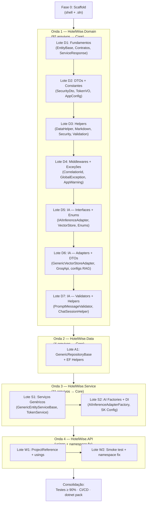

# Plano de Implementação — HotelWise.Core.SDK

**Versão:** 1.0.0  
**Data:** 2026-08-28  
**Status:** Pronto para Execução  
**Documentos Base:**
- [HotelWise.Core.SDK.Levantamento.md](./HotelWise.Core.SDK.Levantamento.md) — Inventário e arquitetura
- [HotelWise.Core.SDK.Especificacao.Domain.md](./HotelWise.Core.SDK.Especificacao.Domain.md)
- [HotelWise.Core.SDK.Especificacao.Data.md](./HotelWise.Core.SDK.Especificacao.Data.md)
- [HotelWise.Core.SDK.Especificacao.Service.md](./HotelWise.Core.SDK.Especificacao.Service.md)
- [HotelWise.Core.SDK.Especificacao.API.md](./HotelWise.Core.SDK.Especificacao.API.md)

**Planos Específicos:**
- [PlanoImplementacao.Domain.md](./HotelWise.Core.SDK.PlanoImplementacao.Domain.md) — Onda 1 (92 arquivos)
- [PlanoImplementacao.Data.md](./HotelWise.Core.SDK.PlanoImplementacao.Data.md) — Onda 2 (4 arquivos)
- [PlanoImplementacao.Service.md](./HotelWise.Core.SDK.PlanoImplementacao.Service.md) — Onda 3 (11 arquivos)
- [PlanoImplementacao.API.md](./HotelWise.Core.SDK.PlanoImplementacao.API.md) — Onda 4 (0 portados, 12 atualizados)

---

## 1. Objetivo

Consolidar **107 arquivos** de código genérico dispersos em 4 projetos host (`Domain`, `Data`, `Service`, `API`) em um núcleo reutilizável único: **`HotelWise.Core.SDK`**, empacotado como NuGet.

---

## 2. Regras Não Negociáveis

| # | Regra | Verificação |
| :--- | :--- | :--- |
| 1 | **Core = fonte canônica** — toda implementação genérica reside exclusivamente no Core.SDK | Inventário §6 do Levantamento |
| 2 | **Host ≠ apagado** — originais viram shim `[Obsolete]` delegando ao Core | `grep -r "HW_CORE_SDK_"` |
| 3 | **Não inventar** — apenas tipos do inventário existente são migrados | Revisão manual vs Levantamento |
| 4 | **Zero regressão** — build e testes verdes após cada fase | `dotnet build` + `dotnet test` |
| 5 | **Cobertura ≥ 90%** — módulos canônicos no `HotelWise.Core.SDK.Tests` | Coverlet report |
| 6 | **Um NuGet** — `PackageId = HotelWise.Core.SDK`, sem satélites | `dotnet pack` |
| 7 | **Build obrigatório após cada lote** — nenhum lote avança com erros | Gate check |

---

## 3. Pré-requisito — Fase 0: Scaffold

Antes de qualquer onda, o shell do projeto deve existir e compilar.

### Tarefas

| # | Tarefa | Saída |
| :--- | :--- | :--- |
| 0.1 | Criar `HotelWise.Core.SDK/HotelWise.Core.SDK.csproj` (multi-TFM: `net10.0;net8.0;netstandard2.1;netstandard2.0`) | Arquivo `.csproj` com NuGet metadata |
| 0.2 | Criar `HotelWise.Core.SDK.Tests/HotelWise.Core.SDK.Tests.csproj` (xUnit + FluentAssertions + Moq + coverlet) | Arquivo `.csproj` de testes |
| 0.3 | Criar `GlobalUsings.cs`, `README.md`, `LICENSE` | Arquivos base |
| 0.4 | Adicionar ambos à `HotelWiseAPI.sln` | Solution atualizada |
| 0.5 | Adicionar `ProjectReference` de `GroqApiLibrary` no Core.SDK | Dependência resolvida |
| 0.6 | `dotnet build HotelWiseAPI.sln` — verde | Build validado |

### Critério de aceite
- Build Release verde em todos os TFMs
- Projetos visíveis na solution
- **Zero** classes de negócio no Core

### `.csproj` de referência
```xml
<Project Sdk="Microsoft.NET.Sdk">
  <PropertyGroup>
    <TargetFrameworks>net10.0;net8.0;netstandard2.1;netstandard2.0</TargetFrameworks>
    <ImplicitUsings>enable</ImplicitUsings>
    <Nullable>enable</Nullable>
    <GenerateDocumentationFile>true</GenerateDocumentationFile>
    <PackageId>HotelWise.Core.SDK</PackageId>
    <Version>1.0.0</Version>
    <Authors>HotelWise</Authors>
    <Description>Núcleo reutilizável do ecossistema HotelWise</Description>
    <PackageLicenseExpression>MIT</PackageLicenseExpression>
    <IncludeSymbols>true</IncludeSymbols>
    <SymbolPackageFormat>snupkg</SymbolPackageFormat>
  </PropertyGroup>

  <!-- Dependências comuns (todos os TFMs) -->
  <ItemGroup>
    <PackageReference Include="Serilog" />
    <PackageReference Include="FluentValidation" />
    <PackageReference Include="AutoMapper" />
    <PackageReference Include="Newtonsoft.Json" />
  </ItemGroup>

  <!-- Dependências pesadas (apenas net10.0/net8.0) -->
  <ItemGroup Condition="'$(TargetFramework)' == 'net10.0' OR '$(TargetFramework)' == 'net8.0'">
    <PackageReference Include="Microsoft.EntityFrameworkCore" />
    <PackageReference Include="Microsoft.SemanticKernel" />
    <PackageReference Include="Microsoft.AspNetCore.Authentication.JwtBearer" />
    <PackageReference Include="HtmlAgilityPack" />
    <PackageReference Include="Markdig" />
    <!-- ... demais deps pesadas -->
  </ItemGroup>

  <ItemGroup>
    <ProjectReference Include="..\GroqApiLibrary\GroqApiLibrary.csproj" />
  </ItemGroup>
</Project>
```

---

## 4. Fluxo Global de Ondas



---

## 5. Critérios de Gate entre Ondas

| Gate | Condição Obrigatória | Comando de Verificação |
| :--- | :--- | :--- |
| **F0 → W1** | Shell compila; solution inclui Core + Tests | `dotnet build HotelWiseAPI.sln` |
| **W1 → W2** | 92 tipos Domain canônicos no Core; shims no host | `dotnet build HotelWise.Domain.csproj` |
| **W2 → W3** | GenericRepositoryBase no Core; repos de domínio herdam Core | `dotnet build HotelWise.Data.csproj` |
| **W3 → W4** | Serviços genéricos e factories no Core; serviços de domínio herdam Core | `dotnet build HotelWise.Service.csproj` |
| **W4 → Consol** | API compila; `SmartDigitalPsico.*` = 0 ocorrências; smoke test OK | `dotnet build HotelWise.API.csproj` |

---

## 6. Ritual de Migração por Tipo

Para cada tipo migrado, seguir rigorosamente esta sequência:

```
1. Copiar arquivo para Core.SDK (pasta destino do inventário)
2. Alterar namespace para HotelWise.Core.SDK.*
3. Ajustar imports/usings para tipos já canônicos no Core
4. Build do Core.SDK — verde
5. Transformar original no host em shim [Obsolete]:
   a. Herdar/delegar ao tipo Core (classes/interfaces)
   b. Redirecionar chamadas (classes estáticas)
   c. Adicionar DiagnosticId correto
6. Build da solution — verde
7. Adicionar testes canônicos em Core.SDK.Tests
8. Executar testes — verde
```

---

## 7. Resumo Quantitativo por Onda

| Onda | Projeto | Portar | Manter | Lotes | Plano Detalhado |
| :--- | :--- | :---: | :---: | :---: | :--- |
| **1** | Domain | 92 | 46 | 7 | [PlanoImplementacao.Domain.md](./HotelWise.Core.SDK.PlanoImplementacao.Domain.md) |
| **2** | Data | 4 | 12 | 1 | [PlanoImplementacao.Data.md](./HotelWise.Core.SDK.PlanoImplementacao.Data.md) |
| **3** | Service | 11 | 14 | 2 | [PlanoImplementacao.Service.md](./HotelWise.Core.SDK.PlanoImplementacao.Service.md) |
| **4** | API | 0 | 12 | 2 | [PlanoImplementacao.API.md](./HotelWise.Core.SDK.PlanoImplementacao.API.md) |
| **Total** | | **107** | **84** | **12** | |

---

## 8. O que NÃO Fazer em Paralelo

- **Onda 1 (Domain)** deve completar **antes** de portar impls Data que dependem de `EntityBase` / `IGenericRepository<T>`
- **Onda 2 (Data)** deve completar **antes** de Service que depende de `GenericRepositoryBase`
- **Onda 4 (API)** usings em massa **apenas após** Onda 3 (tipos já no Core para resolver)
- **Dentro** de cada onda: lotes são **sequenciais** (cada lote depende do anterior)
- **Dentro** de cada lote: tipos **sem dependência mútua** podem ser paralelizados

---

## 9. Consolidação Final (Pós-Ondas)

### 9.1 Cobertura de Testes

```powershell
dotnet test HotelWise.Core.SDK.Tests\HotelWise.Core.SDK.Tests.csproj `
    --collect:"XPlat Code Coverage" `
    --results-directory TestResults
```

**Meta:** Line Coverage ≥ 90%, Branch Coverage ≥ 85%

### 9.2 Empacotamento NuGet

```powershell
dotnet build HotelWise.Core.SDK\HotelWise.Core.SDK.csproj -c Release
dotnet pack HotelWise.Core.SDK\HotelWise.Core.SDK.csproj -c Release --no-build
```

**Saída:** `HotelWise.Core.SDK.1.0.0.nupkg` + `.snupkg` com XML docs

### 9.3 Auditoria Final

| Verificação | Comando | Resultado esperado |
| :--- | :--- | :--- |
| Build completo | `dotnet build HotelWiseAPI.sln -c Release` | 0 erros |
| Testes completos | `dotnet test HotelWiseAPI.sln` | 100% passando |
| Namespace legado | `grep -r "SmartDigitalPsico" --include="*.cs"` | 0 ocorrências |
| Shims presentes | `grep -r "HW_CORE_SDK_" --include="*.cs"` | 107 ocorrências nos hosts |
| Consumidores Core | `grep -r "HotelWise\.Core\.SDK" --include="*.cs"` | Presente em controllers e services |
| Cobertura | Coverlet report | ≥ 90% linhas |
| NuGet | `HotelWise.Core.SDK.*.nupkg` | Arquivo presente |
| Smoke test | `GET /health` | 200 OK |

---

## 10. Estimativa de Esforço

| Fase | Escopo | Estimativa (1 dev) |
| :--- | :--- | :--- |
| Fase 0 — Scaffold | Shell + .sln | 0.5 dia |
| Onda 1 — Domain (7 lotes) | 92 arquivos | 5–6 dias |
| Onda 2 — Data (1 lote) | 4 arquivos | 1 dia |
| Onda 3 — Service (2 lotes) | 11 arquivos | 2 dias |
| Onda 4 — API (2 lotes) | 12 atualizações | 1 dia |
| Consolidação | Testes, cobertura, pack | 2 dias |
| **Total** | | **~12 dias úteis** |

---

## 11. Riscos e Mitigações

| Risco | Probabilidade | Impacto | Mitigação |
| :--- | :--- | :--- | :--- |
| Dependências circulares entre Core.SDK e Domain | Média | Alto | Core não referencia projetos host; host referencia Core |
| TFM `netstandard2.0/2.1` incompatível com APIs pesadas | Média | Médio | `#if` condicional + `Compile Remove` por TFM |
| `GroqApiLibrary` acoplado a Core.SDK | Baixa | Médio | Manter como `ProjectReference`; avaliar absorção futura |
| Shims finos não cobrem todos os métodos estáticos | Média | Baixo | Template de shim padronizado; revisão por checklist |
| Coverlet não atinge 90% em módulos de IA | Média | Baixo | Priorizar testes de factories e adapters; mocks de SK |
