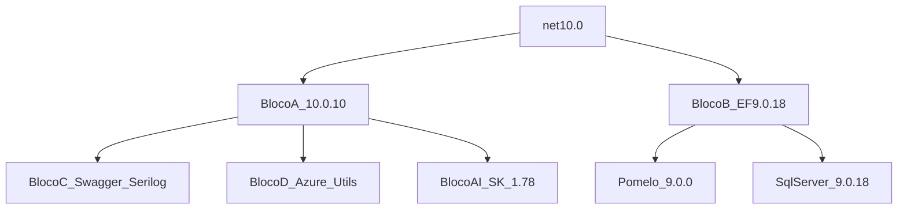
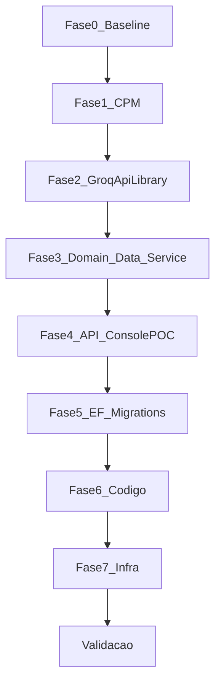

# Plano de Ação — Migração HotelWiseAPI .NET 8 → .NET 10

**Documento:** Plano de execução operacional  
**Solução:** `HotelWiseAPI/HotelWiseAPI.sln`  
**Baseado em:** `RascunhoPlanoUpdateDotNet10.md`, `DOCUMENTACAO/GuiaGenericoAtualizacaoPacotes.md` e inventário em `DOCUMENTACAO/API/2026-07-LevantamentoConjuntoHomologado-HotelWiseAPI.md`  
**Data:** 2026-07-31  
**Status:** Planejado (não executado)

---

## 1. Objetivo

Atualizar **todos os projetos .NET da solução `HotelWiseAPI.sln`** de `net8.0` para `net10.0`, preservando:

- Compatibilidade do pacote publicável `GroqApiLibrary` com consumidores ainda em .NET 8 (`net8.0;net10.0`)
- Integridade de migrations EF Core (MySQL/Pomelo e SqlServer), seeds e constraints
- Funcionamento da API, ConsolePOC, DI, Serilog, Swagger, Identity.Web e stack AI (Semantic Kernel / Kernel Memory)
- Build local, README, `global.json` e alinhamento do pipeline Azure DevOps externo
- Zero alteração de contratos públicos, regras de negócio ou schemas sem necessidade técnica

Detalhamento de versões: **Conjunto Homologado v1** em `DOCUMENTACAO/API/2026-07-LevantamentoConjuntoHomologado-HotelWiseAPI.md`.  
Checklist fase a fase: `DOCUMENTACAO/API/PlanoImplementacaoMigracaoDotNet10-HotelWiseAPI.md`.

---

## 2. Escopo e não escopo

### 2.1 Escopo

| Categoria | Ação |
| --------- | ---- |
| Bibliotecas (Domain, Data, Service) | `TargetFramework` → `net10.0` |
| HotelWise.API / HotelWise.ConsolePOC | `TargetFramework` → `net10.0` |
| GroqApiLibrary (packable) | Multi-targeting `net8.0;net10.0` |
| Pacotes NuGet | Aplicar **Conjunto Homologado v1** (Seção 3) |
| Central Package Management | Criar `HotelWiseAPI/Directory.Packages.props` |
| README / global.json | SDK 10.x |
| Pipeline Azure DevOps (externo) | Task `UseDotNet@2` → `10.x` |

### 2.2 Não escopo

- Frontend `HotelWiseUI` / npm
- Criação de suíte de testes do zero (gap atual: **0** projetos `*Tests*`)
- Fork Pomelo comunitário / EF Core 10 (Conjunto v2)
- Refatoração arquitetural (ex.: remover `Microsoft.AspNetCore.Components` das libs)
- Docker .NET da API (não existe; só `QdrantDockerFile/`)
- Alteração de regras de negócio ou contratos REST

---

## 3. Inventário atual (HotelWiseAPI)

### 3.1 Solução

- **Arquivo:** `HotelWiseAPI/HotelWiseAPI.sln`
- **Projetos no .sln:** 6
- **Framework atual:** `net8.0` em 100% dos projetos do .sln
- **CPM:** ausente (versões inline nos `.csproj`)
- **Testes automatizados:** ausentes

### 3.2 Tabela de projetos

| Projeto | Caminho | Tipo | TFM atual | TFM alvo |
| ------- | ------- | ---- | --------- | -------- |
| HotelWise.API | `HotelWise.API/` | Web API | net8.0 | **net10.0** |
| HotelWise.Service | `HotelWise.Service/` | Class Library | net8.0 | **net10.0** |
| HotelWise.Data | `HotelWise.Data/` | Class Library + EF | net8.0 | **net10.0** |
| HotelWise.Domain | `HotelWise.Domain/` | Class Library + AI | net8.0 | **net10.0** |
| GroqApiLibrary | `GroqApiLibrary/` | Library packable (v1.0.8) | net8.0 | **net8.0;net10.0** |
| HotelWise.ConsolePOC | `HotelWise.ConsolePOC/` | Console | net8.0 | **net10.0** |
| GroqToolLibrary | `GroqApiLibrary/GroqToolLibrary.csproj` | Orphan | net8.0 | Fora do ciclo (não está no .sln) |

**Cadeia:**

```text
HotelWise.API → HotelWise.Service → HotelWise.Data
                               └── HotelWise.Domain → GroqApiLibrary
HotelWise.ConsolePOC (OllamaSharp)
```

### 3.3 Problemas já detectados (pré-migração)

| ID | Problema | Tratamento no Conjunto v1 |
| -- | -------- | ------------------------- |
| P1 | Drift EF **8.0.19** vs Design/SqlServer/Tools **8.0.16** | Alinhar Bloco B em **9.0.18** |
| P2 | Extensions/`System.Text.Json` **9.0.8** com TFM 8 | TFM `net10.0` + Bloco A **10.0.10** |
| P3 | Pomelo **8.0.3** | Pomelo **9.0.0** + EF **9.0.18** |
| P4 | AutoMapper **15.0.1** CVE | **16.2.0** |
| P5 | SemanticKernel.Core **1.41.0** CVE | Família SK **1.78.0** |
| P6 | Previews AI | Família coerente; risco residual |
| P7 | Sem testes / sem CPM | Checklist manual + `Directory.Packages.props` |

### 3.4 Princípio de seleção de versões

Cada pacote na **última versão estável** que seja **simultaneamente**:

1. Compatível com **`net10.0`** (ou `net8.0;net10.0` em `GroqApiLibrary`)
2. Compatível com os demais pacotes do mesmo bloco
3. Sem preview em produção — **exceto** conectores Semantic Kernel que só existem como alpha/preview

**Verificação:** 2026-07-31 via `dotnet list package --outdated` + NuGet.org.

**Regra de ouro:** AspNetCore/Extensions/`System.Text.Json` no mesmo patch **10.0.10**. EF + providers na mesma major, limitada por **Pomelo 9** → EF **9.0.18**.

### 3.5 Conjunto Homologado v1 — resumo por blocos

Fonte completa: `DOCUMENTACAO/API/2026-07-LevantamentoConjuntoHomologado-HotelWiseAPI.md`.

| Bloco | Conteúdo | Versões a aplicar |
| ----- | -------- | ----------------- |
| **A** | AspNetCore, Extensions, System.* | **10.0.10** (+ Extensions.AI **10.8.3**, VectorData **10.8.0**) |
| **B** | EF Core + SqlServer + Pomelo | EF **9.0.18**, Pomelo **9.0.0** |
| **C** | Swashbuckle, Serilog, Identity | Swashbuckle **10.2.3**, Serilog.AspNetCore **10.0.0**, Identity.Web **3.15.1** |
| **D** | Azure, AutoMapper, FluentValidation, etc. | Conforme levantamento (ex.: AutoMapper **16.2.0**, Graph **5.105.0**) |
| **AI** | Semantic Kernel / Kernel Memory / Ollama | SK estável **1.78.0**; alphas **1.78.0-alpha**; InMemory/Qdrant **1.74.0-preview** |



**Dependências rígidas:**

| Se usar | Então obrigatoriamente |
| ------- | ---------------------- |
| Pomelo **9.0.0** | Todos `Microsoft.EntityFrameworkCore.*` em **9.0.18** |
| `net10.0` + Web API | `Microsoft.AspNetCore.*` em **10.0.10** |
| AspNetCore **10.x** | Extensions + `System.Text.Json` em **10.0.10** |
| Swashbuckle **10.x** | ASP.NET Core **10.x** |

### 3.6 Conjunto Homologado v2 (futuro)

Quando Pomelo **10.0.x** oficial existir ([#2007](https://github.com/PomeloFoundation/Pomelo.EntityFrameworkCore.MySql/issues/2007)): subir Bloco B para EF 10; avaliar Identity.Web 4, Graph 6, Markdig 1. **Sem forks comunitários.**

### 3.7 O que **não** aplicar no v1

| Tentativa | Resultado | Correto |
| --------- | --------- | ------- |
| EF **10** + Pomelo **9** | `NU1107` | EF **9.0.18** |
| AspNetCore **8** + `net10.0` | `NU1202` | **10.0.10** |
| Swashbuckle **9** + ASP.NET **10** | Breaking OpenAPI | **10.2.3** |
| Identity.Web **4** / Graph **6** sem smoke | Breaking | Manter majors 3 / 5 no v1 |

### 3.8 Centralização — `Directory.Packages.props`

Criar `HotelWiseAPI/Directory.Packages.props` com o XML do levantamento (Seção 10). Remover `Version=` dos `.csproj`.

---

## 4. Plano de execução por fases

Branch: `chore/update-packages-hotelwiseapi-dotnet10`



| Fase | Ação | Critério de saída |
| ---- | ---- | ----------------- |
| 0 | Baseline `dotnet build -c Release` | 0 erros no estado net8 |
| 1 | Criar CPM + remover Version= | Restore sem conflito |
| 2 | GroqApiLibrary `net8.0;net10.0` + pack | `lib/net8.0` e `lib/net10.0` |
| 3 | Domain → Data → Service → `net10.0` | Build libs OK |
| 4 | API + ConsolePOC → `net10.0` | Solução Release OK |
| 5 | Migrations MySQL; migration temporária vazia | Sem schema acidental |
| 6 | Swagger 10 / OpenAPI 2; LINQ; SK 1.78; AutoMapper 16 | Compile + smoke |
| 7 | `global.json`, README SDK 10, nota CI | Docs alinhados |

Validar build ao fim de cada fase. Detalhe operacional: `DOCUMENTACAO/API/PlanoImplementacaoMigracaoDotNet10-HotelWiseAPI.md`.

---

## 5. Checklist de validação

```powershell
cd HotelWiseAPI
dotnet restore HotelWiseAPI.sln
dotnet build HotelWiseAPI.sln -c Release
dotnet pack GroqApiLibrary/GroqApiLibrary.csproj -c Release -o ./artifacts/nupkg
dotnet ef migrations list --project HotelWise.Data --startup-project HotelWise.API
dotnet run --project HotelWise.API
```

- [ ] Restore sem `NU1107` / `NU1202`
- [ ] Build Release 0 erros; avisos NU1903/NU1904 (AutoMapper 15 / SK 1.41) ausentes
- [ ] Pack Groq com `lib/net8.0` e `lib/net10.0`
- [ ] Migration temporária vazia (ou investigação documentada)
- [ ] API sobe; DI OK; Swagger OK; smoke auth + AI
- [ ] Testes automatizados: **N/A** (gap) — smoke manual obrigatório
- [ ] README + `global.json` em SDK 10; CI externo anotado

---

## 6. Rollback

```powershell
git reset --hard <commit-baseline-fase-0>
cd HotelWiseAPI
dotnet restore HotelWiseAPI.sln
dotnet build HotelWiseAPI.sln -c Release
```

Restaurar em conjunto: `Directory.Packages.props`, `.csproj`, `global.json`, README.

---

## 7. Riscos residuais

| Risco | Mitigação |
| ----- | --------- |
| Pomelo 9 trava EF 9 | Conjunto v2 quando Pomelo 10 oficial |
| SK InMemory/Qdrant 1.74 vs core 1.78 | Smoke; fallback documentado no levantamento |
| Sem testes automatizados | Checklist manual + relatório |
| AutoMapper 16 / licença | Smoke mapeamentos |
| Pipeline DevOps desalinhado | Fase 7 — UseDotNet 10.x |

---

## 8. Evidências da entrega

Preencher `DOCUMENTACAO/UpdateDotNet10/RelatorioMigracaoDotNet10.md` após a execução.

```text
Projetos .NET atualizados: 6
Pacotes NuGet alinhados ao Conjunto v1: N
Testes automatizados: 0/0 (gap)
Build Release: OK/FAIL
Pack GroqApiLibrary: net8.0 + net10.0
Migrations: vazia / investigada
Smoke API / auth / AI: OK/FAIL
```

---

## 9. Referências

- `DOCUMENTACAO/API/2026-07-LevantamentoConjuntoHomologado-HotelWiseAPI.md`
- `DOCUMENTACAO/API/PlanoImplementacaoMigracaoDotNet10-HotelWiseAPI.md`
- `DOCUMENTACAO/UpdateDotNet10/RascunhoPlanoUpdateDotNet10.md`
- `DOCUMENTACAO/UpdateDotNet10/RelatorioMigracaoDotNet10.md`
- `DOCUMENTACAO/GuiaGenericoAtualizacaoPacotes.md`
