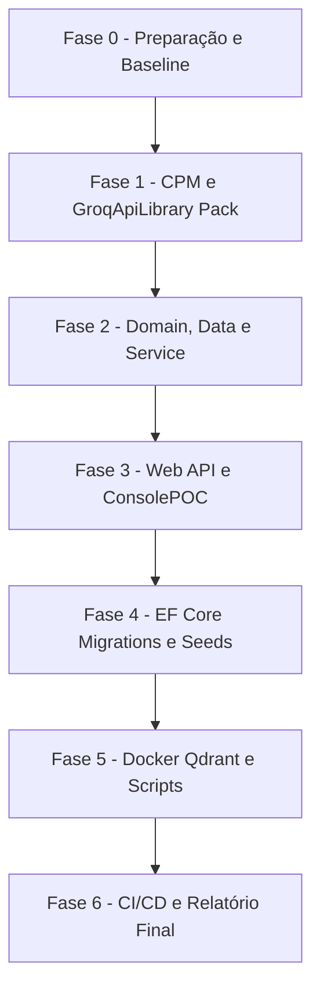

# Guia de Atualização de Pacotes — HotelWiseAPI

**Documento:** Guia operacional específico da solução  
**Solução:** [HotelWiseAPI.sln](file:///c:/git/HotelWise/HotelWiseAPI/HotelWiseAPI.sln)  
**Target Framework:** `.NET 10` (`net10.0` / Multi-target `net8.0;net10.0` no SDK)  
**SDK de Referência:** `.NET SDK 10.0.301` ([global.json](file:///c:/git/HotelWise/HotelWiseAPI/global.json))  
**Governança de Pacotes:** Central Package Management via [Directory.Packages.props](file:///c:/git/HotelWise/HotelWiseAPI/Directory.Packages.props)  
**Processo-Base Genérico:** [GuiaGenericoAtualizacaoPacotes.md](file:///c:/git/HotelWise/HotelWiseAPI/DOCUMENTACAO/UpdatePackages/GuiaGenericoAtualizacaoPacotes.md)  
**Data:** 2026-08-22  

---

## 1. Objetivo e Contexto da Solução

Padronizar a rotina operacional de atualização de dependências e gerenciamento de pacotes na solução **HotelWiseAPI**, assegurando:

- **Compatibilidade do SDK distribuído:** Preservação do multi-targeting (`net8.0;net10.0`) no pacote publicável [GroqApiLibrary](file:///c:/git/HotelWise/HotelWiseAPI/GroqApiLibrary/GroqApiLibrary.csproj) para suportar consumidores legados em .NET 8.
- **Integridade da persistência:** Execução correta de migrations no contexto `HotelWiseDbContextMysql`, estabilidade do provedor Pomelo MySQL 9 e schemas relacionais.
- **Ecossistema de IA e RAG:** Funcionamento dos fluxos conversacionais e busca vetorial baseados em **Semantic Kernel**, **Microsoft.Extensions.AI**, **Microsoft.Extensions.VectorData**, conectores de LLM (**Mistral AI**, **Ollama**) e **Qdrant Vector Store**.
- **Observabilidade e Segurança:** Estabilidade da autenticação JWT, integração com **Microsoft Entra ID** (`Microsoft.Identity.Web`), geração de documentação **Swagger/OpenAPI** e structured logging com **Serilog**.
- **Compilação e Entrega:** Builds limpos com 0 erros, sem vulnerabilidades (`NU1903`/`NU1904`) e alinhamento com pipelines de CI/CD no Azure DevOps.

---

## 2. Estrutura de Projetos da Solução

```text
HotelWiseAPI.sln
├── HotelWise.API          # Host ASP.NET Core Web API (DI, Swagger, Middleware, Health)
├── HotelWise.Service      # Regras de negócio, orquestração de IA e serviços de domínio
├── HotelWise.Data         # EF Core, Pomelo MySQL, migrations e seeds
├── HotelWise.Domain       # Entidades de domínio, DTOs, interfaces e adaptadores SK
├── GroqApiLibrary         # Cliente da API Groq (Biblioteca packable: net8.0;net10.0)
└── HotelWise.ConsolePOC   # Console Application (POC de integração com Ollama local)
```

| Projeto | Caminho | Tipo | TFM | Publicável? | No .sln? |
| ------- | ------- | ---- | --- | ----------- | -------- |
| [HotelWise.API](file:///c:/git/HotelWise/HotelWiseAPI/HotelWise.API/HotelWise.API.csproj) | `HotelWise.API/` | Web API | `net10.0` | Não | Sim |
| [HotelWise.Service](file:///c:/git/HotelWise/HotelWiseAPI/HotelWise.Service/HotelWise.Service.csproj) | `HotelWise.Service/` | Class Library | `net10.0` | Não | Sim |
| [HotelWise.Data](file:///c:/git/HotelWise/HotelWiseAPI/HotelWise.Data/HotelWise.Data.csproj) | `HotelWise.Data/` | Class Library (EF Core) | `net10.0` | Não | Sim |
| [HotelWise.Domain](file:///c:/git/HotelWise/HotelWiseAPI/HotelWise.Domain/HotelWise.Domain.csproj) | `HotelWise.Domain/` | Class Library | `net10.0` | Não | Sim |
| [GroqApiLibrary](file:///c:/git/HotelWise/HotelWiseAPI/GroqApiLibrary/GroqApiLibrary.csproj) | `GroqApiLibrary/` | Class Library (Packable) | `net8.0;net10.0` | **Sim (NuGet)** | Sim |
| [HotelWise.ConsolePOC](file:///c:/git/HotelWise/HotelWiseAPI/HotelWise.ConsolePOC/HotelWise.ConsolePOC.csproj) | `HotelWise.ConsolePOC/` | Console Application | `net10.0` | Não | Sim |
| [GroqToolLibrary](file:///c:/git/HotelWise/HotelWiseAPI/GroqApiLibrary/GroqToolLibrary.csproj) | `GroqApiLibrary/` | Class Library (Órfão) | `net8.0` | Não | **Não** |

> **Nota:** O frontend da plataforma ([HotelWiseUI](https://github.com/LeoneRocha/HotelWiseUI) — React + Vite + TypeScript) reside em repositório externo separado.

---

## 3. Escopo e Não Escopo

### 3.1 Escopo

- Atualização de pacotes NuGet em todos os 6 projetos da solução via [Directory.Packages.props](file:///c:/git/HotelWise/HotelWiseAPI/Directory.Packages.props).
- Validação de empacotamento multi-target do [GroqApiLibrary](file:///c:/git/HotelWise/HotelWiseAPI/GroqApiLibrary/GroqApiLibrary.csproj) gerando binários para `net8.0` e `net10.0`.
- Validação de migrations do EF Core no projeto [HotelWise.Data](file:///c:/git/HotelWise/HotelWiseAPI/HotelWise.Data/HotelWise.Data.csproj).
- Validação dos serviços de suporte Docker ([QdrantDockerFile](file:///c:/git/HotelWise/HotelWiseAPI/QdrantDockerFile/docker-compose.yml) e `IA_Local/`).
- Atualização e teste do script utilitário [check_packages.ps1](file:///c:/git/HotelWise/HotelWiseAPI/check_packages.ps1).
- Alinhamento do arquivo [global.json](file:///c:/git/HotelWise/HotelWiseAPI/global.json) e tasks do Azure DevOps Pipelines.

### 3.2 Não Escopo

- Alterações em código do frontend `HotelWiseUI` (tratado no ciclo do repositório correspondente).
- Projetos órfãos não gerenciados pela solução (ex.: `GroqToolLibrary.csproj`).
- Troca do ORM ou provedor MySQL (permanência em Pomelo MySQL + EF Core).
- Criação de novas regras de negócio ou alteração de payloads de API.

---

## 4. Governança de Pacotes (Central Package Management)

A solução utiliza **Central Package Management (CPM)** habilitado em [Directory.Packages.props](file:///c:/git/HotelWise/HotelWiseAPI/Directory.Packages.props):

```xml
<PropertyGroup>
  <ManagePackageVersionsCentrally>true</ManagePackageVersionsCentrally>
  <CentralPackageTransitivePinningEnabled>true</CentralPackageTransitivePinningEnabled>
</PropertyGroup>
```

**Diretrizes obrigatórias:**
1. Todos os arquivos `.csproj` devem conter apenas `<PackageReference Include="NomeDoPacote" />` sem atributo de versão.
2. A pinagem de vulnerabilidades transitivas (ex.: `System.Security.Cryptography.Xml`, `Microsoft.Kiota.*`) deve ser realizada via `<PackageVersion Include="..." Version="..." />` diretamente no `Directory.Packages.props`.
3. Em cenários excepcionais de multi-targeting onde uma versão não é suportada em TFMs anteriores, utilizar `VersionOverride` de forma explicitamente documentada no `.csproj`.

---

## 5. Blocos Tecnológicos Homologados

### Bloco A — Plataforma e Runtime .NET 10
- `Microsoft.AspNetCore.Authentication.JwtBearer`
- `Microsoft.Extensions.Configuration.*` (Binder, CommandLine, EnvironmentVariables, FileExtensions, Json)
- `Microsoft.Extensions.Caching.Memory`
- `Microsoft.Extensions.Identity.Core`
- `System.Text.Json`
- Família `Microsoft.Kiota.*` (Abstractions, Authentication, HttpClientLibrary, Serializers)

### Bloco B — Persistência e Dados (EF Core 9 + Pomelo 9)
- `Microsoft.EntityFrameworkCore`
- `Microsoft.EntityFrameworkCore.Relational`
- `Microsoft.EntityFrameworkCore.SqlServer`
- `Microsoft.EntityFrameworkCore.Design` / `Microsoft.EntityFrameworkCore.Tools`
- `Pomelo.EntityFrameworkCore.MySql`
> **Trava de Grafo Crítica:** O provider `Pomelo.EntityFrameworkCore.MySql 9.0.0` limita toda a família `Microsoft.EntityFrameworkCore.*` à versão `9.0.18`. A migração para EF Core 10 deve aguardar o lançamento estável oficial do Pomelo 10.

### Bloco C — OpenAPI, Observabilidade e Identidade
- `Swashbuckle.AspNetCore` (v10+ utilizando `using Microsoft.OpenApi;`)
- `Swashbuckle.AspNetCore.Filters`
- `Serilog`, `Serilog.AspNetCore`, `Serilog.Sinks.Console`, `Serilog.Sinks.File`, `Serilog.Enrichers.Environment`
- `Microsoft.Identity.Web`
- `Microsoft.IdentityModel.JsonWebTokens`
- `Microsoft.ApplicationInsights.AspNetCore`

### Bloco D — Azure, Utilitários e Geração de Documentos
- `Azure.Identity`, `Azure.Storage.Blobs`, `Azure.Storage.Queues`, `Azure.Data.Tables`, `Azure.ResourceManager.Authorization`
- `AutoMapper` (atenção às mudanças de licença e breaking changes na v15+)
- `FluentValidation`, `FluentValidation.DependencyInjectionExtensions`
- `Newtonsoft.Json`, `Polly`, `Polly.Core`, `Bogus`, `Microsoft.Graph`
- `DocumentFormat.OpenXml`, `PDFsharp`, `PDFsharp-MigraDoc`, `QuestPDF`, `Markdig`, `HtmlAgilityPack`

### Bloco AI — Inteligência Artificial e Vector Store
- `Microsoft.SemanticKernel` e extensões (Core, Abstractions, PromptTemplates, Agents)
- `Microsoft.SemanticKernel.Connectors.MistralAI`, `Microsoft.SemanticKernel.Connectors.Ollama`
- `Microsoft.Extensions.AI`, `Microsoft.Extensions.VectorData.Abstractions`
- `CommunityToolkit.VectorData.InMemory`, `CommunityToolkit.VectorData.Qdrant`
- `OllamaSharp`, `Mistral.SDK`
> **Atenção:** Assegurar a conformidade com as anotações do VectorData (May 2025+): `[VectorStoreRecordKey]`, `[VectorStoreRecordData]`, `[VectorStoreRecordVector]`.

---

## 6. Fluxo de Execução por Fases



- **Fase 0 — Preparação:** Criar branch `chore/update-packages-hotelwiseapi-<sufixo>`, executar `dotnet list` ou `.\check_packages.ps1` e rodar compilação baseline.
- **Fase 1 — CPM e Packable:** Atualizar [Directory.Packages.props](file:///c:/git/HotelWise/HotelWiseAPI/Directory.Packages.props) e validar empacotamento de [GroqApiLibrary](file:///c:/git/HotelWise/HotelWiseAPI/GroqApiLibrary/GroqApiLibrary.csproj).
- **Fase 2 — Camadas de Domínio, Dados e Serviço:** Compilar `HotelWise.Domain`, `HotelWise.Data` e `HotelWise.Service`.
- **Fase 3 — Hosts Executáveis:** Compilar e validar startup de `HotelWise.API` e `HotelWise.ConsolePOC`.
- **Fase 4 — Persistência e Migrations:** Validar `HotelWiseDbContextMysql`, gerar migration de validação temporária e verificar dados de seed.
- **Fase 5 — Containers e Scripts:** Validar compose do Qdrant e execução de [check_packages.ps1](file:///c:/git/HotelWise/HotelWiseAPI/check_packages.ps1).
- **Fase 6 — CI/CD e Evidências:** Alinhar `global.json`, pipelines do Azure DevOps e documentar o relatório de entrega.

---

## 7. Checklist de Validação Prático

### 7.1 Compilação e Restauração

```powershell
cd c:\git\HotelWise\HotelWiseAPI

dotnet restore HotelWiseAPI.sln
dotnet build HotelWiseAPI.sln -c Release
```

- [ ] Restore concluído sem erros `NU1107` ou `NU1202`.
- [ ] Compilação Release concluída com 0 erros.

### 7.2 Validação do Pacote Publicável (GroqApiLibrary)

```powershell
dotnet pack GroqApiLibrary/GroqApiLibrary.csproj -c Release -o ./artifacts/nupkg
```

- [ ] Arquivo `.nupkg` gerado com sucesso.
- [ ] Verificação de multi-targeting: pacote contém `lib/net8.0/` e `lib/net10.0/`.

### 7.3 Validação de Migrations e Banco de Dados (MySQL)

```powershell
$env:ASPNETCORE_ENVIRONMENT = "Development"

# Listar migrations existentes
dotnet ef migrations list `
  --project HotelWise.Data/HotelWise.Data.csproj `
  --startup-project HotelWise.API/HotelWise.API.csproj `
  --context HotelWiseDbContextMysql

# Atualizar banco de desenvolvimento
dotnet ef database update `
  --project HotelWise.Data/HotelWise.Data.csproj `
  --startup-project HotelWise.API/HotelWise.API.csproj `
  --context HotelWiseDbContextMysql
```

- [ ] Comandos `ef migrations list` e `database update` executados com sucesso.
- [ ] **Migration temporária de checagem:**
  ```powershell
  dotnet ef migrations add ValidacaoPosUpdate `
    --project HotelWise.Data/HotelWise.Data.csproj `
    --startup-project HotelWise.API/HotelWise.API.csproj `
    --context HotelWiseDbContextMysql `
    --output-dir Migrations/MySql
  ```
  - [ ] Métodos `Up` e `Down` gerados vazios (sem impacto DDL).
  - [ ] Remover migration temporária após validação:
  ```powershell
  dotnet ef migrations remove --force `
    --project HotelWise.Data/HotelWise.Data.csproj `
    --startup-project HotelWise.API/HotelWise.API.csproj `
    --context HotelWiseDbContextMysql
  ```
- [ ] Dados de seed validados no MySQL: User `admin` (Id=1), Hotel `Hotel Example` (HotelId=1), Room `Quarto Example` (Id=100).

### 7.4 Smoke Test da API

```powershell
dotnet run --project HotelWise.API/HotelWise.API.csproj
```

- [ ] Startup sem falhas de resolução de injeção de dependência.
- [ ] Endpoint `GET /health` respondendo 200 OK.
- [ ] Documentação Swagger acessível em `/swagger` ou `/swagger/index.html`.
- [ ] Header `X-Correlation-ID` propagado e visível nos logs do Serilog.
- [ ] Endpoints de IA (`api/Hotels/v1/generate`, `api/Assistant/v1/ask`) operacionais.

---

## 8. Infraestrutura e Automação

| Item | Procedimento de Validação |
| ---- | ------------------------- |
| **Qdrant Vector Store** | `cd QdrantDockerFile && docker compose up -d` → Acessar `http://localhost:6333/dashboard` |
| **Ambiente Local de IA** | Validar modelos no Ollama / IA local em `IA_Local/` |
| **Script de Auditoria** | Executar `.\check_packages.ps1` no PowerShell com UTF-8 habilitado |
| **SDK Pin** | Validar `global.json` contendo versão `10.0.301` e `rollForward: latestFeature` |
| **Azure DevOps Pipeline** | Verificar alinhamento da task `UseDotNet@2` com versão `10.x` |

---

## 9. Plano de Rollback

Caso ocorra impedimento durante a homologação:

```powershell
git checkout <branch-do-ciclo>
git reset --hard <commit-baseline>

dotnet restore HotelWiseAPI.sln
dotnet build HotelWiseAPI.sln -c Release
dotnet pack GroqApiLibrary/GroqApiLibrary.csproj -c Release
```

---

## 10. Referências Internas

- [Directory.Packages.props](file:///c:/git/HotelWise/HotelWiseAPI/Directory.Packages.props) — Definição centralizada de versões NuGet
- [global.json](file:///c:/git/HotelWise/HotelWiseAPI/global.json) — Pinagem do SDK .NET
- [README.md](file:///c:/git/HotelWise/HotelWiseAPI/README.md) — Guia geral da API e arquitetura
- [check_packages.ps1](file:///c:/git/HotelWise/HotelWiseAPI/check_packages.ps1) — Script de verificação de dependências
- [2026-07-LevantamentoConjuntoHomologado-HotelWiseAPI.md](file:///c:/git/HotelWise/HotelWiseAPI/DOCUMENTACAO/API/2026-07-LevantamentoConjuntoHomologado-HotelWiseAPI.md) — Inventário e Conjunto Homologado v1
- [PlanoImplementacaoMigracaoDotNet10-HotelWiseAPI.md](file:///c:/git/HotelWise/HotelWiseAPI/DOCUMENTACAO/API/PlanoImplementacaoMigracaoDotNet10-HotelWiseAPI.md) — Plano de implementação fase a fase
- [RelatorioMigracaoDotNet10.md](file:///c:/git/HotelWise/HotelWiseAPI/DOCUMENTACAO/UpdateDotNet10/RelatorioMigracaoDotNet10.md) — Relatório e evidências de migração
- [GuiaGenericoAtualizacaoPacotes.md](file:///c:/git/HotelWise/HotelWiseAPI/DOCUMENTACAO/UpdatePackages/GuiaGenericoAtualizacaoPacotes.md) — Processo genérico de atualização
