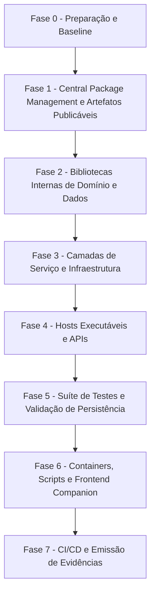

# Guia Genérico — Atualização de Pacotes (.NET NuGet e Frontend npm)

**Documento:** Guia operacional padronizado e reutilizável  
**Aplicabilidade:** Qualquer repositório de software baseado em ecossistema .NET (com ou sem frontend npm/companion, Central Package Management, SDKs packable, EF Core, Docker e CI/CD).  
**Data:** 2026-08-22  

---

## 1. Objetivo

Padronizar o processo de atualização de dependências e gerenciamento de ciclo de vida de pacotes em soluções de software, garantindo:

- **Estabilidade e continuidade:** Zero quebra de contratos públicos (APIs REST/gRPC), regras de negócio e interfaces de domínio durante ciclos de atualização de dependências.
- **Integridade de dados e schemas:** Preservação rigorosa de migrations de banco de dados, seeds e estruturas relacionais/NoSQL.
- **Compatibilidade retroativa de artefatos distribuídos:** Preservação de compatibilidade e multi-targeting em bibliotecas e SDKs públicos distribuídos externamente.
- **Segurança contínua:** Identificação, mitigação e eliminação proativa de vulnerabilidades em dependências diretas e transitivas.
- **Reprodutibilidade:** Builds limpos, determinísticos e consistentes entre ambiente local de desenvolvimento, containers Docker e esteiras de CI/CD.

Este guia define as diretrizes e procedimentos padrão. As versões concretas a serem aplicadas em uma determinada execução devem ser formalizadas em um documento filho de **"Conjunto Homologado"** específico daquele ciclo.

---

## 2. Escopo e Não Escopo

### 2.1 Escopo

| Categoria | Ação |
| --------- | ---- |
| **Projetos .NET** (APIs, bibliotecas, workers, consoles, suítes de teste) | Atualização de versões de pacotes NuGet via Central Package Management (`Directory.Packages.props`); atualização de Target Framework Moniker (TFM) quando o ciclo abranger upgrade de runtime/framework. |
| **Bibliotecas e SDKs publicáveis** | Atualização de dependências preservando contratos públicos e multi-targeting (`TargetFrameworks`) para consumidores legados. |
| **Projetos Frontend e SDKs TypeScript/npm** (quando existirem) | Atualização de `dependencies` e `devDependencies`, respeitando `engines`, `peerDependencies` e lockfiles. |
| **Docker e Infraestrutura local** | Atualização de imagens base de runtime/SDK (`aspnet`, `sdk`, `node`) e serviços auxiliares (bancos, vector stores, caches). |
| **Scripts e Automações** | Alinhamento de comandos, paths e filtros em scripts PowerShell, Bash e Node.js. |
| **Pipelines de Integração Contínua (CI/CD)** | Alinhamento de tasks de SDK (`UseDotNet`, `NodeTool`, etc.) e imagens de build runners. |

### 2.2 Não Escopo

- Modificação de regras de negócio, contratos de API ou schemas de banco sem justificativa técnica indispensável.
- Refatorações arquiteturais extensas ou reestruturação de camadas não relacionadas à atualização de pacotes.
- Reescrita ampla de testes automatizados além do estritamente necessário para compatibilidade com versões atualizadas.
- Substituição de bibliotecas por tecnologias equivalentes (ex.: troca de ORM, framework de testes ou biblioteca de serialização) — tais iniciativas demandam RFC e planejamento arquitetural dedicado.

---

## 3. Princípios Obrigatórios

1. **Inventário antes de qualquer alteração:** Nunca atualizar dependências sem antes mapear o estado atual, listando versões em uso, versões mais recentes disponíveis e vulnerabilidades conhecidas.
2. **Formalização do Conjunto Homologado:** Cada ciclo de atualização deve gerar uma matriz declarativa contendo `Pacote / Versão Atual / Versão Alvo / Latest Disponível / Justificativa de Retenção`. Versões `preview`, `rc`, `beta` ou `canary` são vedadas em ambientes de produção, exceto quando houver exigência técnica explícita documentada.
3. **Atualização por blocos coesos:** Pacotes pertencentes à mesma família ou ecossistema tecnológico devem ser atualizados em conjunto (ex.: toda a família `Microsoft.AspNetCore.*` e `Microsoft.Extensions.*` alinhada; ferramentas de teste coordenadas).
4. **Respeito rigoroso às travas de grafo:** Quando uma dependência intermediária travar a versão de outra (ex.: provider de banco travando a major do ORM), o bloco correspondente deve ser retido na versão compatível, documentando o motivo e a condição futura de destrave.
5. **Execução incremental por fases:** A aplicação das mudanças deve ocorrer em etapas sequenciais por camada, validando restauração, compilação e testes ao término de cada fase.
6. **Centralização de versões via Central Package Management (CPM):** Em soluções .NET, as versões devem ser declaradas exclusivamente no arquivo central `Directory.Packages.props`, mantendo os arquivos de projeto (`.csproj`) sem atributos de versão direta. Em ambientes npm, manter `package-lock.json` rigorosamente sincronizado.
7. **Preservação de compatibilidade de pacotes distribuídos:** Bibliotecas packable distribuídas via NuGet ou npm devem manter suporte às versões anteriores necessárias para seus consumidores.
8. **Trabalho em branch dedicada:** Todas as alterações devem ocorrer em branch isolada (ex.: `chore/update-packages-YYYY-MM`), realizando commits semânticos por fase.
9. **Tratamento criterioso de Major Bumps:** Atualizações de versão maior (major) exigem leitura prévia de notas de release (*breaking changes*) e testes dirigidos.
10. **Garantia de integridade de schemas:** Se uma atualização de pacotes de persistência induzir alterações DDL não planejadas ou gerar migrations indesejadas, a causa deve ser investigada e neutralizada antes da integração.

---

## 4. Fase de Inventário

### 4.1 Inventário .NET / NuGet

Comandos padrão para auditoria completa da solução:

```powershell
# Listar SDKs instalados no ambiente
dotnet --list-sdks

# Listar pacotes com atualizações disponíveis
dotnet list <Solucao>.sln package --outdated

# Listar pacotes com vulnerabilidades conhecidas (diretas e transitivas)
dotnet list <Solucao>.sln package --vulnerable --include-transitive

# Listar árvore consolidada de dependências
dotnet list <Solucao>.sln package
```

Matriz de inventário de projetos:

| Projeto | Caminho | Tipo | TFM Atual | Publicável? | Status no .sln |
| ------- | ------- | ---- | --------- | ----------- | -------------- |
| Exemplo.API | `src/Exemplo.API/` | Web API | netX.0 | Não | Sim |
| Exemplo.Domain | `src/Exemplo.Domain/` | Class Library | netX.0 | Não | Sim |
| Exemplo.Data | `src/Exemplo.Data/` | Class Library | netX.0 | Não | Sim |
| Exemplo.SDK | `src/Exemplo.SDK/` | Class Library | netX.0;netY.0 | **Sim (NuGet)** | Sim |

Matriz de inventário de pacotes:

| Pacote | Versão Atual | Latest Estável | Versão a Aplicar | Justificativa se retido |
| ------ | ------------ | -------------- | ---------------- | ----------------------- |

### 4.2 Inventário Frontend / npm (quando aplicável)

Para cada projeto frontend ou módulo TypeScript presente no repositório:

```powershell
cd <diretorio-do-projeto>
node --version
npm outdated
npm audit --omit=dev
npm ls --depth=0
```

---

## 5. Montagem do Conjunto Homologado

### 5.1 Organização dos Blocos .NET

As dependências devem ser organizadas em blocos lógicos estruturados:

- **Bloco A — Plataforma e Runtime:** `Microsoft.AspNetCore.*`, `Microsoft.Extensions.*`, `System.Text.Json`, utilitários de injeção de dependências e abstrações fundamentais. Devem estar todos alinhados no mesmo patch release compatível com o runtime alvo.
- **Bloco B — Persistência e Dados:** `Microsoft.EntityFrameworkCore.*`, provedores de banco de dados (MySQL, PostgreSQL, SQL Server, SQLite, InMemory) e ferramentas de migração. O bloco é balizado pela versão máxima suportada pelo provider mais restritivo.
- **Bloco C — OpenAPI, Observabilidade e Segurança:** Geradores OpenAPI/Swagger, frameworks de logging (`Serilog.*`), bibliotecas de autenticação/tokens JWT (`Microsoft.IdentityModel.*`, `Microsoft.Identity.Web`) e telemetria (`ApplicationInsights`, `OpenTelemetry`).
- **Bloco D — Domínio, Utilitários e Nuvem:** Mapeadores de objetos (`AutoMapper`), validadores (`FluentValidation`), serializadores, clientes de mensageria/cloud (`Azure.*`, `AWS.*`), bibliotecas de resiliência (`Polly`) e manipuladores de documentos.
- **Bloco AI — Inteligência Artificial e Vetores (se aplicável):** Orquestradores de IA (`Microsoft.SemanticKernel.*`, `Microsoft.Extensions.AI`), conectores LLM e provedores de vector store (`VectorData`, `Qdrant`, etc.).
- **Bloco E — Suíte de Testes:** Runners (`Microsoft.NET.Test.Sdk`), frameworks de teste (xUnit, NUnit, MSTest), ferramentas de mock (`Moq`, `NSubstitute`), asserções e coletores de cobertura (`coverlet.*`).

Tabela de dependências rígidas comuns:

| Se a solução utilizar | Regra obrigatória correspondente |
| --------------------- | -------------------------------- |
| Provider de banco de dados na versão N | Todos os pacotes `Microsoft.EntityFrameworkCore.*` mantidos na versão compatível N |
| Runtime .NET versão X | Bibliotecas de plataforma `Microsoft.AspNetCore.*` / `Microsoft.Extensions.*` alinhadas na release X |
| Framework de mock com integração a ORM | Versão do mock alinhada à major correspondente do ORM em uso |
| Multi-targeting em biblioteca publicável | Compilação e empacotamento validados individualmente em cada TFM suportado |

### 5.2 Organização dos Blocos npm (quando aplicável)

- **Bloco F — Core de Framework:** Framework principal (`react`, `angular`, `vue`), bibliotecas fundamentais e adaptadores de renderização.
- **Bloco G — Componentes UI e Ecossistema:** Bibliotecas de interface, ícones, utilitários de estilo e internacionalização.
- **Bloco H — Ferramental de Build e Lint:** Bundlers (`vite`, `webpack`, `tsup`), compilador `typescript`, `eslint`, `prettier` e plugins.
- **Bloco I — Testes Frontend:** Frameworks de teste (`jest`, `vitest`), adaptadores de ambiente DOM e bibliotecas de asserção.

---

## 6. Plano de Execução por Fases



- **Fase 0 — Preparação e Baseline:** Criação da branch dedicada; consolidação do inventário; compilação baseline com execução de testes para certificar estabilidade prévia.
- **Fase 1 — Central Package Management e Publicáveis:** Configuração do `Directory.Packages.props`; atualização e validação de empacotamento (`dotnet pack` / `npm pack`) de bibliotecas distribuídas.
- **Fase 2 — Camadas Internas de Domínio e Dados:** Aplicação de dependências em projetos base (Domain, Data/Entities); validação de compilação intermediária.
- **Fase 3 — Camadas de Serviço e Infraestrutura:** Atualização das regras de negócio, orquestrações e integrações externas.
- **Fase 4 — Hosts Executáveis e APIs:** Atualização de projetos de inicialização (Web APIs, workers, consoles); ajuste de middlewares e injeção de dependências.
- **Fase 5 — Testes e Persistência:** Atualização da suíte de testes; execução de validação de migrations de banco de dados.
- **Fase 6 — Containers, Scripts e Frontend:** Validação de Dockerfiles, scripts de apoio e módulos frontend companion.
- **Fase 7 — CI/CD e Emissão de Evidências:** Alinhamento de configurações de pipeline de integração contínua; emissão do relatório consolidado de conclusão.

---

## 7. Checklist de Validação

### 7.1 .NET — Restauração e Compilação

```powershell
dotnet restore <Solucao>.sln
dotnet build <Solucao>.sln -c Release
```

- [ ] `dotnet restore` executado sem erros de incompatibilidade (`NU1107`, `NU1202`).
- [ ] Compilação em modo Release concluída com 0 erros.
- [ ] Avisos de obsolescência (`CS0618`) avaliados e tratados ou justificados.
- [ ] Alertas de segurança (`NU1903`, `NU1904`) saneados através de pins transitivos no CPM.

### 7.2 .NET — Testes Automatizados e Cobertura

```powershell
dotnet test <Solucao>.sln -c Release --no-build
dotnet test <Solucao>.sln -c Release /p:CollectCoverage=true /p:CoverletOutputFormat=opencover
```

- [ ] 100% dos testes automatizados aprovados em todas as suítes.
- [ ] Cobertura de código mantida dentro das metas estabelecidas pelo repositório.

### 7.3 .NET — Validação de Persistência e Migrations

```powershell
dotnet ef migrations list --project <ProjetoData> --startup-project <ProjetoHost>
dotnet ef database update --project <ProjetoData> --startup-project <ProjetoHost>
```

- [ ] Listagem de migrations e atualização de banco de dados executadas com sucesso.
- [ ] **Técnica da Migration Temporária:** Gerar migration transitória de verificação (`dotnet ef migrations add ValidacaoPosUpdate`). Se os métodos `Up()` e `Down()` resultarem vazios (ou contiverem apenas ajustes de seed estáveis), comprova-se a inexistência de impacto estrutural imprevisto. Remover em seguida via `dotnet ef migrations remove --force`.

### 7.4 .NET — Validação de Artefatos Distribuídos (Pack)

```powershell
dotnet pack <ProjetoSDK>.csproj -c Release -o ./artifacts/nupkg
```

- [ ] Pacote `.nupkg` gerado com sucesso contendo as pastas correspondentes a cada TFM declarado (ex.: `lib/netX.0/`).

### 7.5 .NET — Smoke Test dos Hosts e Serviços

```powershell
dotnet run --project <ProjetoHost>.csproj
```

- [ ] Inicialização sem falhas de resolução de Injeção de Dependências.
- [ ] Endpoint de verificação de saúde (`/health`) retornando status 200 OK.
- [ ] Documentação Swagger/OpenAPI acessível e operacional.
- [ ] Fluxos de autenticação, autorização e middlewares operando conforme especificado.
- [ ] Logs emitidos de forma estruturada, sem mascaramento indevido ou exposição de credenciais.

### 7.6 Frontend / npm — Validação por Módulo

```powershell
cd <diretorio-do-projeto>
npm ci
npm run lint
npm test
npm run build
```

- [ ] Restauração via `npm ci` sem conflitos de resolução de dependências (`ERESOLVE`).
- [ ] Execução de lint e testes automatizados sem erros.
- [ ] Geração do bundle de produção validada.

---

## 8. Infraestrutura, Containers, Scripts e CI/CD

| Componente | Ações de Validação |
| ---------- | ------------------ |
| **Dockerfiles** | Verificar imagens base (`aspnet`, `sdk`, `node`) alinhadas às versões alvo; assegurar execução como usuário sem privilégios administrativos (*non-root*). |
| **docker-compose** | Executar `docker compose build --no-cache && docker compose up -d` e atestar saúde dos serviços agregados. |
| **Versionamento de SDK** | Alinhar `global.json` com versão de SDK recomendada e política adequada de `rollForward`. |
| **Pipelines CI/CD** | Alinhar tasks de runtime (`UseDotNet@2`, actions de setup) com as versões homologadas. |
| **Scripts Utilitários** | Auditar arquivos `.ps1`, `.sh` e `.js` para atualizar eventuais referências a caminhos de binários ou versões prefixadas. |

---

## 9. Evidências Obrigatórias da Entrega

Ao concluir o ciclo, o responsável técnico ou agente deve produzir as seguintes evidências:

1. **Documento de Conjunto Homologado:** Registro detalhado da matriz de pacotes, versões aplicadas e justificativas.
2. **Inventário de Arquivos Modificados:** Relação dos manifests (`Directory.Packages.props`, `.csproj`, `package.json`, `global.json`, pipelines).
3. **Resumo Métrico da Execução:**

```text
Projetos atualizados: N
Pacotes diretos atualizados: N
Testes executados/aprovados: N / N
Vulnerabilidades saneadas: N
Comportamento de persistência validado: Sim
Status da compilação: 0 erros / 0 warnings não justificados
```

4. **Registro de Riscos Residuais e Travas:** Documentação de dependências retidas para ciclos futuros e condições necessárias para sua liberação.

---

## 10. Plano de Rollback

Em caso de inconsistência crítica intransponível durante o processo de homologação:

```powershell
# Retornar ao estado baseline da branch
git checkout <branch-do-ciclo>
git reset --hard <commit-baseline>

# Reverter e restaurar ambiente .NET
dotnet restore <Solucao>.sln
dotnet build <Solucao>.sln -c Release
dotnet test <Solucao>.sln -c Release

# Reverter e restaurar ambientes npm (se houver)
cd <diretorio-do-projeto>
npm ci
npm test
```

Garantir que todos os arquivos modificados (`Directory.Packages.props`, `.csproj`, `package-lock.json`, `global.json`) sejam restaurados em conjunto.

---

## 11. Riscos Recorrentes e Estratégias de Mitigação

| Risco Identificado | Impacto | Estratégia de Mitigação |
| ------------------ | ------- | ----------------------- |
| **Provider de persistência trava a versão do ORM** | Incompatibilidade ao tentar atualizar o ORM para a última versão disponível | Manter todo o bloco de dados na major suportada pelo provider e documentar a trava como meta futura. |
| **Divergência de patches em bibliotecas de plataforma** | Restauração instável ou erro de grafo `NU1107` | Centralizar versões via CPM (`Directory.Packages.props`) e fixar todos os pacotes da família na mesma release. |
| **Major Bump de terceiros com quebra de API ou licença** | Falha de compilação ou risco de conformidade legal | Tratar majors isoladamente, revisando release notes, termos de licença e realizando testes dirigidos. |
| **Quebra de compatibilidade em SDKs distribuídos** | Consumidores externos quebram ao utilizar novas versões do pacote | Utilizar multi-targeting (`TargetFrameworks`), inspecionar conteúdo do `.nupkg` e executar testes com consumidores nas versões mínimas suportadas. |
| **Alteração de schema DDL não intencional** | Impacto em tabelas de produção | Aplicar rigorosamente a técnica da migration temporária antes de integrar as alterações. |
| **Dessincronização de lockfile em módulos npm** | Builds não reproduzíveis em esteiras de integração | Utilizar `npm ci` nos checklists e commitar `package.json` e `package-lock.json` simultaneamente. |
| **Pipeline de CI/CD utilizando SDK desatualizado** | Quebra na esteira remota apesar de sucesso local | Alinhar tarefas de setup de SDK nos arquivos de pipeline na fase de encerramento do ciclo. |

---

## 12. Modo de Execução Recomendado (para IA / Agentes / Automações)

1. **Fase de Análise:** Ler este guia, inspecionar a solução e gerar o inventário completo (Seção 4) sem introduzir modificações de código.
2. **Fase de Planejamento:** Elaborar a proposta do Conjunto Homologado (Seção 5) em documento de planejamento dedicado e solicitar validação.
3. **Fase de Execução:** Aplicar alterações de forma estritamente sequencial pelas fases do plano (Seção 6), realizando commits ao final de cada etapa bem-sucedida.
4. **Fase de Validação:** Executar os checklists práticos de build, testes, persistência e empacotamento (Seção 7).
5. **Fase de Fechamento:** Atualizar artefatos de infraestrutura/CI quando aplicável (Seção 8), registrar as evidências de entrega (Seção 9) e submeter as alterações para integração.
