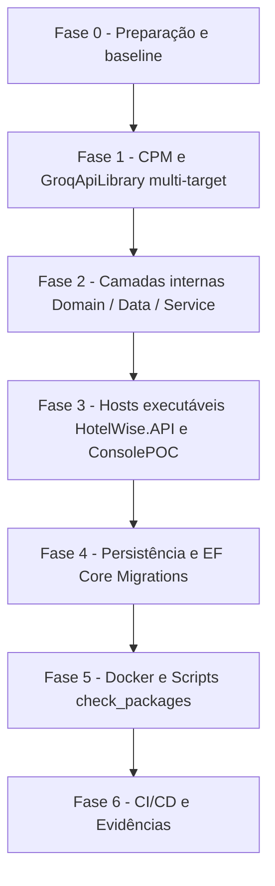

# Guia Genérico — Atualização de Pacotes (.NET NuGet e Central Package Management)

**Documento:** Guia operacional reutilizável  
**Baseado em:** [RascunhoPlanoUpdateDotNet10.md](file:///c:/git/HotelWise/HotelWiseAPI/DOCUMENTACAO/UpdateDotNet10/RascunhoPlanoUpdateDotNet10.md), [PlanoAcaoMigracaoDotNet10.md](file:///c:/git/HotelWise/HotelWiseAPI/DOCUMENTACAO/UpdateDotNet10/PlanoAcaoMigracaoDotNet10.md) e [RelatorioMigracaoDotNet10.md](file:///c:/git/HotelWise/HotelWiseAPI/DOCUMENTACAO/UpdateDotNet10/RelatorioMigracaoDotNet10.md)  
**Data:** 2026-08-22  
**Aplicabilidade:** Qualquer ciclo de atualização de dependências deste repositório (rotina periódica, upgrade de major, migração de runtime/framework).  

**Solução de Referência:** [HotelWiseAPI.sln](file:///c:/git/HotelWise/HotelWiseAPI/HotelWiseAPI.sln)  

---

## 1. Objetivo

Padronizar como atualizar dependências de pacotes em toda a solução backend **HotelWiseAPI**, preservando:

- Integridade de migrations EF Core, seeds, constraints e schemas de banco (MySQL via Pomelo / SQL Server)
- Compatibilidade do pacote publicável [GroqApiLibrary](file:///c:/git/HotelWise/HotelWiseAPI/GroqApiLibrary/GroqApiLibrary.csproj) com consumidores externos através de multi-targeting (`net8.0;net10.0`)
- Funcionamento da API Web ([HotelWise.API](file:///c:/git/HotelWise/HotelWiseAPI/HotelWise.API/HotelWise.API.csproj)), POCs de console ([HotelWise.ConsolePOC](file:///c:/git/HotelWise/HotelWiseAPI/HotelWise.ConsolePOC/HotelWise.ConsolePOC.csproj)), Injeção de Dependências (DI), logging (Serilog), telemetria (Application Insights) e middlewares
- Ecossistema de Inteligência Artificial: Semantic Kernel, conectores de IA (Mistral, Ollama, Groq), Vector Stores (Qdrant, InMemory) e bibliotecas de utilitários
- Build local, containers Docker ([QdrantDockerFile](file:///c:/git/HotelWise/HotelWiseAPI/QdrantDockerFile/docker-compose.yml)), scripts de auditoria de pacotes ([check_packages.ps1](file:///c:/git/HotelWise/HotelWiseAPI/check_packages.ps1)) e pipelines CI/CD
- Zero alteração de regra de negócio ou contrato público de API durante o ciclo de atualização de pacotes

Este guia é genérico: as versões concretas de cada ciclo devem ser registradas em um documento filho por execução (o "Conjunto Homologado" daquele ciclo — ver Seção 5), nunca hardcoded aqui.

---

## 2. Escopo e não escopo

### 2.1 Escopo

| Categoria | Ação |
| --------- | ---- |
| Projetos .NET da solução (`HotelWise.API`, `HotelWise.Service`, `HotelWise.Data`, `HotelWise.Domain`, `HotelWise.ConsolePOC`) | Atualizar pacotes NuGet via Central Package Management ([Directory.Packages.props](file:///c:/git/HotelWise/HotelWiseAPI/Directory.Packages.props)); atualizar TFM apenas em ciclos de migração de runtime |
| Pacote NuGet publicável ([GroqApiLibrary](file:///c:/git/HotelWise/HotelWiseAPI/GroqApiLibrary/GroqApiLibrary.csproj)) | Atualizar dependências preservando interfaces e multi-targeting (`net8.0;net10.0`) |
| Persistência e Migrations ([HotelWise.Data](file:///c:/git/HotelWise/HotelWiseAPI/HotelWise.Data/HotelWise.Data.csproj)) | Validar contexto `HotelWiseDbContextMysql`, migrations em `Migrations/MySql/` e estabilidade de schema DDL |
| Docker e Infraestrutura ([QdrantDockerFile](file:///c:/git/HotelWise/HotelWiseAPI/QdrantDockerFile/docker-compose.yml), `IA_Local/`) | Atualizar imagens base e configurações quando o ciclo envolver mudanças de infraestrutura ou runtime |
| Scripts de automação ([check_packages.ps1](file:///c:/git/HotelWise/HotelWiseAPI/check_packages.ps1)) | Atualizar filtros, encoding e paths caso haja alteração de estrutura |
| Pipelines CI/CD e SDK ([global.json](file:///c:/git/HotelWise/HotelWiseAPI/global.json), Azure DevOps) | Alinhar versão do SDK .NET (`10.0.301` / `UseDotNet@2`) |

### 2.2 Não escopo

- Frontend [HotelWiseUI](https://github.com/LeoneRocha/HotelWiseUI) (reside em repositório externo separado; atualizações de npm/React/Vite são tratadas em ciclo próprio)
- Alteração de regras de negócio, contratos REST, payloads JSON ou schemas de banco sem necessidade técnica
- Refatoração de domínio ou preferências arquiteturais não relacionadas à atualização de pacotes
- Projetos órfãos fora da solução (ex.: [GroqToolLibrary.csproj](file:///c:/git/HotelWise/HotelWiseAPI/GroqApiLibrary/GroqToolLibrary.csproj))
- Troca de bibliotecas por equivalentes (ex.: troca de ORM ou provider Pomelo — decisão arquitetural separada, com RFC própria)

Qualquer mudança fora do escopo deve ser registrada e tratada em PR separado.

---

## 3. Princípios obrigatórios

1. **Inventário antes de alterar** — nunca atualizar sem primeiro gerar a lista do que está desatualizado e vulnerável (Seção 4).
2. **Conjunto Homologado por ciclo** — cada ciclo de atualização produz uma tabela "pacote / versão atual / versão a aplicar / latest disponível / justificativa quando não for a latest". Só entram versões estáveis (sem `preview`, `rc`, `beta`, `next`, `canary`) em produção, exceto quando pacotes específicos exigirem previews coordenadas (ex.: SK connectors).
3. **Atualizar por blocos coesos, nunca pacote a pacote isolado** — pacotes do mesmo ecossistema sobem juntos (ex.: todos `Microsoft.AspNetCore.*` e `Microsoft.Extensions.*` no mesmo patch; família `Microsoft.EntityFrameworkCore.*` alinhada; ferramentas `Microsoft.SemanticKernel.*` coordenadas).
4. **Respeitar dependências rígidas do grafo** — quando um pacote trava a major de outro (ex.: provider de banco `Pomelo.EntityFrameworkCore.MySql` 9.x travando a major do `Microsoft.EntityFrameworkCore` em 9.x), documentar a trava e NÃO forçar a latest. Registrar a condição de destrave para o próximo ciclo ("Conjunto v2 futuro").
5. **Abordagem incremental por fases** — validar build e smoke ao final de cada fase; nunca alterar tudo de uma vez.
6. **Centralização de versões via CPM** — a solução usa Central Package Management ([Directory.Packages.props](file:///c:/git/HotelWise/HotelWiseAPI/Directory.Packages.props) como fonte única; `.csproj` sem atributo `Version`, usando apenas `VersionOverride` em exceções justificadas de multi-targeting).
7. **Não quebrar pacotes distribuídos** — [GroqApiLibrary](file:///c:/git/HotelWise/HotelWiseAPI/GroqApiLibrary/GroqApiLibrary.csproj) mantém multi-targeting (`TargetFrameworks: net8.0;net10.0`) e validação via `dotnet pack`.
8. **Branch dedicada com commits por fase** — ex.: `chore/update-packages-YYYY-MM` ou `chore/update-packages-hotelwiseapi-dotnet10`.
9. **Major bump exige atenção individual** — ler changelog/breaking changes antes de aplicar; um major de terceiro (ex.: AutoMapper 15+, Semantic Kernel, etc.) nunca sobe "de carona" no lote.
10. **Nenhuma migration/schema novo por causa de atualização** — se a atualização gerar migration não-vazia ou diff de schema, investigar antes de commitar.

---

## 4. Fase de inventário (sempre a primeira)

### 4.1 .NET / NuGet

Comandos para inventário da solução:

```powershell
dotnet --list-sdks
dotnet list HotelWiseAPI.sln package --outdated
dotnet list HotelWiseAPI.sln package --vulnerable --include-transitive
dotnet list HotelWiseAPI.sln package
```

Ou através do script de apoio do repositório:

```powershell
.\check_packages.ps1
```

Gerar tabelas de projetos e pacotes:

| Projeto | Tipo | TFM atual | Publicável? | No .sln? |
| ------- | ---- | --------- | ----------- | -------- |
| [HotelWise.API](file:///c:/git/HotelWise/HotelWiseAPI/HotelWise.API/HotelWise.API.csproj) | ASP.NET Core Web API (Host) | net10.0 | Não | Sim |
| [HotelWise.Service](file:///c:/git/HotelWise/HotelWiseAPI/HotelWise.Service/HotelWise.Service.csproj) | Class Library (Services / AI wiring) | net10.0 | Não | Sim |
| [HotelWise.Data](file:///c:/git/HotelWise/HotelWiseAPI/HotelWise.Data/HotelWise.Data.csproj) | Class Library (EF Core / MySQL / SqlServer) | net10.0 | Não | Sim |
| [HotelWise.Domain](file:///c:/git/HotelWise/HotelWiseAPI/HotelWise.Domain/HotelWise.Domain.csproj) | Class Library (Domain / Entities / SK) | net10.0 | Não | Sim |
| [GroqApiLibrary](file:///c:/git/HotelWise/HotelWiseAPI/GroqApiLibrary/GroqApiLibrary.csproj) | Class Library (Cliente Groq / Packable) | net8.0;net10.0 | **Sim (NuGet)** | Sim |
| [HotelWise.ConsolePOC](file:///c:/git/HotelWise/HotelWiseAPI/HotelWise.ConsolePOC/HotelWise.ConsolePOC.csproj) | Console Application (POC Ollama) | net10.0 | Não | Sim |
| [GroqToolLibrary](file:///c:/git/HotelWise/HotelWiseAPI/GroqApiLibrary/GroqToolLibrary.csproj) | Class Library (Órfão) | net8.0 | Não | Não |

| Pacote | Versão atual | Latest stable | Versão a aplicar | Justificativa se diferente da latest |
| ------ | ------------ | ------------- | ---------------- | ------------------------------------ |

---

## 5. Conjunto Homologado — regras de montagem

### 5.1 Blocos .NET (modelo)

Organizar o conjunto em blocos, na ordem de dependência:

- **Bloco A — Plataforma** (`Microsoft.AspNetCore.Authentication.JwtBearer`, `Microsoft.Extensions.*`, `System.Text.Json`, `Microsoft.Kiota.*`): todos no MESMO patch do ciclo do runtime alvo (.NET 10).
- **Bloco B — Persistência** (`Microsoft.EntityFrameworkCore.*` + providers `Pomelo.EntityFrameworkCore.MySql`, `Microsoft.EntityFrameworkCore.SqlServer`): todos na MESMA major, limitada pela major suportada pelo provider mais restritivo. Documentar a trava (ex.: "Pomelo 9.x exige EF Core <= 9.x") e a condição de destrave.
- **Bloco C — OpenAPI, logging, tokens e segurança** (`Swashbuckle.AspNetCore`, `Swashbuckle.AspNetCore.Filters`, `Serilog.*`, `Microsoft.IdentityModel.JsonWebTokens`, `Microsoft.Identity.Web`, `Microsoft.ApplicationInsights.AspNetCore`): Swashbuckle segue compatibilidade com ASP.NET Core / OpenAPI 2.x/3.x e Serilog alinhado.
- **Bloco D — Domínio, utilitários, nuvem e documentos** (`AutoMapper`, `FluentValidation`, `Newtonsoft.Json`, `Polly`, `Bogus`, `HtmlAgilityPack`, `Markdig`, `DocumentFormat.OpenXml`, `PDFsharp`, `QuestPDF`, `Azure.*`, `Microsoft.Graph`): latest estável, com atenção a licenças em majors novos (ex.: AutoMapper 15+).
- **Bloco AI — Inteligência Artificial e Vector Store** (`Microsoft.SemanticKernel.*`, `Microsoft.Extensions.AI`, `Microsoft.Extensions.VectorData.Abstractions`, `CommunityToolkit.VectorData.*`, `OllamaSharp`, `Mistral.SDK`): família Semantic Kernel alinhada na mesma release/preview coordenada.

Dependências rígidas típicas (validar a cada ciclo):

| Se usar | Então obrigatoriamente |
| ------- | ---------------------- |
| Provider `Pomelo.EntityFrameworkCore.MySql` na major N (ex.: 9.0.0) | Todos `Microsoft.EntityFrameworkCore.*` na major N (ex.: 9.0.18) |
| Runtime `net10.0` em Web API / Hosts | Todos `Microsoft.AspNetCore.*` / `Microsoft.Extensions.*` no patch do ciclo (.NET 10) |
| Swashbuckle v10+ | Namespaces atualizados (`Microsoft.OpenApi` em vez de `Microsoft.OpenApi.Models`) |
| Semantic Kernel VectorData (May 2025+) | Atributos `[VectorStoreRecordKey]`, `[VectorStoreRecordData]`, `[VectorStoreRecordVector]` |
| `GroqApiLibrary` multi-target `net8.0;net10.0` | `dotnet pack` deve gerar pastas `lib/net8.0/` e `lib/net10.0/` válidas |

Aplicação: todas as versões entram/atualizam em [Directory.Packages.props](file:///c:/git/HotelWise/HotelWiseAPI/Directory.Packages.props); os arquivos `.csproj` permanecem sem o atributo `Version=`.

---

## 6. Plano de execução por fases



- **Fase 0 — Preparação**: branch dedicada; inventário (Seção 4); montar Conjunto Homologado (Seção 5); commit baseline com build verde no estado atual.
- **Fase 1 — CPM e Packable**: atualizar [Directory.Packages.props](file:///c:/git/HotelWise/HotelWiseAPI/Directory.Packages.props) e validar o build/pack de [GroqApiLibrary](file:///c:/git/HotelWise/HotelWiseAPI/GroqApiLibrary/GroqApiLibrary.csproj) (`net8.0;net10.0`).
- **Fase 2 — Camadas internas**: aplicar blocos A, B, D e AI em [HotelWise.Domain](file:///c:/git/HotelWise/HotelWiseAPI/HotelWise.Domain/HotelWise.Domain.csproj), [HotelWise.Data](file:///c:/git/HotelWise/HotelWiseAPI/HotelWise.Data/HotelWise.Data.csproj) e [HotelWise.Service](file:///c:/git/HotelWise/HotelWiseAPI/HotelWise.Service/HotelWise.Service.csproj).
- **Fase 3 — Hosts executáveis**: aplicar blocos A, C e AI em [HotelWise.API](file:///c:/git/HotelWise/HotelWiseAPI/HotelWise.API/HotelWise.API.csproj) e [HotelWise.ConsolePOC](file:///c:/git/HotelWise/HotelWiseAPI/HotelWise.ConsolePOC/HotelWise.ConsolePOC.csproj).
- **Fase 4 — Persistência e Migrations**: validar migrations EF Core com `HotelWiseDbContextMysql`, gerar migration temporária para validar integridade DDL e aplicar seeds.
- **Fase 5 — Containers e scripts**: verificar [QdrantDockerFile/docker-compose.yml](file:///c:/git/HotelWise/HotelWiseAPI/QdrantDockerFile/docker-compose.yml), stacks `IA_Local/` e script [check_packages.ps1](file:///c:/git/HotelWise/HotelWiseAPI/check_packages.ps1).
- **Fase 6 — CI/CD e evidências**: alinhar [global.json](file:///c:/git/HotelWise/HotelWiseAPI/global.json) e pipelines do Azure DevOps; gerar relatório do ciclo.

---

## 7. Checklist de validação

### 7.1 .NET — build e restore

```powershell
dotnet restore HotelWiseAPI.sln
dotnet build HotelWiseAPI.sln -c Release
```

- [ ] Restore sem `NU1107` (conflito de versão) e `NU1202` (TFM incompatível)
- [ ] Build Release com 0 erros; warnings de obsolescência corrigidos ou justificados
- [ ] Warnings `NU1903` / `NU1904` (vulnerabilidades) mitigados com pins transitivos quando necessário

### 7.2 .NET — EF Core / migrations

```powershell
$env:ASPNETCORE_ENVIRONMENT = "Development"

dotnet ef migrations list `
  --project HotelWise.Data/HotelWise.Data.csproj `
  --startup-project HotelWise.API/HotelWise.API.csproj `
  --context HotelWiseDbContextMysql

dotnet ef database update `
  --project HotelWise.Data/HotelWise.Data.csproj `
  --startup-project HotelWise.API/HotelWise.API.csproj `
  --context HotelWiseDbContextMysql
```

- [ ] `migrations list` e `database update` sem erro
- [ ] Técnica da migration temporária: gerar migration `ValidacaoPosUpdate`; se vier com `Up`/`Down` vazios (ou apenas updates estáveis de seed), a atualização não alterou schema estrutural DDL (esperado) — remover com `dotnet ef migrations remove --force` caso seja puramente transitória.
- [ ] Validação do provider ativo (MySQL / Pomelo e SqlServer se habilitado)
- [ ] Seeds verificados no banco: User `admin`, Hotel `Hotel Example`, Room `Quarto Example`

### 7.3 .NET — pack do SDK publicável (GroqApiLibrary)

```powershell
dotnet pack GroqApiLibrary/GroqApiLibrary.csproj -c Release -o ./artifacts/nupkg
```

- [ ] Pacote `.nupkg` gerado com sucesso
- [ ] Pacote contém ambas as pastas `lib/net8.0/` e `lib/net10.0/`

### 7.4 .NET — execução dos hosts (smoke)

```powershell
# Web API
dotnet run --project HotelWise.API/HotelWise.API.csproj

# Console POC (opcional)
dotnet run --project HotelWise.ConsolePOC/HotelWise.ConsolePOC.csproj
```

- [ ] Startup sem `InvalidOperationException` de DI
- [ ] Endpoint de documentação Swagger acessível (`/swagger` ou `/swagger/index.html`)
- [ ] Endpoint de health check operacional (`GET /health` retornando 200)
- [ ] Autenticação JWT e middlewares (Correlation ID `X-Correlation-ID`) operando normalmente
- [ ] Endpoints de IA e Semantic Kernel respondendo sem quebras de conector
- [ ] Logs do Serilog formatados sem vazamento de credenciais

---

## 8. Evidências obrigatórias da entrega

1. **Conjunto Homologado do ciclo** — documento em `DOCUMENTACAO/API/<AAAA-MM>-LevantamentoConjuntoHomologado-HotelWiseAPI.md` com tabelas aplicadas e justificativas.
2. **Lista de arquivos alterados** — [Directory.Packages.props](file:///c:/git/HotelWise/HotelWiseAPI/Directory.Packages.props), `.csproj`, Dockerfiles, pipelines, scripts, [global.json](file:///c:/git/HotelWise/HotelWiseAPI/global.json).
3. **Relatório quantitativo:**

```text
Projetos .NET atualizados: 6 / 6
Pacotes NuGet atualizados: N
Testes automatizados: 0 (gap documentado; validação via smoke/build/pack)
Vulnerabilidades resolvidas: N
Falhas encontradas/corrigidas: N/N
Migrations validadas: Sim
```

4. **Riscos residuais** — majors adiados (ex.: Pomelo 10 / EF Core 10), travas de grafo, warnings pendentes.

---

## 9. Plano de rollback

```powershell
git checkout <branch-do-ciclo>
git reset --hard <commit-baseline>

dotnet restore HotelWiseAPI.sln
dotnet build HotelWiseAPI.sln -c Release
dotnet pack GroqApiLibrary/GroqApiLibrary.csproj -c Release
```

---

## 10. Referências

- [Directory.Packages.props](file:///c:/git/HotelWise/HotelWiseAPI/Directory.Packages.props) — fonte única de versões NuGet (CPM)
- [global.json](file:///c:/git/HotelWise/HotelWiseAPI/global.json) — especificação e pin do SDK .NET
- [README.md](file:///c:/git/HotelWise/HotelWiseAPI/README.md) — documentação principal da API e arquitetura
- [2026-07-LevantamentoConjuntoHomologado-HotelWiseAPI.md](file:///c:/git/HotelWise/HotelWiseAPI/DOCUMENTACAO/API/2026-07-LevantamentoConjuntoHomologado-HotelWiseAPI.md) — inventário e Conjunto Homologado de referência
- [PlanoImplementacaoMigracaoDotNet10-HotelWiseAPI.md](file:///c:/git/HotelWise/HotelWiseAPI/DOCUMENTACAO/API/PlanoImplementacaoMigracaoDotNet10-HotelWiseAPI.md) — checklist detalhado fase a fase
- [RelatorioMigracaoDotNet10.md](file:///c:/git/HotelWise/HotelWiseAPI/DOCUMENTACAO/UpdateDotNet10/RelatorioMigracaoDotNet10.md) — modelo de relatório de migração e evidências
