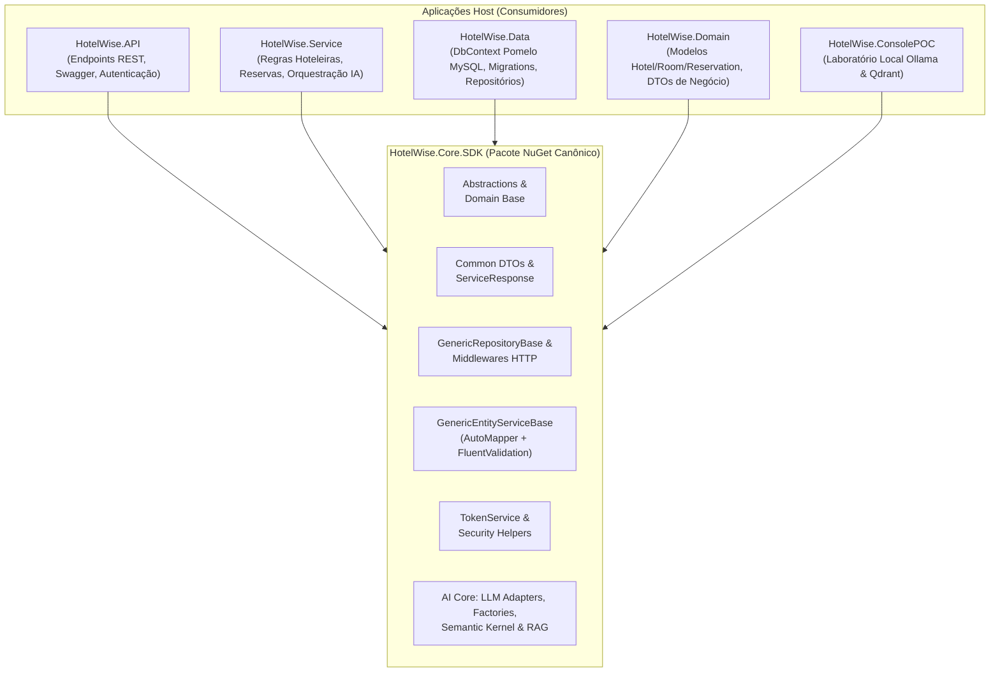

# HotelWise.Core.SDK

[](https://www.nuget.org/)
[](https://dotnet.microsoft.com/)
[](file:///c:/git/HotelWise/HotelWiseAPI/HotelWise.Core.SDK.Tests)
[](file:///c:/git/HotelWise/HotelWiseAPI/HotelWise.Core.SDK.Tests)
[](./LICENSE)

Núcleo reutilizável, canônico e transversal do ecossistema **HotelWise**. O pacote consolida abstrações base, infraestrutura genérica de acesso a dados (Entity Framework Core), pipeline de segurança JWT, middlewares HTTP para ASP.NET Core, serviços base com AutoMapper e FluentValidation, e uma suíte completa de Inteligência Artificial com orquestração de Semantic Kernel, adaptadores LLM agnósticos e suporte a RAG vetorial.

### Migração para SmartCoreHub.Core.SDK

Tipos já unificados no **SmartCoreHub.Core.SDK** estão `[Obsolete]` com mensagem que cita:
1. a **camada** (`Common` / `Domain` / `Infrastructure` / `Service`);
2. o **pacote NuGet** `SmartCoreHub.Core.SDK` + FQN do tipo;
3. que, após publicar o NuGet, este pacote vira **casca** e **delega a SmartCoreHub.Core.SDK**.

Placeholders Version/feed e checklist: **[MIGRATION-TO-SMARTCOREHUB.md](./MIGRATION-TO-SMARTCOREHUB.md)**.


---

## 1. Visão Geral e Propósito

O **`HotelWise.Core.SDK`** foi concebido para desacoplar as fundações de engenharia de software das regras específicas de negócio hoteleiro.



### O que faz parte do Core.SDK:
- **Abstrações e Modelos Base:** Contratos `IEntityBase`, `IGenericRepository<T>`, `IGenericService<TDto>`, `EntityBase`, `EntityBaseWithNameEmail`.
- **Response Pattern & DTOs Transversais:** `ServiceResponse<T>`, `ErrorResponse`, `EntityDtoBase`, DTOs de cultura, fuso horário e segurança.
- **Persistência Genérica EF Core:** `GenericRepositoryBase<T, TContext>`, extensões de mapeamento `ModelBuilderExtensions` e convenções de charset.
- **Serviços Genéricos com Validação:** `GenericEntityServiceBase<T, TDto>` com injeção de `IMapper`, `IValidator<T>` e `Serilog.ILogger`.
- **Segurança e Autenticação JWT:** Emissão e validação de tokens JWT (HMAC-SHA512), refresh tokens e extração segura de claims via `TokenService` e `SecurityHelperApi`.
- **Middlewares ASP.NET Core:** `CorrelationIdMiddleware` (propagação do header `X-Correlation-ID`), `GlobalExceptionMiddleware` (JSON padronizado) e `RequestLoggingMiddleware`.
- **Módulo de Inteligência Artificial & RAG:** Adaptadores LLM (`Groq`, `Mistral`, `Ollama`, `SemanticKernel`), adaptadores de busca vetorial (`Qdrant`, `InMemory`), configurações tipadas de RAG e contadores de tokens.

### O que permanece exclusivamente nos projetos Host:
- Modelos relacionais de domínio hoteleiro (`Hotel`, `Room`, `Reservation`, `RoomAvailability`, `User`).
- DbContext MySQL concreto (`HotelWiseDbContextMysql`) e arquivos de Migrations.
- Repositórios e casos de uso específicos de hotelaria.

---

## 2. Estrutura de Pastas e Namespaces

```
HotelWise.Core.SDK/
├── Abstractions/                  // HotelWise.Core.SDK.Abstractions (Contratos base de repositório, serviço e entidades)
├── Domain/                        // HotelWise.Core.SDK.Domain (EntityBase, EntityBaseWithNameEmail)
├── Common/                        // HotelWise.Core.SDK.Common (ServiceResponse<T>, ErrorResponse, DTOs)
│   ├── Constants/                 // Constantes de validação, appconfig e Azure AD
│   └── Exceptions/                // AppWarningException e exceções padronizadas
├── Infrastructure/                // HotelWise.Core.SDK.Infrastructure (GenericRepositoryBase, HelperCharSet)
│   └── Middleware/                // CorrelationIdMiddleware, GlobalExceptionMiddleware, RequestLoggingMiddleware
├── Services/                      // HotelWise.Core.SDK.Services (GenericEntityServiceBase)
├── Security/                      // HotelWise.Core.SDK.Security (TokenService, TokenVO, SecurityHelper)
├── Helpers/                       // HotelWise.Core.SDK.Helpers (DataHelper, MarkdownHelper, HtmlHelper, TimeFormatter)
├── Extensions/                    // HotelWise.Core.SDK.Extensions (ModelBuilderExtensions, DI Extensions, EnumExtensions)
├── Logging/                       // HotelWise.Core.SDK.Logging (LogAppHelper com Serilog)
├── Validation/                    // HotelWise.Core.SDK.Validation (HelperValidation para FluentValidation)
└── AI/
    ├── Abstractions/              // IAIInferenceAdapter, IVectorStoreAdapter, IApplicationIAConfig, IRagConfig
    ├── Adapters/                  // GroqApiAdapter, MistralApiAdapter, OllamaAdapter, SemanticKernelAdapter, GenericVectorStoreAdapter
    ├── Configuration/             // ApplicationIAConfig, RagConfig, SearchSettings, QdrantConfig, RedisConfig, etc.
    ├── Configure/                 // SemanticKernelProviderConfigure, ConfigureServicesAI
    ├── Constants/                 // ChatCompletionValidatorsConstants
    ├── DTO/                       // PromptMessageVO, DataVectorBase, AskAssistantRequest, AskAssistantResponse
    ├── Enums/                     // AIChatServiceType, AIEmbeddingServiceType, InferenceAiAdapterType, VectorStoreType
    ├── Helpers/                   // TokenCounterHelper, ChatSessionHelper, EmbeddingHelper
    ├── Services/                  // AIInferenceService, AIInferenceAdapterFactory, VectorStoreAdapterFactory
    └── Validation/                // AskAssistantRequestValidator, PromptMessageValidator, HistoryPromptsValidator
```

---

## 3. Matriz de Compatibilidade (Multi-Targeting)

O pacote é compilado para múltiplos targets, permitindo que consumidores modernos e legados utilizem as funcionalidades adequadas:

| Target Framework | Escopo e Capacidades Suportadas |
| :--- | :--- |
| **`net10.0`** *(Principal)* | **Superfície Completa:** EF Core, ASP.NET Core, Semantic Kernel, adaptadores LLM, GroqApiLibrary, JWT Bearer e C# 13+. |
| **`net8.0`** *(LTS)* | **Superfície Completa:** Compatibilidade total com backends corporativos .NET 8. |
| **`netstandard2.1`** | **Superfície Leve:** Abstrações, DTOs, Helpers, Formatação de tempo/markdown/HTML, Logging e constantes. |
| **`netstandard2.0`** | **Superfície Essencial:** Máxima interoperabilidade para bibliotecas cliente e integrações legadas. |

---

## 4. Exemplos Práticos de Uso

### 4.1 Persistência Genérica com `GenericRepositoryBase<T, TContext>`

```csharp
using HotelWise.Core.SDK.Infrastructure;
using Microsoft.EntityFrameworkCore;

public class HotelRepository : GenericRepositoryBase<Hotel, HotelWiseDbContextMysql>, IHotelRepository
{
    public HotelRepository(
        HotelWiseDbContextMysql context,
        DbContextOptions<HotelWiseDbContextMysql> options)
        : base(context, options)
    {
    }

    // Métodos específicos de consulta especializada hoteleira...
}
```

### 4.2 Camada de Serviço com CRUD e Validação Automática

```csharp
using AutoMapper;
using FluentValidation;
using HotelWise.Core.SDK.Services;
using HotelWise.Core.SDK.Common;

public class HotelService : GenericEntityServiceBase<Hotel, HotelDto>, IHotelService
{
    public HotelService(
        IGenericRepository<Hotel> repository,
        IMapper mapper,
        Serilog.ILogger logger,
        IValidator<Hotel> validator)
        : base(repository, mapper, logger, validator)
    {
    }
}

// Em Controllers ou Handlers de API:
hotelService.SetUserId(currentUserId);
ServiceResponse<HotelDto> result = await hotelService.GetByIdAsync(hotelId);

if (!result.Success)
{
    // Tratamento de mensagens de erro encapsuladas em result.Errors
}
```

### 4.3 Geração e Validação de Tokens JWT com `TokenService`

```csharp
using System.Security.Claims;
using HotelWise.Core.SDK.Abstractions;
using HotelWise.Core.SDK.Security;

// Registro no DI:
services.AddSingleton<ITokenConfigurationDto>(tokenConfigurations);
services.AddScoped<ITokenService, TokenService>();

// Emissão:
var claims = new[]
{
    new Claim(ClaimTypes.NameIdentifier, user.Id.ToString()),
    new Claim(ClaimTypes.Name, user.Email),
    new Claim(ClaimTypes.Role, user.Role)
};

string accessToken = tokenService.GenerateAccessToken(claims);
string refreshToken = tokenService.GenerateRefreshToken();
```

### 4.4 Orquestração Dinâmica de LLMs com `AIInferenceAdapterFactory`

```csharp
using HotelWise.Core.SDK.AI.Abstractions;
using HotelWise.Core.SDK.AI.DTO;
using HotelWise.Core.SDK.AI.Enums;

// Obtenção da factory injetada via DI
var adapter = aiAdapterFactory.CreateAdapter(InferenceAiAdapterType.GroqApi);

var messages = new List<PromptMessageVO>
{
    new() { Role = RoleAiPromptsType.System, Message = "Você é um concierge virtual do HotelWise." },
    new() { Role = RoleAiPromptsType.User, Message = "Quais quartos possuem vista para o mar?" }
};

string resposta = await adapter.GenerateChatCompletionAsync(messages);
```

### 4.5 Configuração de Pipeline de Middlewares ASP.NET Core

```csharp
using HotelWise.Core.SDK.Infrastructure.Middleware;

var app = builder.Build();

// Propagação do X-Correlation-ID para rastreabilidade distribuída
app.UseMiddleware<CorrelationIdMiddleware>();

// Tratamento unificado de exceções e JSON de erro padronizado
app.UseMiddleware<GlobalExceptionMiddleware>();

// Log estruturado de requisições e respostas
app.UseMiddleware<RequestLoggingMiddleware>();
```

---

## 5. Qualidade, Testes e Cobertura

O SDK possui uma suíte de testes canônica dedicada desenvolvida em **xUnit**, utilizando **Moq**, **FluentAssertions** e **Coverlet**:

- **Localização:** [HotelWise.Core.SDK.Tests/](file:///c:/git/HotelWise/HotelWiseAPI/HotelWise.Core.SDK.Tests)
- **Status dos Testes:** **79 de 79 testes aprovados (100% de sucesso)**
- **Cobertura de Código:** **92.62% de line coverage** no escopo unit-testável (excluindo apenas conectores live dependentes de serviços externos via [coverlet.runsettings](file:///c:/git/HotelWise/HotelWiseAPI/HotelWise.Core.SDK.Tests/coverlet.runsettings)).
- **Pipeline CI:** Workflow automatizado configurado em [.github/workflows/core-sdk.yml](file:///c:/git/HotelWise/HotelWiseAPI/.github/workflows/core-sdk.yml).

### Comandos de Execução:

```powershell
# 1. Compilar o SDK em modo Release
dotnet build HotelWise.Core.SDK/HotelWise.Core.SDK.csproj -c Release

# 2. Executar suíte de testes com coleta de cobertura
dotnet test HotelWise.Core.SDK.Tests/HotelWise.Core.SDK.Tests.csproj -c Release \
    --collect:"XPlat Code Coverage" \
    --settings HotelWise.Core.SDK.Tests/coverlet.runsettings

# 3. Gerar pacote NuGet (.nupkg) e símbolos (.snupkg) com documentação XML
dotnet pack HotelWise.Core.SDK/HotelWise.Core.SDK.csproj -c Release -o artifacts/core-sdk
```

---

## 6. Documentação Técnica Completa

Para aprofundamento na arquitetura e histórico de evolução:

| Documento | Descrição |
| :--- | :--- |
| [HotelWise.Core.SDK.Guide.md](file:///c:/git/HotelWise/HotelWiseAPI/DOCUMENTACAO/HotelWise.Core.SDK/HotelWise.Core.SDK.Guide.md) | Guia completo de referência técnica e arquitetural do SDK. |
| [HotelWise.Core.SDK.Progresso.md](file:///c:/git/HotelWise/HotelWiseAPI/DOCUMENTACAO/HotelWise.Core.SDK/HotelWise.Core.SDK.Progresso.md) | Registro de progresso de implementação e evidências de validação. |
| [HotelWise.Core.SDK.Levantamento.md](file:///c:/git/HotelWise/HotelWiseAPI/DOCUMENTACAO/HotelWise.Core.SDK/HotelWise.Core.SDK.Levantamento.md) | Levantamento e inventário exaustivo de migração dos 107 tipos. |
| [HotelWise.Core.SDK.PlanoImplementacao.md](file:///c:/git/HotelWise/HotelWiseAPI/DOCUMENTACAO/HotelWise.Core.SDK/HotelWise.Core.SDK.PlanoImplementacao.md) | Plano mestre consolidado de implementação em 4 ondas. |

---

## 7. Licença

Este projeto é distribuído sob a licença **MIT**. Consulte o arquivo [LICENSE](./LICENSE) para mais detalhes.
